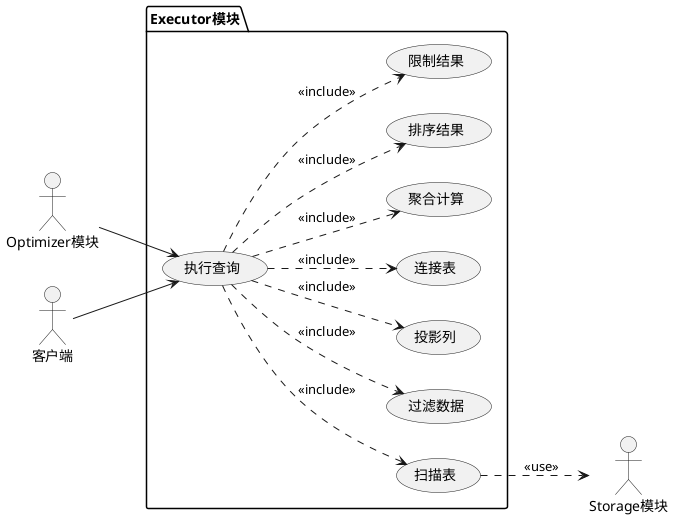
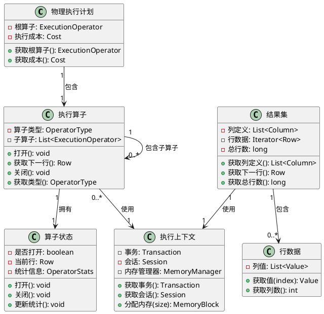
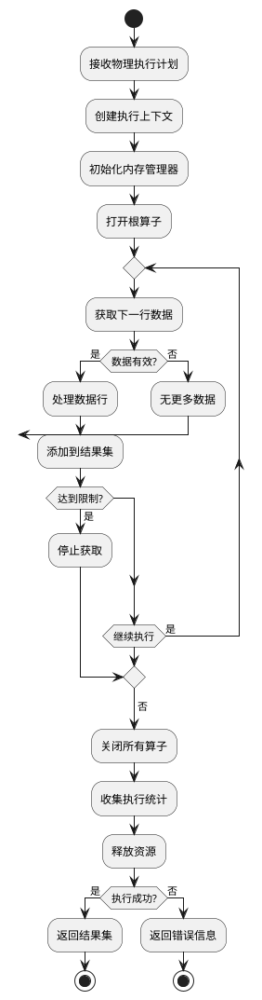
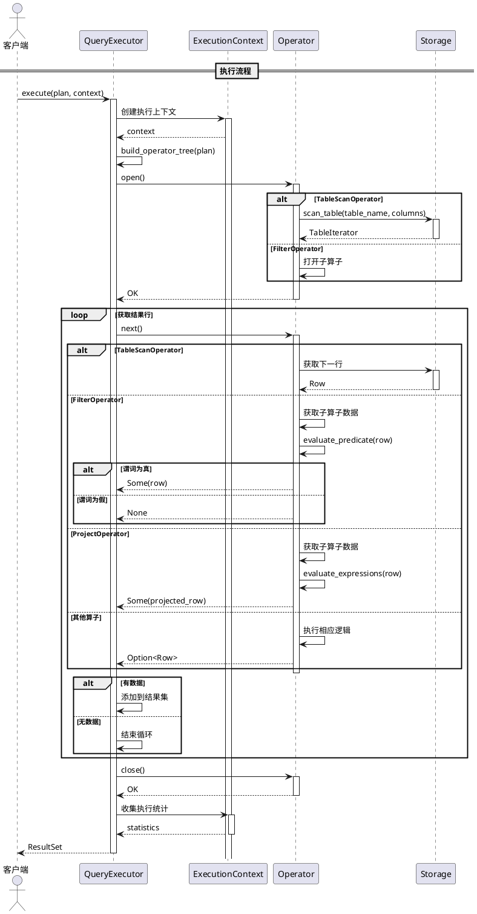

# SQLRustGo Executor模块设计文档

## 1. 模块概述

### 1.1 功能描述

Executor模块是SQLRustGo数据库系统的核心执行引擎，负责接收Optimizer生成的物理执行计划，通过调用各种执行算子完成数据操作，并返回查询结果。该模块是查询处理流程的最后一步，直接决定查询的执行效率和结果正确性。

**核心职责：**

1. **接收物理执行计划**：
   - 从Optimizer模块获取优化后的物理执行计划
   - 解析执行计划的结构和操作序列
   - 初始化执行环境

2. **调用执行算子**：
   - 按照执行计划调用相应的执行算子
   - 管理算子间的数据流
   - 协调算子的执行顺序

3. **返回结果集**：
   - 收集各算子的执行结果
   - 格式化输出结果
   - 处理错误和异常情况

4. **资源管理**：
   - 管理内存分配和释放
   - 控制并发执行
   - 监控执行性能

### 1.2 模块边界

**输入边界：**
- 物理执行计划（来自Optimizer模块）
- 执行上下文（事务信息、会话配置等）
- 系统资源限制（内存限制、并发限制等）

**输出边界：**
- 查询结果集（输出给客户端或上层模块）
- 执行状态信息（成功、失败、警告等）
- 执行统计信息（执行时间、资源消耗等）

**依赖关系：**
- 依赖：Optimizer模块（提供物理计划）、Storage模块（提供数据访问）
- 被依赖：客户端接口、监控模块

**不包含的功能：**
- SQL语句解析（由Parser模块负责）
- 查询优化（由Optimizer模块负责）
- 数据存储管理（由Storage模块负责）
- 事务管理（由Transaction模块负责）

## 2. OOA分析

### 2.1 用例图



### 2.2 概念类图



### 2.3 活动图



## 3. OOD设计

### 3.1 设计类图

```plantuml
@startuml ExecutorDesignClass

interface "Executor接口" as Executor {
    + execute(plan: PhysicalPlan, context: ExecutionContext) -> Result<ResultSet, ExecuteError>
    + cancel_execution() -> void
    + get_execution_stats() -> ExecutionStatistics
}

interface "Operator接口" as Operator {
    + open() -> Result<(), ExecuteError>
    + next() -> Result<Option<Row>, ExecuteError>
    + close() -> Result<(), ExecuteError>
    + get_output_schema() -> Schema
    + get_children() -> Vec<&Operator>
}

interface "Storage接口" as Storage {
    + scan_table(table_name: &str, columns: &[String]) -> Result<TableIterator, StorageError>
    + get_row(table_name: &str, row_id: RowId) -> Result<Row, StorageError>
    + insert_row(table_name: &str, row: Row) -> Result<RowId, StorageError>
    + update_row(table_name: &str, row_id: RowId, row: Row) -> Result<(), StorageError>
    + delete_row(table_name: &str, row_id: RowId) -> Result<(), StorageError>
}

class "QueryExecutor类" as QueryExecutor {
    - storage: Box<dyn Storage>
    - memory_manager: MemoryManager
    - execution_stats: ExecutionStatistics
    - cancel_flag: AtomicBool
    + new(storage: Box<dyn Storage>) -> Self
    + execute(plan: PhysicalPlan, context: ExecutionContext) -> Result<ResultSet, ExecuteError>
    + cancel_execution() -> void
    + get_execution_stats() -> ExecutionStatistics
    - build_operator_tree(plan: PhysicalPlan) -> Result<Box<dyn Operator>, ExecuteError>
    - execute_operator_tree(root: &dyn Operator) -> Result<ResultSet, ExecuteError>
}

class "TableScanOperator类" as TableScanOperator {
    - table_name: String
    - columns: Vec<String>
    - storage: &Storage
    - iterator: Option<TableIterator>
    - schema: Schema
    + new(table_name: String, columns: Vec<String>, storage: &Storage) -> Self
    + open() -> Result<(), ExecuteError>
    + next() -> Result<Option<Row>, ExecuteError>
    + close() -> Result<(), ExecuteError>
    + get_output_schema() -> Schema
    + get_children() -> Vec<&Operator>
}

class "FilterOperator类" as FilterOperator {
    - predicate: Expression
    - child: Box<dyn Operator>
    - schema: Schema
    + new(predicate: Expression, child: Box<dyn Operator>) -> Self
    + open() -> Result<(), ExecuteError>
    + next() -> Result<Option<Row>, ExecuteError>
    + close() -> Result<(), ExecuteError>
    + get_output_schema() -> Schema
    + get_children() -> Vec<&Operator>
    - evaluate_predicate(row: &Row) -> Result<bool, ExecuteError>
}

class "ProjectOperator类" as ProjectOperator {
    - expressions: Vec<Expression>
    - child: Box<dyn Operator>
    - schema: Schema
    + new(expressions: Vec<Expression>, child: Box<dyn Operator>) -> Self
    + open() -> Result<(), ExecuteError>
    + next() -> Result<Option<Row>, ExecuteError>
    + close() -> Result<(), ExecuteError>
    + get_output_schema() -> Schema
    + get_children() -> Vec<&Operator>
    - evaluate_expressions(row: &Row) -> Result<Row, ExecuteError>
}

class "JoinOperator类" as JoinOperator {
    - join_type: JoinType
    - join_condition: Expression
    - left_child: Box<dyn Operator>
    - right_child: Box<dyn Operator>
    - algorithm: JoinAlgorithm
    - schema: Schema
    + new(join_type: JoinType, condition: Expression, left: Box<dyn Operator>, right: Box<dyn Operator>, algorithm: JoinAlgorithm) -> Self
    + open() -> Result<(), ExecuteError>
    + next() -> Result<Option<Row>, ExecuteError>
    + close() -> Result<(), ExecuteError>
    + get_output_schema() -> Schema
    + get_children() -> Vec<&Operator>
    - execute_nested_loop_join() -> Result<Option<Row>, ExecuteError>
    - execute_hash_join() -> Result<Option<Row>, ExecuteError>
    - execute_merge_join() -> Result<Option<Row>, ExecuteError>
}

class "AggregateOperator类" as AggregateOperator {
    - group_by: Vec<Expression>
    - aggregates: Vec<AggregateFunction>
    - child: Box<dyn Operator>
    - schema: Schema
    - hash_table: HashMap<Vec<Value>, Vec<Accumulator>>
    + new(group_by: Vec<Expression>, aggregates: Vec<AggregateFunction>, child: Box<dyn Operator>) -> Self
    + open() -> Result<(), ExecuteError>
    + next() -> Result<Option<Row>, ExecuteError>
    + close() -> Result<(), ExecuteError>
    + get_output_schema() -> Schema
    + get_children() -> Vec<&Operator>
    - compute_aggregates() -> Result<(), ExecuteError>
}

class "SortOperator类" as SortOperator {
    - sort_keys: Vec<SortKey>
    - child: Box<dyn Operator>
    - schema: Schema
    - sorted_data: Vec<Row>
    - current_index: usize
    + new(sort_keys: Vec<SortKey>, child: Box<dyn Operator>) -> Self
    + open() -> Result<(), ExecuteError>
    + next() -> Result<Option<Row>, ExecuteError>
    + close() -> Result<(), ExecuteError>
    + get_output_schema() -> Schema
    + get_children() -> Vec<&Operator>
    - external_sort() -> Result<(), ExecuteError>
}

class "LimitOperator类" as LimitOperator {
    - limit: usize
    - offset: usize
    - child: Box<dyn Operator>
    - current_count: usize
    - skipped_count: usize
    + new(limit: usize, offset: usize, child: Box<dyn Operator>) -> Self
    + open() -> Result<(), ExecuteError>
    + next() -> Result<Option<Row>, ExecuteError>
    + close() -> Result<(), ExecuteError>
    + get_output_schema() -> Schema
    + get_children() -> Vec<&Operator>
}

class "ResultSet类" as ResultSet {
    - schema: Schema
    - rows: Vec<Row>
    - current_index: usize
    - total_rows: usize
    + new(schema: Schema, rows: Vec<Row>) -> Self
    + next() -> Option<Row>
    + get_schema() -> Schema
    + get_total_rows() -> usize
    + reset() -> void
}

class "ExecutionContext类" as ExecutionContext {
    - transaction: Transaction
    - session: Session
    - memory_manager: MemoryManager
    - query_id: String
    + new(transaction: Transaction, session: Session) -> Self
    + get_transaction() -> Transaction
    + get_session() -> Session
    + allocate_memory(size: usize) -> Result<MemoryBlock, ExecuteError>
    + get_query_id() -> String
}

class "ExecutionStatistics类" as ExecutionStatistics {
    - total_time: Duration
    - rows_processed: usize
    - rows_returned: usize
    - memory_used: usize
    - operator_stats: Vec<OperatorStatistics>
    + new() -> Self
    + record_start() -> void
    + record_end() -> void
    + add_rows_processed(count: usize) -> void
    + add_rows_returned(count: usize) -> void
    + add_memory_used(bytes: usize) -> void
    + add_operator_stats(stats: OperatorStatistics) -> void
}

class "OperatorStatistics类" as OperatorStatistics {
    - operator_type: OperatorType
    - execution_time: Duration
    - rows_processed: usize
    - rows_returned: usize
    - memory_used: usize
    + new(operator_type: OperatorType) -> Self
    + record_start() -> void
    + record_end() -> void
}

class "Row类" as Row {
    - values: Vec<Value>
    - row_id: Option<RowId>
    + new(values: Vec<Value>) -> Self
    + get_value(index: usize) -> Option<Value>
    + get_value_by_name(name: &str, schema: Schema) -> Option<Value>
    + len() -> usize
    + is_empty() -> bool
}

class "Schema类" as Schema {
    - columns: Vec<Column>
    + new(columns: Vec<Column>) -> Self
    + get_columns() -> Vec<Column>
    + get_column_index(name: &str) -> Option<usize>
    + get_column_type(index: usize) -> DataType
    + merge(other: Schema) -> Schema
}

class "Column类" as Column {
    - name: String
    - data_type: DataType
    - nullable: bool
    + new(name: String, data_type: DataType, nullable: bool) -> Self
    + get_name() -> String
    + get_data_type() -> DataType
    + is_nullable() -> bool
}

Executor <|.. QueryExecutor
Operator <|.. TableScanOperator
Operator <|.. FilterOperator
Operator <|.. ProjectOperator
Operator <|.. JoinOperator
Operator <|.. AggregateOperator
Operator <|.. SortOperator
Operator <|.. LimitOperator

QueryExecutor o-- Storage
QueryExecutor o-- Operator
QueryExecutor o-- ExecutionContext
QueryExecutor o-- ExecutionStatistics

FilterOperator o-- Operator
ProjectOperator o-- Operator
JoinOperator o-- Operator
AggregateOperator o-- Operator
SortOperator o-- Operator
LimitOperator o-- Operator

ResultSet o-- Row
ResultSet o-- Schema
Schema o-- Column
ExecutionContext o-- ExecutionStatistics
ExecutionStatistics o-- OperatorStatistics

@enduml
```



### 3.2 顺序图



## 4. 核心接口定义

### 4.1 Executor接口

```rust
pub trait Executor: Send + Sync + Debug {
    fn execute(&mut self, plan: PhysicalPlan, context: ExecutionContext) -> Result<ResultSet, ExecuteError>;
    
    fn cancel_execution(&mut self);
    
    fn get_execution_stats(&self) -> ExecutionStatistics;
    
    fn reset_statistics(&mut self);
    
    fn is_executing(&self) -> bool;
}

#[derive(Debug, Clone)]
pub struct ExecutionStatistics {
    pub total_time: Duration,
    pub rows_processed: usize,
    pub rows_returned: usize,
    pub memory_used: usize,
    pub operator_stats: Vec<OperatorStatistics>,
}

#[derive(Debug, Clone)]
pub struct OperatorStatistics {
    pub operator_type: OperatorType,
    pub execution_time: Duration,
    pub rows_processed: usize,
    pub rows_returned: usize,
    pub memory_used: usize,
}
```

### 4.2 Operator接口

```rust
pub trait Operator: Send + Sync + Debug {
    fn open(&mut self) -> Result<(), ExecuteError>;
    
    fn next(&mut self) -> Result<Option<Row>, ExecuteError>;
    
    fn close(&mut self) -> Result<(), ExecuteError>;
    
    fn get_output_schema(&self) -> Schema;
    
    fn get_children(&self) -> Vec<&dyn Operator>;
    
    fn get_operator_type(&self) -> OperatorType;
    
    fn get_statistics(&self) -> OperatorStatistics;
    
    fn reset(&mut self) -> Result<(), ExecuteError>;
}

#[derive(Debug, Clone, PartialEq, Eq)]
pub enum OperatorType {
    TableScan,
    IndexScan,
    Filter,
    Project,
    Join,
    Aggregate,
    Sort,
    Limit,
    Union,
    Insert,
    Update,
    Delete,
}
```

### 4.3 ExecutionContext接口

```rust
pub struct ExecutionContext {
    transaction: Transaction,
    session: Session,
    memory_manager: MemoryManager,
    query_id: String,
    start_time: Instant,
}

impl ExecutionContext {
    pub fn new(transaction: Transaction, session: Session) -> Self {
        ExecutionContext {
            transaction,
            session,
            memory_manager: MemoryManager::new(),
            query_id: generate_query_id(),
            start_time: Instant::now(),
        }
    }
    
    pub fn get_transaction(&self) -> &Transaction {
        &self.transaction
    }
    
    pub fn get_session(&self) -> &Session {
        &self.session
    }
    
    pub fn allocate_memory(&mut self, size: usize) -> Result<MemoryBlock, ExecuteError> {
        self.memory_manager.allocate(size)
    }
    
    pub fn get_query_id(&self) -> &str {
        &self.query_id
    }
    
    pub fn get_elapsed_time(&self) -> Duration {
        self.start_time.elapsed()
    }
}
```

## 5. 火山模型（迭代器模型）设计

### 5.1 火山模型概述

火山模型（Volcano Model）是一种基于迭代器的查询执行模型，每个算子实现 `open()`、`next()`、`close()` 三个基本操作，通过拉取（Pull）方式获取数据。

**核心特点：**
- **流式处理**：数据逐行处理，内存占用小
- **惰性求值**：按需获取数据，避免不必要的计算
- **组合性强**：算子可以任意组合
- **易于并行**：支持算子间的流水线并行

### 5.2 火山模型实现

```rust
pub trait VolcanoOperator: Operator {
    fn init(&mut self) -> Result<(), ExecuteError> {
        self.open()
    }
    
    fn fetch_next(&mut self) -> Result<Option<Row>, ExecuteError> {
        self.next()
    }
    
    fn cleanup(&mut self) -> Result<(), ExecuteError> {
        self.close()
    }
}

pub struct VolcanoExecutor {
    root_operator: Box<dyn VolcanoOperator>,
    context: ExecutionContext,
    buffer: Vec<Row>,
    buffer_size: usize,
}

impl VolcanoExecutor {
    pub fn new(root_operator: Box<dyn VolcanoOperator>, context: ExecutionContext) -> Self {
        VolcanoExecutor {
            root_operator,
            context,
            buffer: Vec::new(),
            buffer_size: 1000,
        }
    }
    
    pub fn execute(&mut self) -> Result<ResultSet, ExecuteError> {
        self.root_operator.init()?;
        
        let schema = self.root_operator.get_output_schema();
        let mut rows = Vec::new();
        
        loop {
            match self.root_operator.fetch_next()? {
                Some(row) => {
                    rows.push(row);
                    
                    if rows.len() >= self.buffer_size {
                        break;
                    }
                }
                None => break,
            }
        }
        
        self.root_operator.cleanup()?;
        
        Ok(ResultSet::new(schema, rows))
    }
    
    pub fn execute_streaming(&mut self) -> Result<StreamingResultSet, ExecuteError> {
        self.root_operator.init()?;
        
        let schema = self.root_operator.get_output_schema();
        
        Ok(StreamingResultSet::new(schema, self))
    }
}

pub struct StreamingResultSet<'a> {
    schema: Schema,
    executor: &'a mut VolcanoExecutor,
}

impl<'a> StreamingResultSet<'a> {
    pub fn new(schema: Schema, executor: &'a mut VolcanoExecutor) -> Self {
        StreamingResultSet { schema, executor }
    }
    
    pub fn next(&mut self) -> Result<Option<Row>, ExecuteError> {
        self.executor.root_operator.fetch_next()
    }
    
    pub fn get_schema(&self) -> Schema {
        self.schema.clone()
    }
    
    pub fn close(mut self) -> Result<(), ExecuteError> {
        self.executor.root_operator.cleanup()
    }
}
```

### 5.3 流水线并行设计

```rust
pub struct PipelineBreaker {
    operator: Box<dyn Operator>,
    buffer: Vec<Row>,
    is_full: bool,
}

impl PipelineBreaker {
    pub fn new(operator: Box<dyn Operator>) -> Self {
        PipelineBreaker {
            operator,
            buffer: Vec::new(),
            is_full: false,
        }
    }
    
    pub fn materialize(&mut self) -> Result<(), ExecuteError> {
        self.operator.open()?;
        
        while let Some(row) = self.operator.next()? {
            self.buffer.push(row);
        }
        
        self.operator.close()?;
        self.is_full = true;
        
        Ok(())
    }
    
    pub fn get_buffer(&self) -> &[Row] {
        &self.buffer
    }
}

pub struct ParallelExecutor {
    operators: Vec<Box<dyn Operator>>,
    thread_pool: ThreadPool,
    pipeline_breakers: Vec<PipelineBreaker>,
}

impl ParallelExecutor {
    pub fn new(operators: Vec<Box<dyn Operator>>, thread_count: usize) -> Self {
        ParallelExecutor {
            operators,
            thread_pool: ThreadPool::new(thread_count),
            pipeline_breakers: Vec::new(),
        }
    }
    
    pub fn execute_parallel(&mut self) -> Result<Vec<ResultSet>, ExecuteError> {
        let mut handles = Vec::new();
        
        for operator in &mut self.operators {
            let operator_ref = operator.as_mut();
            let handle = self.thread_pool.spawn(move || {
                let mut executor = VolcanoExecutor::new(operator_ref, ExecutionContext::new());
                executor.execute()
            });
            handles.push(handle);
        }
        
        let mut results = Vec::new();
        for handle in handles {
            results.push(handle.join().map_err(|_| ExecuteError::ThreadPanic)??);
        }
        
        Ok(results)
    }
}
```

## 6. 执行算子列表

### 6.1 TableScan算子

```rust
pub struct TableScanOperator {
    table_name: String,
    columns: Vec<String>,
    storage: Box<dyn Storage>,
    iterator: Option<TableIterator>,
    schema: Schema,
    stats: OperatorStatistics,
}

impl TableScanOperator {
    pub fn new(table_name: String, columns: Vec<String>, storage: Box<dyn Storage>) -> Self {
        let schema = Schema::new(
            columns.iter()
                .map(|col| Column::new(col.clone(), DataType::String, true))
                .collect()
        );
        
        TableScanOperator {
            table_name,
            columns,
            storage,
            iterator: None,
            schema,
            stats: OperatorStatistics::new(OperatorType::TableScan),
        }
    }
}

impl Operator for TableScanOperator {
    fn open(&mut self) -> Result<(), ExecuteError> {
        self.stats.record_start();
        self.iterator = Some(self.storage.scan_table(&self.table_name, &self.columns)?);
        Ok(())
    }
    
    fn next(&mut self) -> Result<Option<Row>, ExecuteError> {
        if let Some(ref mut iter) = self.iterator {
            match iter.next() {
                Some(row) => {
                    self.stats.rows_processed += 1;
                    self.stats.rows_returned += 1;
                    Ok(Some(row))
                }
                None => Ok(None),
            }
        } else {
            Err(ExecuteError::OperatorNotOpened)
        }
    }
    
    fn close(&mut self) -> Result<(), ExecuteError> {
        self.stats.record_end();
        self.iterator = None;
        Ok(())
    }
    
    fn get_output_schema(&self) -> Schema {
        self.schema.clone()
    }
    
    fn get_children(&self) -> Vec<&dyn Operator> {
        vec![]
    }
    
    fn get_operator_type(&self) -> OperatorType {
        OperatorType::TableScan
    }
    
    fn get_statistics(&self) -> OperatorStatistics {
        self.stats.clone()
    }
    
    fn reset(&mut self) -> Result<(), ExecuteError> {
        self.close()?;
        self.open()
    }
}
```

### 6.2 Filter算子

```rust
pub struct FilterOperator {
    predicate: Expression,
    child: Box<dyn Operator>,
    schema: Schema,
    stats: OperatorStatistics,
}

impl FilterOperator {
    pub fn new(predicate: Expression, child: Box<dyn Operator>) -> Self {
        let schema = child.get_output_schema();
        FilterOperator {
            predicate,
            child,
            schema,
            stats: OperatorStatistics::new(OperatorType::Filter),
        }
    }
    
    fn evaluate_predicate(&self, row: &Row) -> Result<bool, ExecuteError> {
        let evaluator = ExpressionEvaluator::new(row, &self.schema);
        match evaluator.evaluate(&self.predicate)? {
            Value::Boolean(result) => Ok(result),
            Value::Null => Ok(false),
            _ => Err(ExecuteError::InvalidPredicateType),
        }
    }
}

impl Operator for FilterOperator {
    fn open(&mut self) -> Result<(), ExecuteError> {
        self.stats.record_start();
        self.child.open()
    }
    
    fn next(&mut self) -> Result<Option<Row>, ExecuteError> {
        loop {
            match self.child.next()? {
                Some(row) => {
                    self.stats.rows_processed += 1;
                    
                    if self.evaluate_predicate(&row)? {
                        self.stats.rows_returned += 1;
                        return Ok(Some(row));
                    }
                }
                None => return Ok(None),
            }
        }
    }
    
    fn close(&mut self) -> Result<(), ExecuteError> {
        self.stats.record_end();
        self.child.close()
    }
    
    fn get_output_schema(&self) -> Schema {
        self.schema.clone()
    }
    
    fn get_children(&self) -> Vec<&dyn Operator> {
        vec![self.child.as_ref()]
    }
    
    fn get_operator_type(&self) -> OperatorType {
        OperatorType::Filter
    }
    
    fn get_statistics(&self) -> OperatorStatistics {
        self.stats.clone()
    }
    
    fn reset(&mut self) -> Result<(), ExecuteError> {
        self.child.reset()
    }
}
```

### 6.3 Project算子

```rust
pub struct ProjectOperator {
    expressions: Vec<Expression>,
    child: Box<dyn Operator>,
    schema: Schema,
    stats: OperatorStatistics,
}

impl ProjectOperator {
    pub fn new(expressions: Vec<Expression>, child: Box<dyn Operator>) -> Self {
        let child_schema = child.get_output_schema();
        let schema = Self::compute_output_schema(&expressions, &child_schema);
        
        ProjectOperator {
            expressions,
            child,
            schema,
            stats: OperatorStatistics::new(OperatorType::Project),
        }
    }
    
    fn compute_output_schema(expressions: &[Expression], child_schema: &Schema) -> Schema {
        let columns: Vec<Column> = expressions.iter()
            .map(|expr| match expr {
                Expression::Column(name) => {
                    if let Some(idx) = child_schema.get_column_index(name) {
                        let col = &child_schema.get_columns()[idx];
                        Column::new(name.clone(), col.get_data_type(), col.is_nullable())
                    } else {
                        Column::new(name.clone(), DataType::String, true)
                    }
                }
                Expression::Alias(name, _) => Column::new(name.clone(), DataType::String, true),
                _ => Column::new("expr".to_string(), DataType::String, true),
            })
            .collect();
        
        Schema::new(columns)
    }
    
    fn evaluate_expressions(&self, row: &Row) -> Result<Row, ExecuteError> {
        let evaluator = ExpressionEvaluator::new(row, &self.schema);
        let values: Result<Vec<Value>, _> = self.expressions.iter()
            .map(|expr| evaluator.evaluate(expr))
            .collect();
        
        Ok(Row::new(values?))
    }
}

impl Operator for ProjectOperator {
    fn open(&mut self) -> Result<(), ExecuteError> {
        self.stats.record_start();
        self.child.open()
    }
    
    fn next(&mut self) -> Result<Option<Row>, ExecuteError> {
        match self.child.next()? {
            Some(row) => {
                self.stats.rows_processed += 1;
                let projected_row = self.evaluate_expressions(&row)?;
                self.stats.rows_returned += 1;
                Ok(Some(projected_row))
            }
            None => Ok(None),
        }
    }
    
    fn close(&mut self) -> Result<(), ExecuteError> {
        self.stats.record_end();
        self.child.close()
    }
    
    fn get_output_schema(&self) -> Schema {
        self.schema.clone()
    }
    
    fn get_children(&self) -> Vec<&dyn Operator> {
        vec![self.child.as_ref()]
    }
    
    fn get_operator_type(&self) -> OperatorType {
        OperatorType::Project
    }
    
    fn get_statistics(&self) -> OperatorStatistics {
        self.stats.clone()
    }
    
    fn reset(&mut self) -> Result<(), ExecuteError> {
        self.child.reset()
    }
}
```

### 6.4 Join算子

```rust
pub struct JoinOperator {
    join_type: JoinType,
    join_condition: Expression,
    left_child: Box<dyn Operator>,
    right_child: Box<dyn Operator>,
    algorithm: JoinAlgorithm,
    schema: Schema,
    stats: OperatorStatistics,
    state: JoinState,
}

#[derive(Debug, Clone)]
pub enum JoinType {
    Inner,
    LeftOuter,
    RightOuter,
    FullOuter,
    Cross,
}

#[derive(Debug, Clone)]
pub enum JoinAlgorithm {
    NestedLoop,
    Hash,
    Merge,
}

#[derive(Debug)]
struct JoinState {
    left_row: Option<Row>,
    right_rows: Vec<Row>,
    right_index: usize,
    hash_table: HashMap<Vec<Value>, Vec<Row>>,
}

impl JoinOperator {
    pub fn new(
        join_type: JoinType,
        join_condition: Expression,
        left_child: Box<dyn Operator>,
        right_child: Box<dyn Operator>,
        algorithm: JoinAlgorithm,
    ) -> Self {
        let left_schema = left_child.get_output_schema();
        let right_schema = right_child.get_output_schema();
        let schema = left_schema.merge(right_schema);
        
        JoinOperator {
            join_type,
            join_condition,
            left_child,
            right_child,
            algorithm,
            schema,
            stats: OperatorStatistics::new(OperatorType::Join),
            state: JoinState {
                left_row: None,
                right_rows: Vec::new(),
                right_index: 0,
                hash_table: HashMap::new(),
            },
        }
    }
    
    fn execute_nested_loop_join(&mut self) -> Result<Option<Row>, ExecuteError> {
        loop {
            if self.state.left_row.is_none() {
                self.state.left_row = self.left_child.next()?;
                if self.state.left_row.is_none() {
                    return Ok(None);
                }
                self.right_child.reset()?;
            }
            
            while let Some(right_row) = self.right_child.next()? {
                let joined_row = self.combine_rows(
                    self.state.left_row.as_ref().unwrap(),
                    &right_row
                );
                
                if self.evaluate_join_condition(&joined_row)? {
                    self.stats.rows_returned += 1;
                    return Ok(Some(joined_row));
                }
            }
            
            self.state.left_row = None;
        }
    }
    
    fn execute_hash_join(&mut self) -> Result<Option<Row>, ExecuteError> {
        if self.state.hash_table.is_empty() {
            self.build_hash_table()?;
        }
        
        loop {
            if self.state.left_row.is_none() {
                self.state.left_row = self.left_child.next()?;
                if self.state.left_row.is_none() {
                    return Ok(None);
                }
                self.state.right_index = 0;
            }
            
            let left_row = self.state.left_row.as_ref().unwrap();
            let join_key = self.extract_join_key(left_row)?;
            
            if let Some(right_rows) = self.state.hash_table.get(&join_key) {
                while self.state.right_index < right_rows.len() {
                    let right_row = &right_rows[self.state.right_index];
                    self.state.right_index += 1;
                    
                    let joined_row = self.combine_rows(left_row, right_row);
                    if self.evaluate_join_condition(&joined_row)? {
                        self.stats.rows_returned += 1;
                        return Ok(Some(joined_row));
                    }
                }
            }
            
            self.state.left_row = None;
        }
    }
    
    fn build_hash_table(&mut self) -> Result<(), ExecuteError> {
        self.right_child.open()?;
        
        while let Some(right_row) = self.right_child.next()? {
            let join_key = self.extract_join_key(&right_row)?;
            self.state.hash_table
                .entry(join_key)
                .or_insert_with(Vec::new)
                .push(right_row);
        }
        
        self.right_child.close()?;
        Ok(())
    }
    
    fn extract_join_key(&self, row: &Row) -> Result<Vec<Value>, ExecuteError> {
        let columns = self.get_join_columns()?;
        let mut key = Vec::new();
        
        for col in columns {
            if let Some(value) = row.get_value_by_name(&col, self.schema.clone()) {
                key.push(value);
            } else {
                return Err(ExecuteError::ColumnNotFound(col));
            }
        }
        
        Ok(key)
    }
    
    fn get_join_columns(&self) -> Result<Vec<String>, ExecuteError> {
        let extractor = JoinColumnExtractor::new();
        extractor.extract(&self.join_condition)
    }
    
    fn combine_rows(&self, left: &Row, right: &Row) -> Row {
        let mut values = left.get_values().clone();
        values.extend(right.get_values().clone());
        Row::new(values)
    }
    
    fn evaluate_join_condition(&self, row: &Row) -> Result<bool, ExecuteError> {
        let evaluator = ExpressionEvaluator::new(row, &self.schema);
        match evaluator.evaluate(&self.join_condition)? {
            Value::Boolean(result) => Ok(result),
            Value::Null => Ok(false),
            _ => Err(ExecuteError::InvalidJoinCondition),
        }
    }
}

impl Operator for JoinOperator {
    fn open(&mut self) -> Result<(), ExecuteError> {
        self.stats.record_start();
        self.left_child.open()?;
        self.right_child.open()?;
        Ok(())
    }
    
    fn next(&mut self) -> Result<Option<Row>, ExecuteError> {
        self.stats.rows_processed += 1;
        
        match self.algorithm {
            JoinAlgorithm::NestedLoop => self.execute_nested_loop_join(),
            JoinAlgorithm::Hash => self.execute_hash_join(),
            JoinAlgorithm::Merge => self.execute_merge_join(),
        }
    }
    
    fn close(&mut self) -> Result<(), ExecuteError> {
        self.stats.record_end();
        self.left_child.close()?;
        self.right_child.close()
    }
    
    fn get_output_schema(&self) -> Schema {
        self.schema.clone()
    }
    
    fn get_children(&self) -> Vec<&dyn Operator> {
        vec![self.left_child.as_ref(), self.right_child.as_ref()]
    }
    
    fn get_operator_type(&self) -> OperatorType {
        OperatorType::Join
    }
    
    fn get_statistics(&self) -> OperatorStatistics {
        self.stats.clone()
    }
    
    fn reset(&mut self) -> Result<(), ExecuteError> {
        self.left_child.reset()?;
        self.right_child.reset()
    }
}
```

### 6.5 其他算子

| 算子名称 | 功能描述 | 关键方法 |
|---------|---------|---------|
| **AggregateOperator** | 执行聚合计算（SUM, COUNT, AVG等） | `compute_aggregates()`, `get_accumulator()` |
| **SortOperator** | 对数据进行排序 | `external_sort()`, `quick_sort()` |
| **LimitOperator** | 限制返回结果数量 | `apply_limit()`, `apply_offset()` |
| **UnionOperator** | 合并多个结果集 | `merge_results()`, `remove_duplicates()` |
| **InsertOperator** | 执行插入操作 | `insert_row()`, `validate_constraints()` |
| **UpdateOperator** | 执行更新操作 | `update_row()`, `apply_changes()` |
| **DeleteOperator** | 执行删除操作 | `delete_row()`, `cascade_delete()` |

## 7. 扩展点说明

### 7.1 自定义算子

支持用户自定义执行算子：

```rust
pub trait CustomOperator: Operator {
    fn initialize(&mut self, config: &OperatorConfig) -> Result<(), ExecuteError>;
    
    fn validate(&self) -> Result<(), ExecuteError>;
    
    fn get_custom_statistics(&self) -> HashMap<String, Value>;
}

pub struct OperatorConfig {
    pub name: String,
    pub parameters: HashMap<String, String>,
    pub input_schema: Schema,
    pub output_schema: Schema,
}

impl QueryExecutor {
    pub fn register_custom_operator(&mut self, operator: Box<dyn CustomOperator>) -> Result<(), ExecuteError> {
        operator.validate()?;
        self.custom_operators.push(operator);
        Ok(())
    }
}
```

### 7.2 执行策略插件

支持插件式的执行策略：

```rust
pub trait ExecutionStrategy: Send + Sync + Debug {
    fn name(&self) -> &str;
    
    fn can_execute(&self, plan: &PhysicalPlan) -> bool;
    
    fn execute(&self, plan: PhysicalPlan, context: ExecutionContext) -> Result<ResultSet, ExecuteError>;
    
    fn get_priority(&self) -> usize;
}

pub struct StrategyPlugin {
    name: String,
    strategy: Box<dyn ExecutionStrategy>,
    priority: usize,
}

impl QueryExecutor {
    pub fn register_strategy(&mut self, plugin: StrategyPlugin) {
        self.strategies.push(plugin);
        self.strategies.sort_by_key(|s| s.priority);
    }
    
    pub fn select_strategy(&self, plan: &PhysicalPlan) -> Option<&StrategyPlugin> {
        self.strategies.iter()
            .find(|s| s.strategy.can_execute(plan))
    }
}
```

### 7.3 性能监控扩展

支持详细的性能监控：

```rust
pub trait ExecutionMonitor: Send + Sync + Debug {
    fn on_execution_start(&mut self, plan: &PhysicalPlan);
    
    fn on_operator_open(&mut self, operator: &dyn Operator);
    
    fn on_operator_next(&mut self, operator: &dyn Operator, row: &Row);
    
    fn on_operator_close(&mut self, operator: &dyn Operator);
    
    fn on_execution_complete(&mut self, result: &Result<ResultSet, ExecuteError>);
    
    fn get_metrics(&self) -> ExecutionMetrics;
}

#[derive(Debug, Clone)]
pub struct ExecutionMetrics {
    pub total_time: Duration,
    pub operator_times: HashMap<OperatorType, Duration>,
    pub rows_processed: usize,
    pub rows_returned: usize,
    pub memory_usage: usize,
    pub io_operations: usize,
}
```

### 7.4 资源管理扩展

支持自定义资源管理策略：

```rust
pub trait ResourceManager: Send + Sync + Debug {
    fn allocate_memory(&mut self, size: usize) -> Result<MemoryBlock, ExecuteError>;
    
    fn deallocate_memory(&mut self, block: MemoryBlock);
    
    fn get_memory_usage(&self) -> usize;
    
    fn get_memory_limit(&self) -> usize;
    
    fn set_memory_limit(&mut self, limit: usize);
    
    fn can_allocate(&self, size: usize) -> bool;
}

pub struct MemoryBlock {
    ptr: *mut u8,
    size: usize,
}

impl Drop for MemoryBlock {
    fn drop(&mut self) {
        unsafe {
            std::alloc::dealloc(self.ptr, std::alloc::Layout::from_size_align(self.size, 8).unwrap());
        }
    }
}
```

### 7.5 并行执行扩展

支持并行执行策略：

```rust
pub trait ParallelExecutionStrategy: ExecutionStrategy {
    fn set_parallelism(&mut self, degree: usize);
    
    fn get_parallelism(&self) -> usize;
    
    fn execute_parallel(&self, plan: PhysicalPlan, context: ExecutionContext) -> Result<Vec<ResultSet>, ExecuteError>;
}

pub struct ParallelQueryExecutor {
    inner: QueryExecutor,
    parallelism: usize,
    thread_pool: ThreadPool,
}

impl ParallelQueryExecutor {
    pub fn new(executor: QueryExecutor, parallelism: usize) -> Self {
        ParallelQueryExecutor {
            inner: executor,
            parallelism,
            thread_pool: ThreadPool::new(parallelism),
        }
    }
    
    pub fn execute_partitioned(&mut self, plan: PhysicalPlan, context: ExecutionContext) -> Result<ResultSet, ExecuteError> {
        let partitions = self.partition_plan(&plan)?;
        let mut handles = Vec::new();
        
        for partition in partitions {
            let handle = self.thread_pool.spawn(move || {
                self.inner.execute(partition, context.clone())
            });
            handles.push(handle);
        }
        
        let mut results = Vec::new();
        for handle in handles {
            results.push(handle.join().map_err(|_| ExecuteError::ThreadPanic)??);
        }
        
        self.merge_results(results)
    }
    
    fn partition_plan(&self, plan: &PhysicalPlan) -> Result<Vec<PhysicalPlan>, ExecuteError> {
        // 根据数据分布和执行计划进行分区
        todo!()
    }
    
    fn merge_results(&self, results: Vec<ResultSet>) -> Result<ResultSet, ExecuteError> {
        // 合并多个分区结果
        todo!()
    }
}
```

## 8. 设计原则和最佳实践

### 8.1 设计原则

1. **流式处理**：采用火山模型，逐行处理数据，减少内存占用
2. **惰性求值**：按需获取数据，避免不必要的计算
3. **算子组合**：算子可以任意组合，形成复杂的执行计划
4. **资源管理**：严格控制内存使用，防止内存溢出
5. **错误处理**：完善的错误处理机制，确保系统稳定性

### 8.2 性能优化策略

1. **算子融合**：将多个算子融合为一个，减少数据拷贝
2. **向量化执行**：批量处理数据，提高CPU缓存命中率
3. **并行执行**：利用多核CPU并行执行独立算子
4. **内存池**：重用内存块，减少内存分配开销
5. **预编译**：预编译常用表达式，减少运行时开销

### 8.3 质量保证

1. **单元测试**：每个算子都有完整的单元测试
2. **集成测试**：测试算子组合的正确性
3. **性能测试**：建立性能基准，监控性能变化
4. **压力测试**：测试系统在极端情况下的表现
5. **回归测试**：确保新功能不影响现有功能

---

**文档版本**: 1.0  
**最后更新**: 2026-06-01  
**维护者**: SQLRustGo开发团队