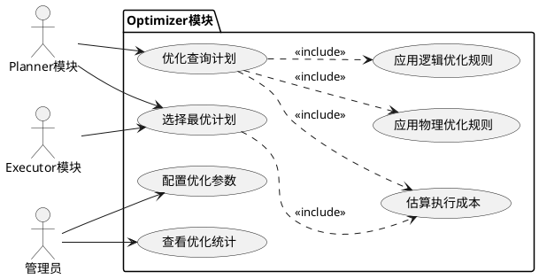
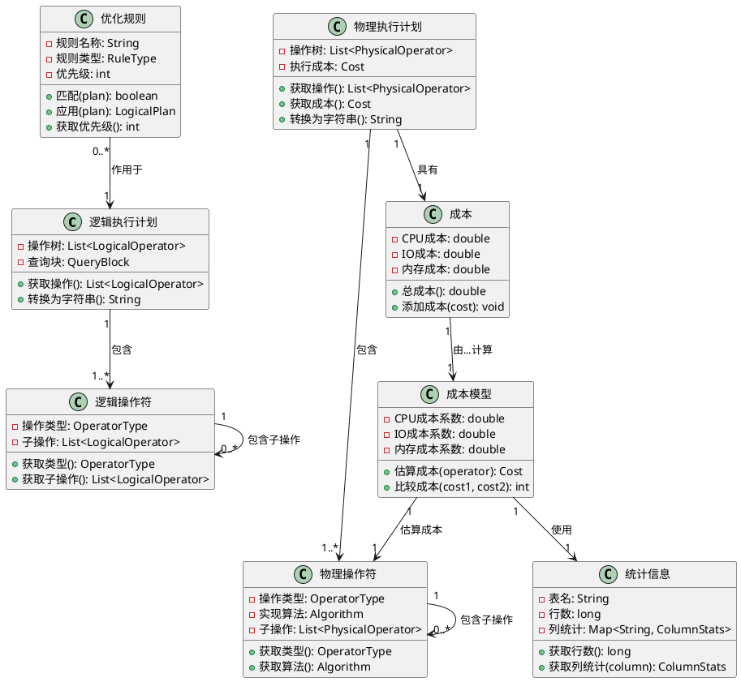
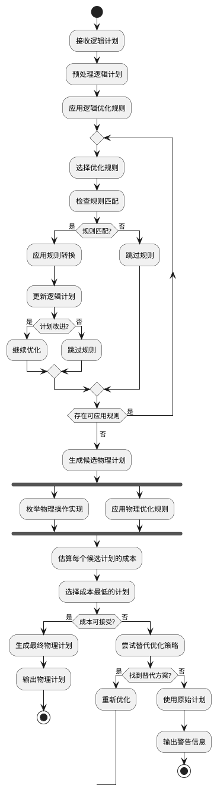
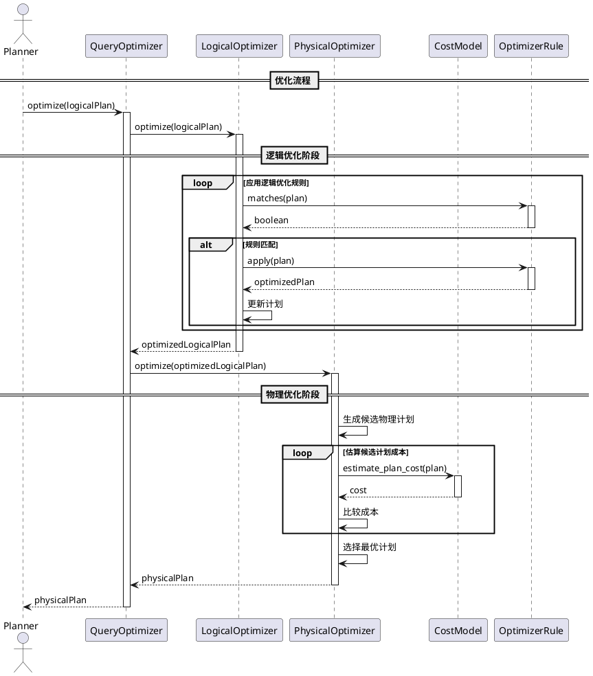

# SQLRustGo Optimizer模块设计文档

## 1. 模块概述

### 1.1 功能描述

Optimizer模块是SQLRustGo数据库系统的核心组件之一，负责将Parser生成的逻辑执行计划转换为高效的物理执行计划。该模块是查询处理流程的第二步，直接影响数据库的查询性能。

**核心职责：**

1. **逻辑优化**：
   - 基于代数等价变换优化逻辑计划
   - 应用启发式规则改进查询结构
   - 消除冗余操作和不必要的计算

2. **物理优化**：
   - 选择最优的物理操作实现（如不同的join算法）
   - 确定数据访问路径（索引扫描 vs 全表扫描）
   - 优化操作的执行顺序和并行策略

3. **成本估算**：
   - 基于统计信息估算操作成本
   - 比较不同执行计划的成本
   - 选择成本最低的执行计划

### 1.2 模块边界

**输入边界：**
- 逻辑执行计划（来自Parser模块）
- 表统计信息（来自Storage模块）
- 索引信息（来自Storage模块）
- 系统配置参数（成本模型参数、内存限制等）

**输出边界：**
- 物理执行计划（输出给Executor模块）
- 优化统计信息（用于性能监控）

**依赖关系：**
- 依赖：Parser模块（提供逻辑计划）、Storage模块（提供统计信息）
- 被依赖：Executor模块（使用物理执行计划）

**不包含的功能：**
- SQL语句解析（由Parser模块负责）
- 查询执行（由Executor模块负责）
- 数据存储管理（由Storage模块负责）
- 统计信息收集（由Storage模块负责）

## 2. OOA分析

### 2.1 用例图



### 2.2 概念类图



### 2.3 活动图



## 3. OOD设计

### 3.1 设计类图

```plantuml
@startuml OptimizerDesignClass

interface "Optimizer接口" as Optimizer {
    + optimize(logical_plan: LogicalPlan) -> Result<PhysicalPlan, OptimizeError>
    + get_statistics() -> OptimizerStatistics
    + reset_statistics() -> void
}

interface "OptimizerRule接口" as OptimizerRule {
    + name() -> String
    + rule_type() -> RuleType
    + priority() -> usize
    + matches(plan: &LogicalPlan) -> bool
    + apply(plan: LogicalPlan) -> Result<LogicalPlan, OptimizeError>
}

interface "CostModel接口" as CostModel {
    + estimate_cost(operator: &PhysicalOperator) -> Cost
    + estimate_plan_cost(plan: &PhysicalPlan) -> Cost
    + compare_costs(cost1: &Cost, cost2: &Cost) -> Ordering
}

interface "PhysicalOperator接口" as PhysicalOperator {
    + get_operator_type() -> OperatorType
    + get_children() -> Vec<&PhysicalOperator>
    + get_algorithm() -> Algorithm
    + estimate_cost(cost_model: &CostModel) -> Cost
}

interface "LogicalOperator接口" as LogicalOperator {
    + get_operator_type() -> OperatorType
    + get_children() -> Vec<&LogicalOperator>
    + to_physical() -> Vec<PhysicalOperator>
}

class "QueryOptimizer类" as QueryOptimizer {
    - logical_optimizer: LogicalOptimizer
    - physical_optimizer: PhysicalOptimizer
    - cost_model: Box<dyn CostModel>
    - statistics: OptimizerStatistics
    + new(cost_model: Box<dyn CostModel>) -> Self
    + optimize(logical_plan: LogicalPlan) -> Result<PhysicalPlan, OptimizeError>
    + get_statistics() -> OptimizerStatistics
    - apply_logical_rules(plan: LogicalPlan) -> Result<LogicalPlan, OptimizeError>
    - apply_physical_rules(plan: LogicalPlan) -> Result<PhysicalPlan, OptimizeError>
}

class "LogicalOptimizer类" as LogicalOptimizer {
    - rules: Vec<Box<dyn OptimizerRule>>
    - max_iterations: usize
    + new() -> Self
    + add_rule(rule: Box<dyn OptimizerRule>) -> void
    + optimize(plan: LogicalPlan) -> Result<LogicalPlan, OptimizeError>
    - find_applicable_rules(plan: &LogicalPlan) -> Vec<&dyn OptimizerRule>
    - apply_rule(rule: &dyn OptimizerRule, plan: LogicalPlan) -> Result<LogicalPlan, OptimizeError>
}

class "PhysicalOptimizer类" as PhysicalOptimizer {
    - cost_model: Box<dyn CostModel>
    - statistics: Statistics
    + new(cost_model: Box<dyn CostModel>, statistics: Statistics) -> Self
    + optimize(logical_plan: LogicalPlan) -> Result<PhysicalPlan, OptimizeError>
    - generate_physical_plans(logical_plan: LogicalPlan) -> Vec<PhysicalPlan>
    - select_best_plan(plans: Vec<PhysicalPlan>) -> PhysicalPlan
    - estimate_plan_cost(plan: &PhysicalPlan) -> Cost
}

class "PredicatePushdownRule类" as PredicatePushdownRule {
    + name() -> String
    + rule_type() -> RuleType
    + priority() -> usize
    + matches(plan: &LogicalPlan) -> bool
    + apply(plan: LogicalPlan) -> Result<LogicalPlan, OptimizeError>
    - push_down_predicate(plan: LogicalPlan, predicate: Expression) -> LogicalPlan
}

class "ProjectionPushdownRule类" as ProjectionPushdownRule {
    + name() -> String
    + rule_type() -> RuleType
    + priority() -> usize
    + matches(plan: &LogicalPlan) -> bool
    + apply(plan: LogicalPlan) -> Result<LogicalPlan, OptimizeError>
    - push_down_projection(plan: LogicalPlan, columns: Vec<String>) -> LogicalPlan
}

class "ConstantFoldingRule类" as ConstantFoldingRule {
    + name() -> String
    + rule_type() -> RuleType
    + priority() -> usize
    + matches(plan: &LogicalPlan) -> bool
    + apply(plan: LogicalPlan) -> Result<LogicalPlan, OptimizeError>
    - fold_constants(expression: Expression) -> Expression
}

class "JoinReorderRule类" as JoinReorderRule {
    + name() -> String
    + rule_type() -> RuleType
    + priority() -> usize
    + matches(plan: &LogicalPlan) -> bool
    + apply(plan: LogicalPlan) -> Result<LogicalPlan, OptimizeError>
    - reorder_joins(plan: LogicalPlan) -> LogicalPlan
}

class "StandardCostModel类" as StandardCostModel {
    - cpu_cost_coefficient: f64
    - io_cost_coefficient: f64
    - memory_cost_coefficient: f64
    - network_cost_coefficient: f64
    + new(config: CostConfig) -> Self
    + estimate_cost(operator: &PhysicalOperator) -> Cost
    + estimate_plan_cost(plan: &PhysicalPlan) -> Cost
    + compare_costs(cost1: &Cost, cost2: &Cost) -> Ordering
    - estimate_scan_cost(scan_op: &ScanOperator) -> Cost
    - estimate_join_cost(join_op: &JoinOperator) -> Cost
    - estimate_aggregate_cost(agg_op: &AggregateOperator) -> Cost
}

class "LogicalPlan类" as LogicalPlan {
    - root: Box<dyn LogicalOperator>
    - query_block: QueryBlock
    + new(root: Box<dyn LogicalOperator>, query_block: QueryBlock) -> Self
    + get_root() -> &dyn LogicalOperator
    + get_query_block() -> QueryBlock
    + clone() -> LogicalPlan
}

class "PhysicalPlan类" as PhysicalPlan {
    - root: Box<dyn PhysicalOperator>
    - total_cost: Cost
    + new(root: Box<dyn PhysicalOperator>, total_cost: Cost) -> Self
    + get_root() -> &dyn PhysicalOperator
    + get_total_cost() -> Cost
    + set_total_cost(cost: Cost) -> void
}

class "Cost结构体" as Cost {
    - cpu_cost: f64
    - io_cost: f64
    - memory_cost: f64
    - network_cost: f64
    + new() -> Self
    + total() -> f64
    + add_cpu_cost(cost: f64) -> void
    + add_io_cost(cost: f64) -> void
    + add_memory_cost(cost: f64) -> void
    + add_network_cost(cost: f64) -> void
}

class "ScanOperator类" as ScanOperator {
    - table_name: String
    - columns: Vec<String>
    - predicate: Option<Expression>
    - use_index: Option<IndexInfo>
    + get_table_name() -> String
    + get_columns() -> Vec<String>
    + get_predicate() -> Option<Expression>
    + get_index_info() -> Option<IndexInfo>
}

class "JoinOperator类" as JoinOperator {
    - join_type: JoinType
    - join_condition: Expression
    - left_child: Box<dyn PhysicalOperator>
    - right_child: Box<dyn PhysicalOperator>
    - algorithm: JoinAlgorithm
    + get_join_type() -> JoinType
    + get_condition() -> Expression
    + get_algorithm() -> JoinAlgorithm
}

class "AggregateOperator类" as AggregateOperator {
    - group_by: Vec<Expression>
    - aggregates: Vec<AggregateFunction>
    - child: Box<dyn PhysicalOperator>
    + get_group_by() -> Vec<Expression>
    + get_aggregates() -> Vec<AggregateFunction>
}

Optimizer <|.. QueryOptimizer
OptimizerRule <|.. PredicatePushdownRule
OptimizerRule <|.. ProjectionPushdownRule
OptimizerRule <|.. ConstantFoldingRule
OptimizerRule <|.. JoinReorderRule
CostModel <|.. StandardCostModel
PhysicalOperator <|.. ScanOperator
PhysicalOperator <|.. JoinOperator
PhysicalOperator <|.. AggregateOperator

QueryOptimizer o-- LogicalOptimizer
QueryOptimizer o-- PhysicalOptimizer
QueryOptimizer o-- CostModel
LogicalOptimizer o-- OptimizerRule
PhysicalOptimizer o-- CostModel
PhysicalPlan o-- PhysicalOperator
LogicalPlan o-- LogicalOperator
CostModel ..> Cost : 生成

@enduml
```



### 3.2 顺序图



## 4. 核心接口定义

### 4.1 Optimizer接口

```rust
pub trait Optimizer: Send + Sync {
    fn optimize(&mut self, logical_plan: LogicalPlan) -> Result<PhysicalPlan, OptimizeError>;
    
    fn get_statistics(&self) -> OptimizerStatistics;
    
    fn reset_statistics(&mut self);
    
    fn get_cost_model(&self) -> &dyn CostModel;
    
    fn set_cost_model(&mut self, cost_model: Box<dyn CostModel>);
}

#[derive(Debug, Clone)]
pub struct OptimizerStatistics {
    pub total_optimizations: usize,
    pub total_optimization_time: Duration,
    pub average_optimization_time: Duration,
    pub logical_rules_applied: usize,
    pub physical_plans_generated: usize,
    pub cost_estimations: usize,
}
```

### 4.2 OptimizerRule接口

```rust
pub trait OptimizerRule: Send + Sync + Debug {
    fn name(&self) -> &str;
    
    fn rule_type(&self) -> RuleType;
    
    fn priority(&self) -> usize;
    
    fn matches(&self, plan: &LogicalPlan) -> bool;
    
    fn apply(&self, plan: LogicalPlan) -> Result<LogicalPlan, OptimizeError>;
    
    fn is_enabled(&self) -> bool {
        true
    }
}

#[derive(Debug, Clone, PartialEq, Eq)]
pub enum RuleType {
    Logical,
    Physical,
    Transformation,
    Implementation,
}

impl PartialOrd for OptimizerRule {
    fn partial_cmp(&self, other: &Self) -> Option<Ordering> {
        Some(self.priority().cmp(&other.priority()))
    }
}
```

### 4.3 CostModel接口

```rust
pub trait CostModel: Send + Sync + Debug {
    fn estimate_cost(&self, operator: &PhysicalOperator) -> Cost;
    
    fn estimate_plan_cost(&self, plan: &PhysicalPlan) -> Cost;
    
    fn compare_costs(&self, cost1: &Cost, cost2: &Cost) -> Ordering;
    
    fn get_cpu_coefficient(&self) -> f64;
    
    fn get_io_coefficient(&self) -> f64;
    
    fn get_memory_coefficient(&self) -> f64;
    
    fn update_coefficients(&mut self, config: &CostConfig);
}

#[derive(Debug, Clone)]
pub struct Cost {
    cpu_cost: f64,
    io_cost: f64,
    memory_cost: f64,
    network_cost: f64,
}

impl Cost {
    pub fn new() -> Self {
        Cost {
            cpu_cost: 0.0,
            io_cost: 0.0,
            memory_cost: 0.0,
            network_cost: 0.0,
        }
    }
    
    pub fn total(&self) -> f64 {
        self.cpu_cost + self.io_cost + self.memory_cost + self.network_cost
    }
    
    pub fn add_cpu_cost(&mut self, cost: f64) {
        self.cpu_cost += cost;
    }
    
    pub fn add_io_cost(&mut self, cost: f64) {
        self.io_cost += cost;
    }
    
    pub fn add_memory_cost(&mut self, cost: f64) {
        self.memory_cost += cost;
    }
    
    pub fn add_network_cost(&mut self, cost: f64) {
        self.network_cost += cost;
    }
    
    pub fn merge(&mut self, other: &Cost) {
        self.cpu_cost += other.cpu_cost;
        self.io_cost += other.io_cost;
        self.memory_cost += other.memory_cost;
        self.network_cost += other.network_cost;
    }
}

impl Default for Cost {
    fn default() -> Self {
        Self::new()
    }
}

#[derive(Debug, Clone)]
pub struct CostConfig {
    pub cpu_coefficient: f64,
    pub io_coefficient: f64,
    pub memory_coefficient: f64,
    pub network_coefficient: f64,
}

impl Default for CostConfig {
    fn default() -> Self {
        CostConfig {
            cpu_coefficient: 0.01,
            io_coefficient: 1.0,
            memory_coefficient: 0.001,
            network_coefficient: 10.0,
        }
    }
}
```

### 4.4 PhysicalOperator接口

```rust
pub trait PhysicalOperator: Send + Sync + Debug {
    fn get_operator_type(&self) -> OperatorType;
    
    fn get_children(&self) -> Vec<&PhysicalOperator>;
    
    fn get_algorithm(&self) -> Algorithm;
    
    fn estimate_cost(&self, cost_model: &CostModel) -> Cost;
    
    fn get_output_schema(&self) -> Schema;
    
    fn explain(&self) -> String;
}

#[derive(Debug, Clone, PartialEq, Eq, Hash)]
pub enum OperatorType {
    Scan,
    Filter,
    Project,
    Join,
    Aggregate,
    Sort,
    Limit,
    Union,
    Insert,
    Update,
    Delete,
}

#[derive(Debug, Clone, PartialEq, Eq)]
pub enum Algorithm {
    SeqScan,
    IndexScan,
    NestedLoopJoin,
    HashJoin,
    MergeJoin,
    HashAggregate,
    SortAggregate,
    ExternalSort,
    QuickSort,
}
```

## 5. 支持的优化规则列表

### 5.1 谓词下推规则 (Predicate Pushdown)

**规则描述：**
将过滤条件尽可能下推到数据源，尽早过滤数据，减少后续处理的数据量。

**实现原理：**
```rust
pub struct PredicatePushdownRule {
    name: String,
    priority: usize,
}

impl OptimizerRule for PredicatePushdownRule {
    fn name(&self) -> &str {
        &self.name
    }
    
    fn rule_type(&self) -> RuleType {
        RuleType::Logical
    }
    
    fn priority(&self) -> usize {
        self.priority
    }
    
    fn matches(&self, plan: &LogicalPlan) -> bool {
        self.find_pushdown_predicates(plan).is_some()
    }
    
    fn apply(&self, plan: LogicalPlan) -> Result<LogicalPlan, OptimizeError> {
        let predicates = self.find_pushdown_predicates(&plan)
            .ok_or_else(|| OptimizeError::NoApplicablePredicates)?;
        
        let mut optimized_plan = plan;
        for predicate in predicates {
            optimized_plan = self.push_down_predicate(optimized_plan, predicate)?;
        }
        
        Ok(optimized_plan)
    }
}

impl PredicatePushdownRule {
    fn find_pushdown_predicates(&self, plan: &LogicalPlan) -> Option<Vec<Expression>> {
        let mut predicates = Vec::new();
        self.collect_predicates(plan.get_root(), &mut predicates);
        if predicates.is_empty() {
            None
        } else {
            Some(predicates)
        }
    }
    
    fn collect_predicates(&self, operator: &dyn LogicalOperator, predicates: &mut Vec<Expression>) {
        if operator.get_operator_type() == OperatorType::Filter {
            if let Some(filter_op) = operator.as_any().downcast_ref::<FilterOperator>() {
                predicates.push(filter_op.get_predicate().clone());
            }
        }
        
        for child in operator.get_children() {
            self.collect_predicates(child, predicates);
        }
    }
    
    fn push_down_predicate(&self, plan: LogicalPlan, predicate: Expression) -> Result<LogicalPlan, OptimizeError> {
        let root = plan.get_root();
        let optimized_root = self.push_down_recursive(root, predicate)?;
        Ok(LogicalPlan::new(optimized_root, plan.get_query_block().clone()))
    }
    
    fn push_down_recursive(&self, operator: &dyn LogicalOperator, predicate: Expression) -> Result<Box<dyn LogicalOperator>, OptimizeError> {
        match operator.get_operator_type() {
            OperatorType::Scan => {
                if let Some(scan_op) = operator.as_any().downcast_ref::<ScanOperator>() {
                    let new_scan = scan_op.with_predicate(Some(predicate));
                    Ok(Box::new(new_scan))
                } else {
                    Ok(operator.clone_box())
                }
            }
            OperatorType::Join => {
                if let Some(join_op) = operator.as_any().downcast_ref::<JoinOperator>() {
                    let (left_pred, right_pred) = self.split_predicate_for_join(&predicate, join_op)?;
                    let optimized_left = self.push_down_recursive(join_op.get_left_child(), left_pred)?;
                    let optimized_right = self.push_down_recursive(join_op.get_right_child(), right_pred)?;
                    let new_join = join_op.with_children(optimized_left, optimized_right);
                    Ok(Box::new(new_join))
                } else {
                    Ok(operator.clone_box())
                }
            }
            _ => {
                let mut optimized_children = Vec::new();
                for child in operator.get_children() {
                    optimized_children.push(self.push_down_recursive(child, predicate.clone())?);
                }
                Ok(operator.with_children(optimized_children))
            }
        }
    }
    
    fn split_predicate_for_join(&self, predicate: &Expression, join_op: &JoinOperator) -> Result<(Expression, Expression), OptimizeError> {
        let left_columns = join_op.get_left_schema().get_columns();
        let right_columns = join_op.get_right_schema().get_columns();
        
        let mut left_predicates = Vec::new();
        let mut right_predicates = Vec::new();
        let mut join_predicates = Vec::new();
        
        self.classify_predicate(predicate, &left_columns, &right_columns, 
                               &mut left_predicates, &mut right_predicates, &mut join_predicates);
        
        let left_expr = if left_predicates.is_empty() {
            Expression::Literal(true)
        } else {
            Expression::and(left_predicates)
        };
        
        let right_expr = if right_predicates.is_empty() {
            Expression::Literal(true)
        } else {
            Expression::and(right_predicates)
        };
        
        Ok((left_expr, right_expr))
    }
    
    fn classify_predicate(&self, predicate: &Expression, left_columns: &[String], right_columns: &[String],
                         left_preds: &mut Vec<Expression>, right_preds: &mut Vec<Expression>, 
                         join_preds: &mut Vec<Expression>) {
        match predicate {
            Expression::And(left, right) => {
                self.classify_predicate(left, left_columns, right_columns, left_preds, right_preds, join_preds);
                self.classify_predicate(right, left_columns, right_columns, left_preds, right_preds, join_preds);
            }
            Expression::Or(left, right) => {
                self.classify_predicate(left, left_columns, right_columns, left_preds, right_preds, join_preds);
                self.classify_predicate(right, left_columns, right_columns, left_preds, right_preds, join_preds);
            }
            _ => {
                let referenced_columns = self.get_referenced_columns(predicate);
                let left_only = referenced_columns.iter().all(|c| left_columns.contains(c));
                let right_only = referenced_columns.iter().all(|c| right_columns.contains(c));
                
                if left_only {
                    left_preds.push(predicate.clone());
                } else if right_only {
                    right_preds.push(predicate.clone());
                } else {
                    join_preds.push(predicate.clone());
                }
            }
        }
    }
    
    fn get_referenced_columns(&self, expression: &Expression) -> Vec<String> {
        let mut columns = Vec::new();
        self.collect_columns(expression, &mut columns);
        columns
    }
    
    fn collect_columns(&self, expression: &Expression, columns: &mut Vec<String>) {
        match expression {
            Expression::Column(name) => {
                if !columns.contains(name) {
                    columns.push(name.clone());
                }
            }
            Expression::BinaryOp { left, right, .. } => {
                self.collect_columns(left, columns);
                self.collect_columns(right, columns);
            }
            Expression::Function { args, .. } => {
                for arg in args {
                    self.collect_columns(arg, columns);
                }
            }
            _ => {}
        }
    }
}
```

### 5.2 投影下推规则 (Projection Pushdown)

**规则描述：**
将投影操作尽可能下推到数据源，只读取需要的列，减少I/O和内存开销。

**实现原理：**
```rust
pub struct ProjectionPushdownRule {
    name: String,
    priority: usize,
}

impl OptimizerRule for ProjectionPushdownRule {
    fn name(&self) -> &str {
        &self.name
    }
    
    fn rule_type(&self) -> RuleType {
        RuleType::Logical
    }
    
    fn priority(&self) -> usize {
        self.priority
    }
    
    fn matches(&self, plan: &LogicalPlan) -> bool {
        self.find_pushdown_projections(plan).is_some()
    }
    
    fn apply(&self, plan: LogicalPlan) -> Result<LogicalPlan, OptimizeError> {
        let required_columns = self.find_pushdown_projections(&plan)
            .ok_or_else(|| OptimizeError::NoApplicableProjections)?;
        
        let optimized_plan = self.push_down_projections(plan, required_columns)?;
        Ok(optimized_plan)
    }
}

impl ProjectionPushdownRule {
    fn find_pushdown_projections(&self, plan: &LogicalPlan) -> Option<Vec<String>> {
        let root = plan.get_root();
        if root.get_operator_type() == OperatorType::Project {
            if let Some(project_op) = root.as_any().downcast_ref::<ProjectOperator>() {
                Some(project_op.get_columns().clone())
            } else {
                None
            }
        } else {
            None
        }
    }
    
    fn push_down_projections(&self, plan: LogicalPlan, required_columns: Vec<String>) -> Result<LogicalPlan, OptimizeError> {
        let root = plan.get_root();
        let optimized_root = self.push_down_recursive(root, &required_columns)?;
        Ok(LogicalPlan::new(optimized_root, plan.get_query_block().clone()))
    }
    
    fn push_down_recursive(&self, operator: &dyn LogicalOperator, required_columns: &[String]) -> Result<Box<dyn LogicalOperator>, OptimizeError> {
        match operator.get_operator_type() {
            OperatorType::Scan => {
                if let Some(scan_op) = operator.as_any().downcast_ref::<ScanOperator>() {
                    let available_columns = scan_op.get_schema().get_columns();
                    let columns_to_read: Vec<String> = required_columns.iter()
                        .filter(|c| available_columns.contains(c))
                        .cloned()
                        .collect();
                    
                    if columns_to_read.len() < available_columns.len() {
                        let new_scan = scan_op.with_columns(columns_to_read);
                        Ok(Box::new(new_scan))
                    } else {
                        Ok(operator.clone_box())
                    }
                } else {
                    Ok(operator.clone_box())
                }
            }
            OperatorType::Project => {
                if let Some(project_op) = operator.as_any().downcast_ref::<ProjectOperator>() {
                    let project_columns = project_op.get_columns();
                    let new_required_columns: Vec<String> = required_columns.iter()
                        .filter(|c| project_columns.contains(c))
                        .cloned()
                        .collect();
                    
                    let child = project_op.get_child();
                    let optimized_child = self.push_down_recursive(child, &new_required_columns)?;
                    
                    let new_project = project_op.with_child_and_columns(optimized_child, new_required_columns);
                    Ok(Box::new(new_project))
                } else {
                    Ok(operator.clone_box())
                }
            }
            OperatorType::Join => {
                if let Some(join_op) = operator.as_any().downcast_ref::<JoinOperator>() {
                    let left_schema = join_op.get_left_schema();
                    let right_schema = join_op.get_right_schema();
                    
                    let left_required: Vec<String> = required_columns.iter()
                        .filter(|c| left_schema.has_column(c))
                        .cloned()
                        .collect();
                    
                    let right_required: Vec<String> = required_columns.iter()
                        .filter(|c| right_schema.has_column(c))
                        .cloned()
                        .collect();
                    
                    let optimized_left = self.push_down_recursive(join_op.get_left_child(), &left_required)?;
                    let optimized_right = self.push_down_recursive(join_op.get_right_child(), &right_required)?;
                    
                    let new_join = join_op.with_children(optimized_left, optimized_right);
                    Ok(Box::new(new_join))
                } else {
                    Ok(operator.clone_box())
                }
            }
            _ => {
                let mut optimized_children = Vec::new();
                for child in operator.get_children() {
                    optimized_children.push(self.push_down_recursive(child, required_columns)?);
                }
                Ok(operator.with_children(optimized_children))
            }
        }
    }
}
```

### 5.3 常量折叠规则 (Constant Folding)

**规则描述：**
在编译时计算常量表达式，减少运行时计算开销。

**实现原理：**
```rust
pub struct ConstantFoldingRule {
    name: String,
    priority: usize,
}

impl OptimizerRule for ConstantFoldingRule {
    fn name(&self) -> &str {
        &self.name
    }
    
    fn rule_type(&self) -> RuleType {
        RuleType::Logical
    }
    
    fn priority(&self) -> usize {
        self.priority
    }
    
    fn matches(&self, plan: &LogicalPlan) -> bool {
        self.has_foldable_expressions(plan)
    }
    
    fn apply(&self, plan: LogicalPlan) -> Result<LogicalPlan, OptimizeError> {
        let root = plan.get_root();
        let optimized_root = self.fold_constants_recursive(root)?;
        Ok(LogicalPlan::new(optimized_root, plan.get_query_block().clone()))
    }
}

impl ConstantFoldingRule {
    fn has_foldable_expressions(&self, plan: &LogicalPlan) -> bool {
        self.contains_foldable_expression(plan.get_root())
    }
    
    fn contains_foldable_expression(&self, operator: &dyn LogicalOperator) -> bool {
        if let Some(filter_op) = operator.as_any().downcast_ref::<FilterOperator>() {
            if self.is_foldable(&filter_op.get_predicate()) {
                return true;
            }
        }
        
        if let Some(project_op) = operator.as_any().downcast_ref::<ProjectOperator>() {
            for expr in project_op.get_expressions() {
                if self.is_foldable(expr) {
                    return true;
                }
            }
        }
        
        for child in operator.get_children() {
            if self.contains_foldable_expression(child) {
                return true;
            }
        }
        
        false
    }
    
    fn is_foldable(&self, expression: &Expression) -> bool {
        match expression {
            Expression::BinaryOp { left, right, .. } => {
                self.is_constant(left) && self.is_constant(right)
            }
            Expression::UnaryOp { operand, .. } => {
                self.is_constant(operand)
            }
            Expression::Function { name, args } => {
                if self.is_foldable_function(name) {
                    args.iter().all(|arg| self.is_constant(arg))
                } else {
                    false
                }
            }
            _ => false
        }
    }
    
    fn is_constant(&self, expression: &Expression) -> bool {
        matches!(expression, Expression::Literal(_) | Expression::Parameter(_))
    }
    
    fn is_foldable_function(&self, name: &str) -> bool {
        matches!(name.to_lowercase().as_str(), 
            "abs" | "ceil" | "floor" | "round" | "sqrt" | "exp" | "ln" | "log10" |
            "sin" | "cos" | "tan" | "asin" | "acos" | "atan" |
            "length" | "lower" | "upper" | "trim" | "ltrim" | "rtrim")
    }
    
    fn fold_constants_recursive(&self, operator: &dyn LogicalOperator) -> Result<Box<dyn LogicalOperator>, OptimizeError> {
        let mut optimized_children = Vec::new();
        for child in operator.get_children() {
            optimized_children.push(self.fold_constants_recursive(child)?);
        }
        
        let optimized_operator = match operator.get_operator_type() {
            OperatorType::Filter => {
                if let Some(filter_op) = operator.as_any().downcast_ref::<FilterOperator>() {
                    let folded_predicate = self.fold_expression(&filter_op.get_predicate())?;
                    let new_filter = filter_op.with_predicate(folded_predicate);
                    new_filter.with_children(optimized_children)
                } else {
                    operator.with_children(optimized_children)
                }
            }
            OperatorType::Project => {
                if let Some(project_op) = operator.as_any().downcast_ref::<ProjectOperator>() {
                    let folded_expressions: Result<Vec<_>, _> = project_op.get_expressions()
                        .iter()
                        .map(|expr| self.fold_expression(expr))
                        .collect();
                    let new_project = project_op.with_expressions(folded_expressions?);
                    new_project.with_children(optimized_children)
                } else {
                    operator.with_children(optimized_children)
                }
            }
            _ => operator.with_children(optimized_children)
        };
        
        Ok(optimized_operator)
    }
    
    fn fold_expression(&self, expression: &Expression) -> Result<Expression, OptimizeError> {
        match expression {
            Expression::BinaryOp { op, left, right } => {
                let folded_left = self.fold_expression(left)?;
                let folded_right = self.fold_expression(right)?;
                
                if let (Expression::Literal(left_val), Expression::Literal(right_val)) = (&folded_left, &folded_right) {
                    self.evaluate_binary_op(op, left_val, right_val)
                } else {
                    Ok(Expression::BinaryOp {
                        op: op.clone(),
                        left: Box::new(folded_left),
                        right: Box::new(folded_right),
                    })
                }
            }
            Expression::UnaryOp { op, operand } => {
                let folded_operand = self.fold_expression(operand)?;
                
                if let Expression::Literal(val) = folded_operand {
                    self.evaluate_unary_op(op, &val)
                } else {
                    Ok(Expression::UnaryOp {
                        op: op.clone(),
                        operand: Box::new(folded_operand),
                    })
                }
            }
            Expression::Function { name, args } => {
                let folded_args: Result<Vec<_>, _> = args.iter()
                    .map(|arg| self.fold_expression(arg))
                    .collect();
                
                let folded_args = folded_args?;
                
                if folded_args.iter().all(|arg| matches!(arg, Expression::Literal(_))) {
                    self.evaluate_function(name, &folded_args)
                } else {
                    Ok(Expression::Function {
                        name: name.clone(),
                        args: folded_args,
                    })
                }
            }
            _ => Ok(expression.clone())
        }
    }
    
    fn evaluate_binary_op(&self, op: &BinaryOperator, left: &Value, right: &Value) -> Result<Expression, OptimizeError> {
        match (left, right) {
            (Value::Int(l), Value::Int(r)) => {
                let result = match op {
                    BinaryOperator::Add => Value::Int(l + r),
                    BinaryOperator::Subtract => Value::Int(l - r),
                    BinaryOperator::Multiply => Value::Int(l * r),
                    BinaryOperator::Divide => {
                        if *r == 0 {
                            return Err(OptimizeError::DivisionByZero);
                        }
                        Value::Int(l / r)
                    }
                    BinaryOperator::Modulo => {
                        if *r == 0 {
                            return Err(OptimizeError::DivisionByZero);
                        }
                        Value::Int(l % r)
                    }
                    _ => return Ok(Expression::BinaryOp {
                        op: op.clone(),
                        left: Box::new(Expression::Literal(left.clone())),
                        right: Box::new(Expression::Literal(right.clone())),
                    })
                };
                Ok(Expression::Literal(result))
            }
            (Value::Float(l), Value::Float(r)) => {
                let result = match op {
                    BinaryOperator::Add => Value::Float(l + r),
                    BinaryOperator::Subtract => Value::Float(l - r),
                    BinaryOperator::Multiply => Value::Float(l * r),
                    BinaryOperator::Divide => {
                        if *r == 0.0 {
                            return Err(OptimizeError::DivisionByZero);
                        }
                        Value::Float(l / r)
                    }
                    BinaryOperator::Modulo => {
                        if *r == 0.0 {
                            return Err(OptimizeError::DivisionByZero);
                        }
                        Value::Float(l % r)
                    }
                    _ => return Ok(Expression::BinaryOp {
                        op: op.clone(),
                        left: Box::new(Expression::Literal(left.clone())),
                        right: Box::new(Expression::Literal(right.clone())),
                    })
                };
                Ok(Expression::Literal(result))
            }
            _ => Ok(Expression::BinaryOp {
                op: op.clone(),
                left: Box::new(Expression::Literal(left.clone())),
                right: Box::new(Expression::Literal(right.clone())),
            })
        }
    }
    
    fn evaluate_unary_op(&self, op: &UnaryOperator, operand: &Value) -> Result<Expression, OptimizeError> {
        let result = match (op, operand) {
            (UnaryOperator::Minus, Value::Int(v)) => Value::Int(-v),
            (UnaryOperator::Minus, Value::Float(v)) => Value::Float(-v),
            (UnaryOperator::Not, Value::Boolean(v)) => Value::Boolean(!v),
            _ => return Ok(Expression::UnaryOp {
                op: op.clone(),
                operand: Box::new(Expression::Literal(operand.clone())),
            })
        };
        Ok(Expression::Literal(result))
    }
    
    fn evaluate_function(&self, name: &str, args: &[Expression]) -> Result<Expression, OptimizeError> {
        let values: Vec<Value> = args.iter()
            .filter_map(|expr| {
                if let Expression::Literal(v) = expr {
                    Some(v.clone())
                } else {
                    None
                }
            })
            .collect();
        
        if values.len() != args.len() {
            return Ok(Expression::Function {
                name: name.to_string(),
                args: args.to_vec(),
            });
        }
        
        let result = match name.to_lowercase().as_str() {
            "abs" => {
                if let Value::Int(v) = values[0] {
                    Value::Int(v.abs())
                } else if let Value::Float(v) = values[0] {
                    Value::Float(v.abs())
                } else {
                    return Err(OptimizeError::InvalidFunctionArgument);
                }
            }
            "ceil" => {
                if let Value::Float(v) = values[0] {
                    Value::Float(v.ceil())
                } else {
                    return Err(OptimizeError::InvalidFunctionArgument);
                }
            }
            "floor" => {
                if let Value::Float(v) = values[0] {
                    Value::Float(v.floor())
                } else {
                    return Err(OptimizeError::InvalidFunctionArgument);
                }
            }
            "length" => {
                if let Value::String(s) = &values[0] {
                    Value::Int(s.len() as i64)
                } else {
                    return Err(OptimizeError::InvalidFunctionArgument);
                }
            }
            "lower" => {
                if let Value::String(s) = &values[0] {
                    Value::String(s.to_lowercase())
                } else {
                    return Err(OptimizeError::InvalidFunctionArgument);
                }
            }
            "upper" => {
                if let Value::String(s) = &values[0] {
                    Value::String(s.to_uppercase())
                } else {
                    return Err(OptimizeError::InvalidFunctionArgument);
                }
            }
            _ => return Ok(Expression::Function {
                name: name.to_string(),
                args: args.to_vec(),
            })
        };
        
        Ok(Expression::Literal(result))
    }
}
```

### 5.4 其他支持的优化规则

| 规则名称 | 类型 | 优先级 | 描述 |
|---------|------|--------|------|
| **JoinReorderRule** | Logical | 100 | 重新排序连接操作，选择最优的连接顺序 |
| **ColumnPruningRule** | Logical | 90 | 移除不需要的列，减少数据传输 |
| **DistinctEliminationRule** | Logical | 80 | 消除不必要的DISTINCT操作 |
| **SubqueryUnnestRule** | Logical | 70 | 将子查询转换为连接操作 |
| **LimitPushdownRule** | Logical | 60 | 将LIMIT操作下推，减少处理的数据量 |
| **IndexScanRule** | Physical | 200 | 选择合适的索引扫描策略 |
| **JoinAlgorithmSelectionRule** | Physical | 190 | 选择最优的连接算法（Hash Join、Merge Join等） |
| **SortEliminationRule** | Physical | 180 | 消除不必要的排序操作 |
| **AggregatePushdownRule** | Logical | 50 | 将聚合操作下推到数据源 |
| **ViewMergingRule** | Logical | 40 | 合并视图定义，避免重复计算 |

## 6. 扩展点说明

### 6.1 自定义优化规则

支持用户自定义优化规则：

```rust
pub trait CustomOptimizerRule: OptimizerRule {
    fn initialize(&mut self, config: &RuleConfig) -> Result<(), OptimizeError>;
    
    fn validate(&self) -> Result<(), OptimizeError>;
}

pub struct RuleConfig {
    pub enabled: bool,
    pub priority: usize,
    pub parameters: HashMap<String, String>,
}

impl Optimizer {
    pub fn add_custom_rule(&mut self, rule: Box<dyn CustomOptimizerRule>) -> Result<(), OptimizeError> {
        rule.validate()?;
        self.logical_optimizer.add_custom_rule(rule);
        Ok(())
    }
}
```

### 6.2 自定义成本模型

支持用户自定义成本估算模型：

```rust
pub trait CustomCostModel: CostModel {
    fn initialize(&mut self, config: &CostModelConfig) -> Result<(), OptimizeError>;
    
    fn update_statistics(&mut self, stats: &Statistics);
}

pub struct CostModelConfig {
    pub coefficients: CostConfig,
    pub machine_specs: MachineSpecs,
    pub workload_characteristics: WorkloadCharacteristics,
}

pub struct MachineSpecs {
    pub cpu_cores: usize,
    pub memory_gb: usize,
    pub disk_io_bandwidth: f64,
    pub network_bandwidth: f64,
}
```

### 6.3 优化策略插件

支持插件式的优化策略：

```rust
pub trait OptimizationStrategy: Send + Sync + Debug {
    fn name(&self) -> &str;
    
    fn optimize(&self, logical_plan: LogicalPlan, cost_model: &CostModel) -> Result<PhysicalPlan, OptimizeError>;
    
    fn can_handle(&self, plan: &LogicalPlan) -> bool;
}

pub struct StrategyPlugin {
    name: String,
    strategy: Box<dyn OptimizationStrategy>,
    priority: usize,
}

impl Optimizer {
    pub fn register_strategy(&mut self, plugin: StrategyPlugin) {
        self.strategies.push(plugin);
        self.strategies.sort_by_key(|s| s.priority);
    }
}
```

### 6.4 统计信息提供者

支持自定义统计信息来源：

```rust
pub trait StatisticsProvider: Send + Sync + Debug {
    fn get_table_statistics(&self, table_name: &str) -> Result<TableStatistics, OptimizeError>;
    
    fn get_column_statistics(&self, table_name: &str, column_name: &str) -> Result<ColumnStatistics, OptimizeError>;
    
    fn get_index_statistics(&self, index_name: &str) -> Result<IndexStatistics, OptimizeError>;
    
    fn update_statistics(&mut self) -> Result<(), OptimizeError>;
}

#[derive(Debug, Clone)]
pub struct TableStatistics {
    pub row_count: usize,
    pub page_count: usize,
    pub avg_row_length: f64,
    pub last_analyzed: DateTime<Utc>,
}

#[derive(Debug, Clone)]
pub struct ColumnStatistics {
    pub null_count: usize,
    pub distinct_count: usize,
    pub min_value: Option<Value>,
    pub max_value: Option<Value>,
    pub histogram: Option<Histogram>,
}
```

### 6.5 优化监控和诊断

支持优化过程的监控和诊断：

```rust
pub trait OptimizationMonitor: Send + Sync + Debug {
    fn on_optimization_start(&mut self, plan: &LogicalPlan);
    
    fn on_rule_applied(&mut self, rule: &dyn OptimizerRule, plan: &LogicalPlan);
    
    fn on_optimization_complete(&mut self, result: &Result<PhysicalPlan, OptimizeError>);
    
    fn get_metrics(&self) -> OptimizationMetrics;
}

#[derive(Debug, Clone)]
pub struct OptimizationMetrics {
    pub rules_applied: Vec<String>,
    pub plans_generated: usize,
    pub total_time: Duration,
    pub cost_reduction: f64,
    pub memory_usage: usize,
}

pub struct DiagnosticLogger {
    log_level: LogLevel,
    output: Box<dyn Write + Send>,
}

impl OptimizationMonitor for DiagnosticLogger {
    fn on_optimization_start(&mut self, plan: &LogicalPlan) {
        self.log_info(&format!("Optimization started for plan: {}", plan.get_root().get_operator_type()));
    }
    
    fn on_rule_applied(&mut self, rule: &dyn OptimizerRule, plan: &LogicalPlan) {
        self.log_debug(&format!("Applied rule: {}", rule.name()));
    }
    
    fn on_optimization_complete(&mut self, result: &Result<PhysicalPlan, OptimizeError>) {
        match result {
            Ok(plan) => {
                self.log_info(&format!("Optimization completed. Total cost: {}", plan.get_total_cost().total()));
            }
            Err(error) => {
                self.log_error(&format!("Optimization failed: {}", error));
            }
        }
    }
    
    fn get_metrics(&self) -> OptimizationMetrics {
        OptimizationMetrics {
            rules_applied: vec![],
            plans_generated: 0,
            total_time: Duration::from_secs(0),
            cost_reduction: 0.0,
            memory_usage: 0,
        }
    }
}
```

### 6.6 并行优化支持

支持并行执行优化规则：

```rust
pub trait ParallelOptimizer: Optimizer {
    fn set_parallelism(&mut self, degree: usize);
    
    fn get_parallelism(&self) -> usize;
    
    fn optimize_parallel(&mut self, logical_plan: LogicalPlan) -> Result<PhysicalPlan, OptimizeError>;
}

pub struct ParallelQueryOptimizer {
    inner: QueryOptimizer,
    parallelism: usize,
    thread_pool: ThreadPool,
}

impl ParallelOptimizer for ParallelQueryOptimizer {
    fn set_parallelism(&mut self, degree: usize) {
        self.parallelism = degree.max(1);
    }
    
    fn get_parallelism(&self) -> usize {
        self.parallelism
    }
    
    fn optimize_parallel(&mut self, logical_plan: LogicalPlan) -> Result<PhysicalPlan, OptimizeError> {
        if self.parallelism <= 1 {
            return self.inner.optimize(logical_plan);
        }
        
        let rules = self.inner.logical_optimizer.get_applicable_rules(&logical_plan);
        let mut results = Vec::new();
        
        for rule in rules {
            let rule_clone = rule.clone_box();
            let plan_clone = logical_plan.clone();
            
            let result = self.thread_pool.spawn(move || {
                rule_clone.apply(plan_clone)
            });
            
            results.push(result);
        }
        
        let mut best_plan = logical_plan;
        let mut best_cost = f64::MAX;
        
        for result in results {
            match result.join() {
                Ok(Ok(plan)) => {
                    let cost = self.inner.cost_model.estimate_plan_cost(&plan);
                    if cost.total() < best_cost {
                        best_cost = cost.total();
                        best_plan = plan;
                    }
                }
                _ => continue
            }
        }
        
        self.inner.physical_optimizer.optimize(best_plan)
    }
}
```

## 7. 设计原则和最佳实践

### 7.1 设计原则

1. **模块化设计**：逻辑优化和物理优化分离，便于独立开发和测试
2. **可扩展性**：通过trait和插件机制支持自定义规则和成本模型
3. **性能优先**：优化过程本身不能成为性能瓶颈
4. **正确性保证**：优化必须保持查询语义的等价性
5. **可观测性**：提供详细的优化过程信息和统计

### 7.2 性能优化策略

1. **规则缓存**：缓存已应用的规则，避免重复计算
2. **成本估算缓存**：缓存相似计划的成本估算结果
3. **并行优化**：利用多核CPU并行应用优化规则
4. **增量优化**：对部分修改的计划进行增量优化
5. **早停机制**：当成本改进不大时提前终止优化

### 7.3 质量保证

1. **等价性验证**：确保优化前后查询语义等价
2. **成本模型校准**：定期校准成本模型参数
3. **A/B测试**：对比不同优化策略的效果
4. **回归测试**：确保新规则不影响现有查询的正确性
5. **性能基准**：建立性能基准，监控优化效果

---

**文档版本**: 1.0  
**最后更新**: 2026-06-01  
**维护者**: SQLRustGo开发团队