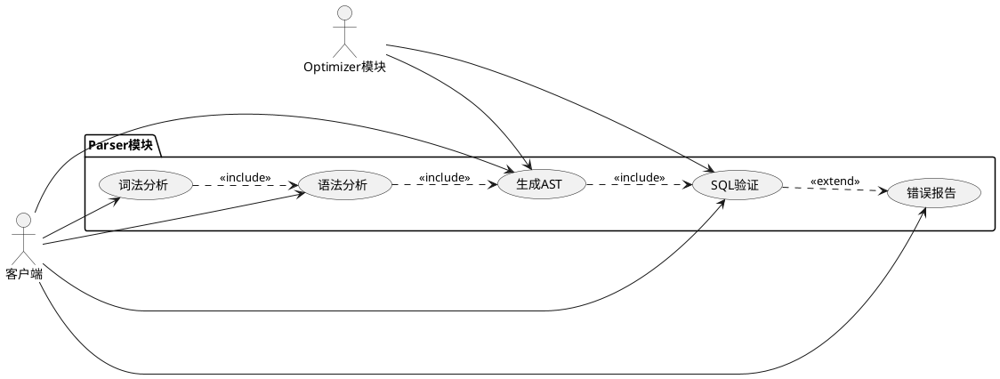
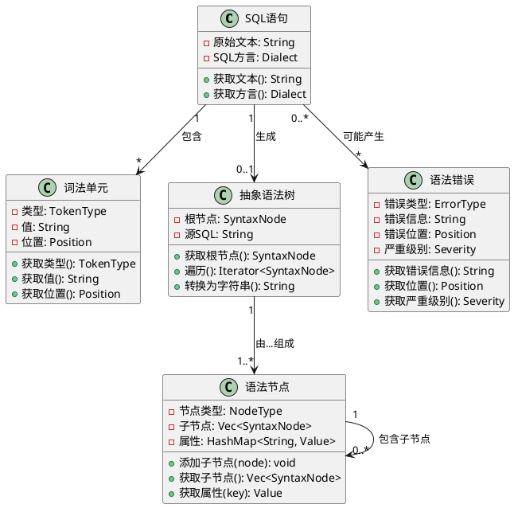
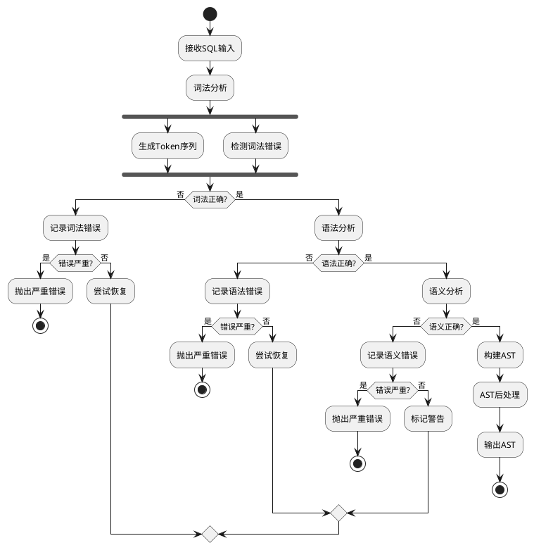
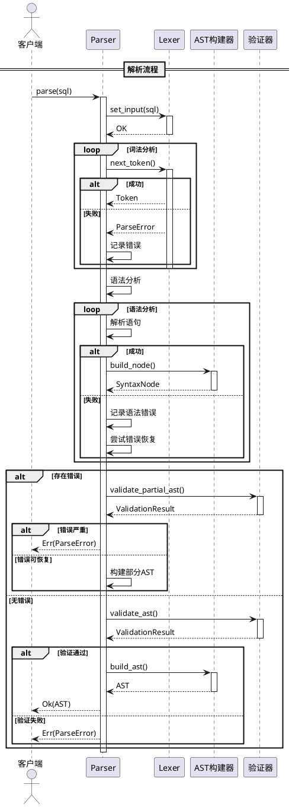
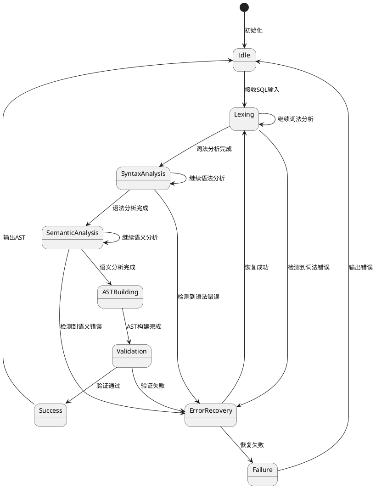
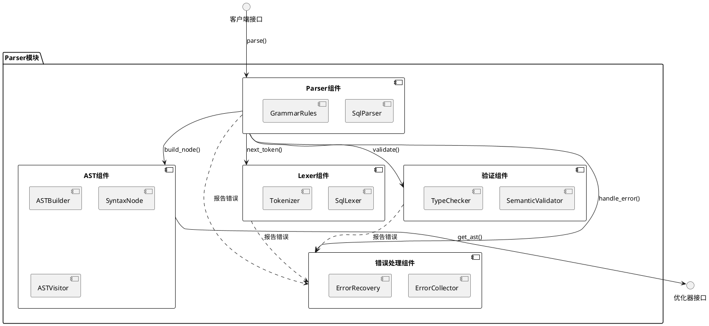

# SQLRustGo Parser模块设计文档

## 1. 模块概述

### 1.1 功能描述

Parser模块是SQLRustGo数据库系统的核心组件之一，负责将原始SQL语句转换为结构化的抽象语法树（AST）。该模块是查询处理流程的第一步，为后续的优化和执行提供基础数据结构。

**核心功能：**
- 词法分析：将SQL字符串分解为词法单元（Token）
- 语法分析：根据SQL语法规则构建抽象语法树
- 语义验证：检查SQL语句的语义正确性
- 错误处理：提供详细的语法错误信息和位置
- AST构建：生成可被优化器和执行器使用的抽象语法树

### 1.2 模块边界

**输入边界：**
- 原始SQL字符串（来自客户端或上层模块）
- SQL方言配置（支持MySQL、PostgreSQL等）

**输出边界：**
- 抽象语法树（AST）- 输出给Optimizer模块
- 解析错误信息 - 输出给错误处理模块

**依赖关系：**
- 依赖：无（Parser是独立的底层模块）
- 被依赖：Optimizer模块、Executor模块

**不包含的功能：**
- SQL查询优化（由Optimizer模块负责）
- 数据执行操作（由Executor模块负责）
- 数据存储管理（由Storage模块负责）

## 2. OOA分析

### 2.1 用例图



### 2.2 概念类图



### 2.3 活动图



## 3. OOD设计

### 3.1 设计类图

```plantuml
@startuml ParserDesignClass
interface "Lexer接口" as Lexer {
    + next_token(): Result<Token, ParseError>
    + peek_token(): Result<Token, ParseError>
    + get_position(): Position
    + reset(): void
    + set_input(input: String): void
}

interface "Parser接口" as Parser {
    + parse(sql: String) -> Result<AST, ParseError>
    + validate(ast: &AST) -> Result<bool, ParseError>
    + get_errors() -> Vec<ParseError>
}

interface "ASTVisitor" as ASTVisitor {
    + visit(node: &SyntaxNode) -> Result<(), ParseError>
    + visit_select(node: &SelectNode) -> Result<(), ParseError>
    + visit_insert(node: &InsertNode) -> Result<(), ParseError>
    + visit_update(node: &UpdateNode) -> Result<(), ParseError>
    + visit_delete(node: &DeleteNode) -> Result<(), ParseError>
}

class "SqlLexer类" as SqlLexer {
    - input: String
    - position: usize
    - current_char: Option<char>
    - tokens: Vec<Token>
    - dialect: Dialect
    + new(input: String, dialect: Dialect) -> Self
    + next_token() -> Result<Token, ParseError>
    + peek_token() -> Result<Token, ParseError>
    - skip_whitespace() -> void
    - read_number() -> Result<String, ParseError>
    - read_identifier() -> Result<String, ParseError>
    - read_string() -> Result<String, ParseError>
    - read_operator() -> Result<String, ParseError>
}

class "SqlParser类" as SqlParser {
    - lexer: Box<dyn Lexer>
    - current_token: Option<Token>
    - errors: Vec<ParseError>
    - dialect: Dialect
    + new(lexer: Box<dyn Lexer>) -> Self
    + parse(sql: String) -> Result<AST, ParseError>
    + validate(ast: &AST) -> Result<bool, ParseError>
    + get_errors() -> Vec<ParseError>
    - parse_statement() -> Result<Box<dyn SyntaxNode>, ParseError>
    - parse_select() -> Result<SelectNode, ParseError>
    - parse_insert() -> Result<InsertNode, ParseError>
    - parse_update() -> Result<UpdateNode, ParseError>
    - parse_delete() -> Result<DeleteNode, ParseError>
    - parse_expression() -> Result<ExpressionNode, ParseError>
    - expect_token(token_type: TokenType) -> Result<Token, ParseError>
}

class "Token类" as Token {
    - token_type: TokenType
    - value: String
    - position: Position
    + new(token_type: TokenType, value: String, position: Position) -> Self
    + get_type() -> TokenType
    + get_value() -> String
    + get_position() -> Position
    + is_keyword() -> bool
    + is_operator() -> bool
}

class "AST类" as AST {
    - root_node: Box<dyn SyntaxNode>
    - source: String
    - dialect: Dialect
    + new(root_node: Box<dyn SyntaxNode>, source: String, dialect: Dialect) -> Self
    + get_root_node() -> &dyn SyntaxNode
    + get_source() -> String
    + accept(visitor: &dyn ASTVisitor) -> Result<(), ParseError>
    + to_string() -> String
}

class "ParseError类" as ParseError {
    - error_type: ErrorType
    - message: String
    - position: Position
    - severity: Severity
    + new(error_type: ErrorType, message: String, position: Position) -> Self
    + get_type() -> ErrorType
    + get_message() -> String
    + get_position() -> Position
    + get_severity() -> Severity
}

class "Position结构体" as Position {
    - line: usize
    - column: usize
    - offset: usize
    + new(line: usize, column: usize, offset: usize) -> Self
    + get_line() -> usize
    + get_column() -> usize
    + get_offset() -> usize
}

trait "SyntaxNode特征" as SyntaxNode {
    + get_node_type() -> NodeType
    + get_children() -> Vec<&dyn SyntaxNode>
    + accept(visitor: &dyn ASTVisitor) -> Result<(), ParseError>
    + to_string() -> String
}

class "SelectNode" as SelectNode {
    - columns: Vec<ExpressionNode>
    - from: TableReference
    - where_clause: Option<ExpressionNode>
    - group_by: Vec<ExpressionNode>
    - having: Option<ExpressionNode>
    - order_by: Vec<OrderByClause>
    - limit: Option<usize>
    + get_columns() -> Vec<ExpressionNode>
    + get_from() -> TableReference
}

class "InsertNode" as InsertNode {
    - table: String
    - columns: Vec<String>
    - values: Vec<Vec<ExpressionNode>>
    + get_table() -> String
    + get_columns() -> Vec<String>
    + get_values() -> Vec<Vec<ExpressionNode>>
}

class "UpdateNode" as UpdateNode {
    - table: String
    - assignments: Vec<Assignment>
    - where_clause: Option<ExpressionNode>
    + get_table() -> String
    + get_assignments() -> Vec<Assignment>
}

class "DeleteNode" as DeleteNode {
    - table: String
    - where_clause: Option<ExpressionNode>
    + get_table() -> String
    + get_where_clause() -> Option<ExpressionNode>
}

enum "TokenType" as TokenType {
    KEYWORD
    IDENTIFIER
    NUMBER
    STRING
    OPERATOR
    DELIMITER
    EOF
}

enum "NodeType" as NodeType {
    SELECT
    INSERT
    UPDATE
    DELETE
    EXPRESSION
    TABLE_REFERENCE
}

enum "ErrorType" as ErrorType {
    LEXICAL_ERROR
    SYNTAX_ERROR
    SEMANTIC_ERROR
}

enum "Severity" as Severity {
    ERROR
    WARNING
    INFO
}

Lexer <|.. SqlLexer
Parser <|.. SqlParser
SyntaxNode <|.. SelectNode
SyntaxNode <|.. InsertNode
SyntaxNode <|.. UpdateNode
SyntaxNode <|.. DeleteNode
ASTVisitor <|.. SqlParser

SqlParser o-- Lexer : 使用
SqlParser --> Token : 处理
SqlParser --> AST : 生成
SqlParser --> ParseError : 报告
AST --> SyntaxNode : 包含
Token ..> TokenType : 使用
ParseError ..> ErrorType : 使用
ParseError ..> Severity : 使用
SelectNode ..> NodeType : 使用
InsertNode ..> NodeType : 使用
UpdateNode ..> NodeType : 使用
DeleteNode ..> NodeType : 使用

@enduml
```

### 3.2 顺序图



### 3.3 状态图



### 3.4 组件图



## 4. 核心接口定义

### 4.1 Lexer接口

```rust
pub trait Lexer: Send + Sync {
    fn next_token(&mut self) -> Result<Token, ParseError>;
    
    fn peek_token(&self) -> Result<Token, ParseError>;
    
    fn get_position(&self) -> Position;
    
    fn reset(&mut self);
    
    fn set_input(&mut self, input: String);
    
    fn get_dialect(&self) -> Dialect;
}
```

### 4.2 Parser接口

```rust
pub trait Parser: Send + Sync {
    fn parse(&mut self, sql: String) -> Result<AST, ParseError>;
    
    fn validate(&self, ast: &AST) -> Result<bool, ParseError>;
    
    fn get_errors(&self) -> Vec<ParseError>;
    
    fn clear_errors(&mut self);
    
    fn set_dialect(&mut self, dialect: Dialect);
}
```

### 4.3 ASTVisitor接口

```rust
pub trait ASTVisitor: Send + Sync {
    fn visit(&mut self, node: &dyn SyntaxNode) -> Result<(), ParseError> {
        node.accept(self)
    }
    
    fn visit_select(&mut self, node: &SelectNode) -> Result<(), ParseError>;
    
    fn visit_insert(&mut self, node: &InsertNode) -> Result<(), ParseError>;
    
    fn visit_update(&mut self, node: &UpdateNode) -> Result<(), ParseError>;
    
    fn visit_delete(&mut self, node: &DeleteNode) -> Result<(), ParseError>;
    
    fn visit_expression(&mut self, node: &ExpressionNode) -> Result<(), ParseError>;
}
```

### 4.4 SyntaxNode特征

```rust
pub trait SyntaxNode: Send + Sync + Debug {
    fn get_node_type(&self) -> NodeType;
    
    fn get_children(&self) -> Vec<&dyn SyntaxNode>;
    
    fn accept(&self, visitor: &dyn ASTVisitor) -> Result<(), ParseError>;
    
    fn to_string(&self) -> String;
    
    fn get_position(&self) -> Option<Position>;
}
```

## 5. 关键数据结构

### 5.1 Token结构体

```rust
#[derive(Debug, Clone, PartialEq, Eq)]
pub struct Token {
    token_type: TokenType,
    value: String,
    position: Position,
}

impl Token {
    pub fn new(token_type: TokenType, value: String, position: Position) -> Self {
        Token {
            token_type,
            value,
            position,
        }
    }
    
    pub fn get_type(&self) -> TokenType {
        self.token_type.clone()
    }
    
    pub fn get_value(&self) -> &str {
        &self.value
    }
    
    pub fn get_position(&self) -> &Position {
        &self.position
    }
    
    pub fn is_keyword(&self) -> bool {
        matches!(self.token_type, TokenType::KEYWORD)
    }
    
    pub fn is_operator(&self) -> bool {
        matches!(self.token_type, TokenType::OPERATOR)
    }
}

#[derive(Debug, Clone, PartialEq, Eq, Hash)]
pub enum TokenType {
    KEYWORD,
    IDENTIFIER,
    NUMBER,
    STRING,
    OPERATOR,
    DELIMITER,
    EOF,
}
```

### 5.2 Position结构体

```rust
#[derive(Debug, Clone, Copy, PartialEq, Eq)]
pub struct Position {
    line: usize,
    column: usize,
    offset: usize,
}

impl Position {
    pub fn new(line: usize, column: usize, offset: usize) -> Self {
        Position {
            line,
            column,
            offset,
        }
    }
    
    pub fn get_line(&self) -> usize {
        self.line
    }
    
    pub fn get_column(&self) -> usize {
        self.column
    }
    
    pub fn get_offset(&self) -> usize {
        self.offset
    }
}
```

### 5.3 AST结构体

```rust
#[derive(Debug)]
pub struct AST {
    root_node: Box<dyn SyntaxNode>,
    source: String,
    dialect: Dialect,
}

impl AST {
    pub fn new(root_node: Box<dyn SyntaxNode>, source: String, dialect: Dialect) -> Self {
        AST {
            root_node,
            source,
            dialect,
        }
    }
    
    pub fn get_root_node(&self) -> &dyn SyntaxNode {
        self.root_node.as_ref()
    }
    
    pub fn get_source(&self) -> &str {
        &self.source
    }
    
    pub fn get_dialect(&self) -> Dialect {
        self.dialect.clone()
    }
    
    pub fn accept(&self, visitor: &dyn ASTVisitor) -> Result<(), ParseError> {
        self.root_node.accept(visitor)
    }
    
    pub fn to_string(&self) -> String {
        self.root_node.to_string()
    }
}
```

### 5.4 SelectNode结构体

```rust
#[derive(Debug)]
pub struct SelectNode {
    columns: Vec<ExpressionNode>,
    from: TableReference,
    where_clause: Option<ExpressionNode>,
    group_by: Vec<ExpressionNode>,
    having: Option<ExpressionNode>,
    order_by: Vec<OrderByClause>,
    limit: Option<usize>,
    position: Option<Position>,
}

impl SyntaxNode for SelectNode {
    fn get_node_type(&self) -> NodeType {
        NodeType::SELECT
    }
    
    fn get_children(&self) -> Vec<&dyn SyntaxNode> {
        let mut children = Vec::new();
        for column in &self.columns {
            children.push(column as &dyn SyntaxNode);
        }
        if let Some(where_clause) = &self.where_clause {
            children.push(where_clause as &dyn SyntaxNode);
        }
        children
    }
    
    fn accept(&self, visitor: &dyn ASTVisitor) -> Result<(), ParseError> {
        visitor.visit_select(self)
    }
    
    fn to_string(&self) -> String {
        format!("SELECT {}", self.columns.iter()
            .map(|c| c.to_string())
            .collect::<Vec<_>>()
            .join(", "))
    }
    
    fn get_position(&self) -> Option<Position> {
        self.position
    }
}
```

### 5.5 ParseError结构体

```rust
#[derive(Debug, Clone)]
pub struct ParseError {
    error_type: ErrorType,
    message: String,
    position: Position,
    severity: Severity,
}

impl ParseError {
    pub fn new(error_type: ErrorType, message: String, position: Position) -> Self {
        let severity = match error_type {
            ErrorType::LEXICAL_ERROR => Severity::ERROR,
            ErrorType::SYNTAX_ERROR => Severity::ERROR,
            ErrorType::SEMANTIC_ERROR => Severity::WARNING,
        };
        
        ParseError {
            error_type,
            message,
            position,
            severity,
        }
    }
    
    pub fn get_type(&self) -> ErrorType {
        self.error_type.clone()
    }
    
    pub fn get_message(&self) -> &str {
        &self.message
    }
    
    pub fn get_position(&self) -> &Position {
        &self.position
    }
    
    pub fn get_severity(&self) -> Severity {
        self.severity
    }
}

impl std::fmt::Display for ParseError {
    fn fmt(&self, f: &mut std::fmt::Formatter<'_>) -> std::fmt::Result {
        write!(
            f,
            "{} at line {}, column {}: {}",
            self.error_type,
            self.position.get_line(),
            self.position.get_column(),
            self.message
        )
    }
}

impl std::error::Error for ParseError {}

#[derive(Debug, Clone, PartialEq, Eq)]
pub enum ErrorType {
    LEXICAL_ERROR,
    SYNTAX_ERROR,
    SEMANTIC_ERROR,
}

#[derive(Debug, Clone, Copy, PartialEq, Eq)]
pub enum Severity {
    ERROR,
    WARNING,
    INFO,
}
```

## 6. 错误处理设计

### 6.1 错误处理策略

Parser模块采用多层次的错误处理机制：

1. **词法错误处理**：
   - 识别非法字符和不符合规范的词法单元
   - 提供精确的错误位置信息
   - 尝试跳过错误继续分析

2. **语法错误处理**：
   - 检测SQL语法规则违反
   - 提供期望的token和实际token的对比
   - 支持错误恢复机制

3. **语义错误处理**：
   - 验证表名、列名的存在性
   - 检查数据类型兼容性
   - 标记为警告而非错误，允许继续处理

### 6.2 错误恢复机制

```rust
pub trait ErrorRecovery: Send + Sync {
    fn can_recover(&self, error: &ParseError) -> bool;
    
    fn recover(&mut self, error: &ParseError) -> RecoveryAction;
    
    fn sync_to(&mut self, tokens: &[TokenType]) -> bool;
}

pub enum RecoveryAction {
    Continue,
    Skip,
    Retry,
    Abort,
}
```

### 6.3 错误收集器

```rust
pub struct ErrorCollector {
    errors: Vec<ParseError>,
    max_errors: usize,
}

impl ErrorCollector {
    pub fn new(max_errors: usize) -> Self {
        ErrorCollector {
            errors: Vec::new(),
            max_errors,
        }
    }
    
    pub fn add_error(&mut self, error: ParseError) -> bool {
        if self.errors.len() < self.max_errors {
            self.errors.push(error);
            true
        } else {
            false
        }
    }
    
    pub fn has_errors(&self) -> bool {
        !self.errors.is_empty()
    }
    
    pub fn has_fatal_errors(&self) -> bool {
        self.errors.iter()
            .any(|e| e.get_severity() == Severity::ERROR)
    }
    
    pub fn get_errors(&self) -> &[ParseError] {
        &self.errors
    }
    
    pub fn clear(&mut self) {
        self.errors.clear();
    }
}
```

## 7. 扩展点说明

### 7.1 SQL方言扩展

Parser模块支持多种SQL方言的扩展：

```rust
pub trait DialectHandler: Send + Sync {
    fn get_keywords(&self) -> HashSet<String>;
    
    fn get_operators(&self) -> HashSet<String>;
    
    fn get_functions(&self) -> HashSet<String>;
    
    fn validate_syntax(&self, node: &dyn SyntaxNode) -> Result<(), ParseError>;
}

pub struct MySQLDialect;
pub struct PostgreSQLDialect;
pub struct SQLiteDialect;
```

### 7.2 自定义语法规则

支持用户自定义语法规则和扩展：

```rust
pub trait GrammarExtension: Send + Sync {
    fn can_parse(&self, token: &Token) -> bool;
    
    fn parse(&self, parser: &mut dyn Parser) -> Result<Box<dyn SyntaxNode>, ParseError>;
    
    fn get_priority(&self) -> usize;
}
```

### 7.3 AST转换器

支持AST的自定义转换和优化：

```rust
pub trait ASTTransformer: Send + Sync {
    fn transform(&self, ast: &mut AST) -> Result<(), ParseError>;
    
    fn can_transform(&self, node: &dyn SyntaxNode) -> bool;
}
```

### 7.4 插件系统

支持插件式的功能扩展：

```rust
pub trait ParserPlugin: Send + Sync {
    fn name(&self) -> &str;
    
    fn version(&self) -> &str;
    
    fn initialize(&mut self, config: &PluginConfig) -> Result<(), ParseError>;
    
    fn on_parse_start(&mut self, sql: &str);
    
    fn on_parse_complete(&mut self, ast: &AST);
    
    fn on_error(&mut self, error: &ParseError);
}
```

### 7.5 性能监控扩展

支持性能监控和统计：

```rust
pub trait PerformanceMonitor: Send + Sync {
    fn on_lexing_start(&mut self);
    
    fn on_lexing_complete(&mut self, duration: Duration);
    
    fn on_parsing_start(&mut self);
    
    fn on_parsing_complete(&mut self, duration: Duration);
    
    fn on_validation_start(&mut self);
    
    fn on_validation_complete(&mut self, duration: Duration);
    
    fn get_statistics(&self) -> ParserStatistics;
}

#[derive(Debug, Clone)]
pub struct ParserStatistics {
    pub total_parse_time: Duration,
    pub average_parse_time: Duration,
    pub parse_count: usize,
    pub error_count: usize,
    pub success_rate: f64,
}
```

## 8. 设计原则和最佳实践

### 8.1 设计原则

1. **单一职责原则**：每个组件只负责一个明确的功能
2. **开闭原则**：对扩展开放，对修改关闭
3. **依赖倒置原则**：依赖抽象而非具体实现
4. **接口隔离原则**：使用细粒度的接口
5. **里氏替换原则**：子类可以替换父类而不影响程序正确性

### 8.2 性能考虑

1. **零拷贝设计**：尽可能避免数据的复制
2. **内存池**：重用Token和AST节点对象
3. **惰性求值**：延迟不必要的计算
4. **并行处理**：支持并行解析多个SQL语句

### 8.3 安全性考虑

1. **输入验证**：严格验证所有输入
2. **资源限制**：限制解析深度和复杂度
3. **错误隔离**：错误不应影响系统稳定性
4. **内存安全**：利用Rust的类型系统保证内存安全

---

**文档版本**: 1.0  
**最后更新**: 2026-06-01  
**维护者**: SQLRustGo开发团队