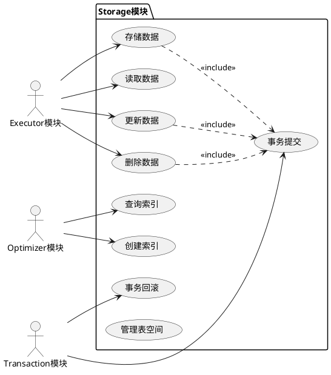
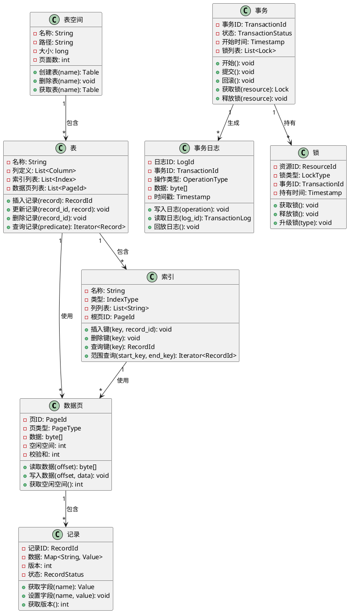
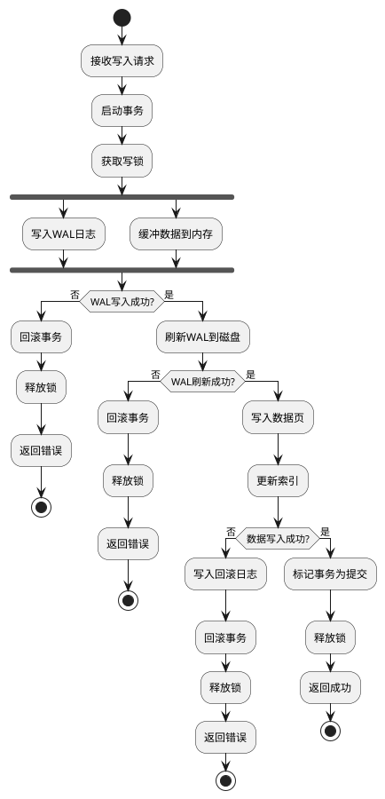
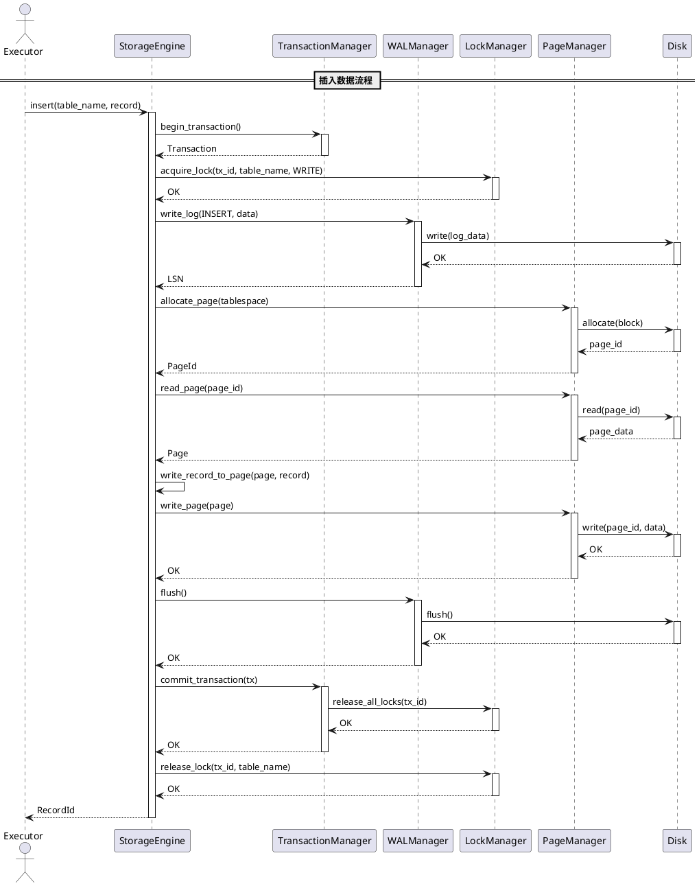

# SQLRustGo Storage模块设计文档

## 1. 模块概述

### 1.1 功能描述

Storage模块是SQLRustGo数据库系统的核心存储引擎，负责数据的持久化存储、事务管理和并发控制。该模块为上层Executor提供数据读写接口，是数据库系统的基石。

**核心职责：**

1. **数据持久化**：
   - 将数据写入磁盘，保证数据的持久性
   - 管理数据的物理存储结构（页、表空间、索引）
   - 提供高效的数据读写接口

2. **事务管理**：
   - 支持ACID事务（原子性、一致性、隔离性、持久性）
   - 实现事务的开始、提交和回滚
   - 管理事务日志（WAL - Write-Ahead Logging）

3. **并发控制**：
   - 实现锁机制，保证并发访问的正确性
   - 支持不同的隔离级别
   - 处理死锁检测和解决

4. **索引管理**：
   - 支持B+树索引
   - 管理索引的创建、删除和查询
   - 优化索引的维护和查询性能

5. **空间管理**：
   - 管理磁盘空间的分配和回收
   - 处理数据的碎片化问题
   - 支持表空间的扩展和收缩

### 1.2 模块边界

**输入边界：**
- 数据读写请求（来自Executor模块）
- 事务操作请求（来自Transaction模块）
- 索引操作请求（来自Optimizer模块）

**输出边界：**
- 查询结果数据（输出给Executor模块）
- 事务状态信息（输出给Transaction模块）
- 统计信息（输出给监控模块）

**依赖关系：**
- 依赖：Transaction模块（事务协调）
- 被依赖：Executor模块、Optimizer模块

**不包含的功能：**
- SQL语句解析（由Parser模块负责）
- 查询优化（由Optimizer模块负责）
- 查询执行（由Executor模块负责）

## 2. OOA分析

### 2.1 用例图



### 2.2 概念类图



### 2.3 活动图（写入数据流程）



## 3. OOD设计

### 3.1 设计类图

```plantuml
@startuml StorageDesignClass

interface "StorageEngine接口" as StorageEngine {
    + begin_transaction() -> Result<Transaction, StorageError>
    + commit_transaction(tx: Transaction) -> Result<(), StorageError>
    + rollback_transaction(tx: Transaction) -> Result<(), StorageError>
    + insert(table_name: &str, record: Record) -> Result<RecordId, StorageError>
    + update(table_name: &str, record_id: RecordId, record: Record) -> Result<(), StorageError>
    + delete(table_name: &str, record_id: RecordId) -> Result<(), StorageError>
    + select(table_name: &str, predicate: Expression) -> Result<Vec<Record>, StorageError>
    + create_table(table_name: &str, schema: Schema) -> Result<(), StorageError>
    + drop_table(table_name: &str) -> Result<(), StorageError>
    + create_index(table_name: &str, index_name: &str, columns: &[String]) -> Result<(), StorageError>
    + drop_index(table_name: &str, index_name: &str) -> Result<(), StorageError>
}

interface "PageManager接口" as PageManager {
    + allocate_page(tablespace_name: &str) -> Result<PageId, StorageError>
    + free_page(page_id: PageId) -> Result<(), StorageError>
    + read_page(page_id: PageId) -> Result<Page, StorageError>
    + write_page(page: Page) -> Result<(), StorageError>
    + flush_pages() -> Result<(), StorageError>
    + get_page_count() -> usize
}

interface "TransactionManager接口" as TransactionManager {
    + begin() -> Result<Transaction, StorageError>
    + commit(tx: Transaction) -> Result<(), StorageError>
    + rollback(tx: Transaction) -> Result<(), StorageError>
    + get_transaction(tx_id: TransactionId) -> Option<Transaction>
    + is_active(tx_id: TransactionId) -> bool
}

interface "LockManager接口" as LockManager {
    + acquire_lock(tx_id: TransactionId, resource_id: ResourceId, lock_type: LockType) -> Result<(), StorageError>
    + release_lock(tx_id: TransactionId, resource_id: ResourceId) -> Result<(), StorageError>
    + upgrade_lock(tx_id: TransactionId, resource_id: ResourceId, new_lock_type: LockType) -> Result<(), StorageError>
    + detect_deadlock() -> Vec<TransactionId>
}

interface "WALManager接口" as WALManager {
    + write_log(entry: WALEntry) -> Result<(), StorageError>
    + flush() -> Result<(), StorageError>
    + replay() -> Result<(), StorageError>
    + truncate(lsn: LSN) -> Result<(), StorageError>
    + get_current_lsn() -> LSN
}

class "FileStorageEngine类" as FileStorageEngine {
    - data_path: String
    - wal_path: String
    - page_manager: Box<dyn PageManager>
    - transaction_manager: Box<dyn TransactionManager>
    - lock_manager: Box<dyn LockManager>
    - wal_manager: Box<dyn WALManager>
    - tablespaces: HashMap<String, Tablespace>
    + new(data_path: String, wal_path: String) -> Self
    + begin_transaction() -> Result<Transaction, StorageError>
    + commit_transaction(tx: Transaction) -> Result<(), StorageError>
    + insert(table_name: &str, record: Record) -> Result<RecordId, StorageError>
    + update(table_name: &str, record_id: RecordId, record: Record) -> Result<(), StorageError>
    + delete(table_name: &str, record_id: RecordId) -> Result<(), StorageError>
    + select(table_name: &str, predicate: Expression) -> Result<Vec<Record>, StorageError>
}

class "MemoryStorageEngine类" as MemoryStorageEngine {
    - tables: HashMap<String, Table>
    - transactions: HashMap<TransactionId, Transaction>
    - next_tx_id: AtomicU64
    - next_record_id: AtomicU64
    + new() -> Self
    + begin_transaction() -> Result<Transaction, StorageError>
    + commit_transaction(tx: Transaction) -> Result<(), StorageError>
    + insert(table_name: &str, record: Record) -> Result<RecordId, StorageError>
    + select(table_name: &str, predicate: Expression) -> Result<Vec<Record>, StorageError>
}

class "BufferPoolPageManager类" as BufferPoolPageManager {
    - buffer_pool: BufferPool
    - disk_manager: DiskManager
    - page_cache: HashMap<PageId, Page>
    - eviction_policy: EvictionPolicy
    + new(buffer_size: usize, disk_manager: DiskManager) -> Self
    + allocate_page(tablespace_name: &str) -> Result<PageId, StorageError>
    + free_page(page_id: PageId) -> Result<(), StorageError>
    + read_page(page_id: PageId) -> Result<Page, StorageError>
    + write_page(page: Page) -> Result<(), StorageError>
    + flush_pages() -> Result<(), StorageError>
}

class "SimpleTransactionManager类" as SimpleTransactionManager {
    - transactions: HashMap<TransactionId, Transaction>
    - next_tx_id: AtomicU64
    - wal_manager: Box<dyn WALManager>
    - lock_manager: Box<dyn LockManager>
    + new(wal_manager: Box<dyn WALManager>, lock_manager: Box<dyn LockManager>) -> Self
    + begin() -> Result<Transaction, StorageError>
    + commit(tx: Transaction) -> Result<(), StorageError>
    + rollback(tx: Transaction) -> Result<(), StorageError>
}

class "Page类" as Page {
    - page_id: PageId
    - page_type: PageType
    - data: Vec<u8>
    - header: PageHeader
    + new(page_id: PageId, page_type: PageType) -> Self
    + read(offset: usize, length: usize) -> &[u8]
    + write(offset: usize, data: &[u8]) -> Result<(), StorageError>
    + get_free_space() -> usize
    + set_header(header: PageHeader) -> void
    + get_header() -> PageHeader
}

class "PageHeader结构体" as PageHeader {
    - magic: u32
    - page_id: PageId
    - page_type: PageType
    - free_offset: usize
    - used_offset: usize
    - checksum: u32
    - lsn: LSN
    + new(page_id: PageId, page_type: PageType) -> Self
    + to_bytes() -> Vec<u8>
    + from_bytes(bytes: &[u8]) -> Self
}

class "Record类" as Record {
    - record_id: RecordId
    - data: Vec<Value>
    - version: u64
    - status: RecordStatus
    + new(data: Vec<Value>) -> Self
    + get_value(index: usize) -> Option<Value>
    + set_value(index: usize, value: Value) -> void
    + to_bytes() -> Vec<u8>
    + from_bytes(bytes: &[u8], schema: Schema) -> Self
}

class "Transaction类" as Transaction {
    - tx_id: TransactionId
    - status: TransactionStatus
    - start_time: Instant
    - isolation_level: IsolationLevel
    - locks: Vec<Lock>
    + new(tx_id: TransactionId, isolation_level: IsolationLevel) -> Self
    + get_id() -> TransactionId
    + get_status() -> TransactionStatus
    + set_status(status: TransactionStatus) -> void
    + add_lock(lock: Lock) -> void
    + remove_lock(resource_id: ResourceId) -> void
}

class "WALEntry类" as WALEntry {
    - lsn: LSN
    - tx_id: TransactionId
    - operation: WALOperation
    - data: Vec<u8>
    - timestamp: Instant
    + new(tx_id: TransactionId, operation: WALOperation, data: Vec<u8>) -> Self
    + to_bytes() -> Vec<u8>
    + from_bytes(bytes: &[u8]) -> Self
}

class "Lock类" as Lock {
    - resource_id: ResourceId
    - lock_type: LockType
    - tx_id: TransactionId
    - granted_at: Instant
    + new(resource_id: ResourceId, lock_type: LockType, tx_id: TransactionId) -> Self
    + get_resource_id() -> ResourceId
    + get_lock_type() -> LockType
    + get_tx_id() -> TransactionId
}

class "Tablespace类" as Tablespace {
    - name: String
    - path: String
    - pages: Vec<PageId>
    - tables: HashMap<String, Table>
    + new(name: String, path: String) -> Self
    + create_table(name: &str, schema: Schema) -> Result<(), StorageError>
    + get_table(name: &str) -> Option<&Table>
    + drop_table(name: &str) -> Result<(), StorageError>
}

class "Table类" as Table {
    - name: String
    - schema: Schema
    - pages: Vec<PageId>
    - indexes: HashMap<String, Index>
    + new(name: String, schema: Schema) -> Self
    + insert(record: Record) -> Result<RecordId, StorageError>
    + update(record_id: RecordId, record: Record) -> Result<(), StorageError>
    + delete(record_id: RecordId) -> Result<(), StorageError>
    + select(predicate: Expression) -> Result<Vec<Record>, StorageError>
}

class "Index类" as Index {
    - name: String
    - columns: Vec<String>
    - root_page_id: PageId
    - index_type: IndexType
    + new(name: String, columns: Vec<String>, index_type: IndexType) -> Self
    + insert(key: Vec<Value>, record_id: RecordId) -> Result<(), StorageError>
    + delete(key: Vec<Value>) -> Result<(), StorageError>
    + search(key: Vec<Value>) -> Option<RecordId>
    + range_search(start: Option<Vec<Value>>, end: Option<Vec<Value>>) -> Vec<RecordId>
}

StorageEngine <|.. FileStorageEngine
StorageEngine <|.. MemoryStorageEngine
PageManager <|.. BufferPoolPageManager
TransactionManager <|.. SimpleTransactionManager

FileStorageEngine o-- PageManager
FileStorageEngine o-- TransactionManager
FileStorageEngine o-- LockManager
FileStorageEngine o-- WALManager
FileStorageEngine o-- Tablespace

BufferPoolPageManager o-- DiskManager
BufferPoolPageManager o-- BufferPool

SimpleTransactionManager o-- WALManager
SimpleTransactionManager o-- LockManager

Tablespace o-- Table
Table o-- Index
Table o-- Page

@enduml
```



### 3.2 顺序图



## 4. 核心接口定义

### 4.1 StorageEngine接口

```rust
pub trait StorageEngine: Send + Sync + Debug {
    fn begin_transaction(&mut self) -> Result<Transaction, StorageError>;
    
    fn commit_transaction(&mut self, tx: Transaction) -> Result<(), StorageError>;
    
    fn rollback_transaction(&mut self, tx: Transaction) -> Result<(), StorageError>;
    
    fn insert(&mut self, table_name: &str, record: Record) -> Result<RecordId, StorageError>;
    
    fn update(&mut self, table_name: &str, record_id: RecordId, record: Record) -> Result<(), StorageError>;
    
    fn delete(&mut self, table_name: &str, record_id: RecordId) -> Result<(), StorageError>;
    
    fn select(&mut self, table_name: &str, predicate: Expression) -> Result<Vec<Record>, StorageError>;
    
    fn create_table(&mut self, table_name: &str, schema: Schema) -> Result<(), StorageError>;
    
    fn drop_table(&mut self, table_name: &str) -> Result<(), StorageError>;
    
    fn create_index(&mut self, table_name: &str, index_name: &str, columns: &[String]) -> Result<(), StorageError>;
    
    fn drop_index(&mut self, table_name: &str, index_name: &str) -> Result<(), StorageError>;
    
    fn get_table_schema(&self, table_name: &str) -> Result<Schema, StorageError>;
}

#[derive(Debug, Clone)]
pub struct StorageError {
    error_type: StorageErrorType,
    message: String,
    source: Option<Box<dyn std::error::Error + 'static>>,
}

#[derive(Debug, Clone, PartialEq, Eq)]
pub enum StorageErrorType {
    TransactionError,
    LockError,
    IOError,
    PageError,
    RecordError,
    IndexError,
    SchemaError,
    ConcurrencyError,
    DeadlockError,
}
```

### 4.2 PageManager接口

```rust
pub trait PageManager: Send + Sync + Debug {
    fn allocate_page(&mut self, tablespace_name: &str) -> Result<PageId, StorageError>;
    
    fn free_page(&mut self, page_id: PageId) -> Result<(), StorageError>;
    
    fn read_page(&mut self, page_id: PageId) -> Result<Page, StorageError>;
    
    fn write_page(&mut self, page: Page) -> Result<(), StorageError>;
    
    fn flush_pages(&mut self) -> Result<(), StorageError>;
    
    fn get_page_count(&self) -> usize;
    
    fn get_free_page_count(&self) -> usize;
    
    fn invalidate_page(&mut self, page_id: PageId) -> Result<(), StorageError>;
    
    fn pin_page(&mut self, page_id: PageId) -> Result<(), StorageError>;
    
    fn unpin_page(&mut self, page_id: PageId) -> Result<(), StorageError>;
}

#[derive(Debug, Clone, Copy, PartialEq, Eq, Hash)]
pub struct PageId(pub u64);

#[derive(Debug, Clone, PartialEq, Eq)]
pub enum PageType {
    DataPage,
    IndexPage,
    MetaPage,
    FreeListPage,
}

#[derive(Debug, Clone)]
pub struct Page {
    page_id: PageId,
    page_type: PageType,
    data: Vec<u8>,
    header: PageHeader,
}

#[derive(Debug, Clone)]
pub struct PageHeader {
    magic: u32,
    page_id: PageId,
    page_type: PageType,
    free_offset: usize,
    used_offset: usize,
    checksum: u32,
    lsn: LSN,
}
```

### 4.3 TransactionManager接口

```rust
pub trait TransactionManager: Send + Sync + Debug {
    fn begin(&mut self) -> Result<Transaction, StorageError>;
    
    fn commit(&mut self, tx: Transaction) -> Result<(), StorageError>;
    
    fn rollback(&mut self, tx: Transaction) -> Result<(), StorageError>;
    
    fn get_transaction(&self, tx_id: TransactionId) -> Option<Transaction>;
    
    fn is_active(&self, tx_id: TransactionId) -> bool;
    
    fn get_active_transactions(&self) -> Vec<Transaction>;
    
    fn set_isolation_level(&mut self, level: IsolationLevel);
    
    fn get_isolation_level(&self) -> IsolationLevel;
}

#[derive(Debug, Clone, Copy, PartialEq, Eq, Hash)]
pub struct TransactionId(pub u64);

#[derive(Debug, Clone, PartialEq, Eq)]
pub enum TransactionStatus {
    Active,
    Committed,
    RolledBack,
    Aborted,
}

#[derive(Debug, Clone, Copy, PartialEq, Eq)]
pub enum IsolationLevel {
    ReadUncommitted,
    ReadCommitted,
    RepeatableRead,
    Serializable,
}

#[derive(Debug, Clone)]
pub struct Transaction {
    tx_id: TransactionId,
    status: TransactionStatus,
    start_time: Instant,
    isolation_level: IsolationLevel,
    locks: Vec<Lock>,
    changes: Vec<TransactionChange>,
}

#[derive(Debug, Clone)]
pub struct TransactionChange {
    change_type: ChangeType,
    table_name: String,
    record_id: RecordId,
    old_data: Option<Record>,
    new_data: Option<Record>,
}

#[derive(Debug, Clone, PartialEq, Eq)]
pub enum ChangeType {
    Insert,
    Update,
    Delete,
}
```

### 4.4 WALManager接口

```rust
pub trait WALManager: Send + Sync + Debug {
    fn write_log(&mut self, entry: WALEntry) -> Result<(), StorageError>;
    
    fn flush(&mut self) -> Result<(), StorageError>;
    
    fn replay(&mut self) -> Result<(), StorageError>;
    
    fn truncate(&mut self, lsn: LSN) -> Result<(), StorageError>;
    
    fn get_current_lsn(&self) -> LSN;
    
    fn get_last_checkpoint_lsn(&self) -> LSN;
    
    fn create_checkpoint(&mut self) -> Result<LSN, StorageError>;
}

#[derive(Debug, Clone, Copy, PartialEq, Eq, Ord, PartialOrd)]
pub struct LSN(pub u64);

#[derive(Debug, Clone)]
pub struct WALEntry {
    lsn: LSN,
    tx_id: TransactionId,
    operation: WALOperation,
    data: Vec<u8>,
    timestamp: Instant,
}

#[derive(Debug, Clone, PartialEq, Eq)]
pub enum WALOperation {
    Begin,
    Commit,
    Rollback,
    Insert { table_name: String, record: Record },
    Update { table_name: String, record_id: RecordId, record: Record },
    Delete { table_name: String, record_id: RecordId },
    CreateTable { table_name: String, schema: Schema },
    DropTable { table_name: String },
    CreateIndex { table_name: String, index_name: String, columns: Vec<String> },
    DropIndex { table_name: String, index_name: String },
    Checkpoint,
}
```

## 5. 存储结构设计

### 5.1 页大小设计

```rust
pub const PAGE_SIZE: usize = 8192; // 8KB
pub const PAGE_HEADER_SIZE: usize = 32;
pub const PAGE_METADATA_SIZE: usize = 64;
pub const PAGE_DATA_SIZE: usize = PAGE_SIZE - PAGE_HEADER_SIZE - PAGE_METADATA_SIZE;

pub const MAX_RECORDS_PER_PAGE: usize = PAGE_DATA_SIZE / MIN_RECORD_SIZE;
pub const MIN_RECORD_SIZE: usize = 4 + 8 + 1; // header + id + at least one column
```

### 5.2 页格式设计

```rust
pub struct PageLayout {
    header: PageHeaderLayout,
    records: Vec<RecordLayout>,
    free_space: FreeSpaceLayout,
}

pub struct PageHeaderLayout {
    magic: [u8; 4],           // 字节 0-3: 魔数标识
    page_id: [u8; 8],         // 字节 4-11: 页ID
    page_type: [u8; 4],       // 字节 12-15: 页类型
    lsn: [u8; 8],             // 字节 16-23: 日志序列号
    free_offset: [u8; 4],     // 字节 24-27: 空闲空间偏移
    used_offset: [u8; 4],     // 字节 28-31: 已使用空间偏移
    checksum: [u8; 4],        // 字节 32-35: 校验和
    flags: [u8; 4],           // 字节 36-39: 标志位
}

pub struct RecordLayout {
    offset: usize,            // 记录在页中的偏移
    length: usize,            // 记录长度
    record_id: RecordId,      // 记录ID
    version: u64,            // 版本号
    status: RecordStatus,     // 记录状态
    data: RecordDataLayout,   // 记录数据
}

pub struct RecordDataLayout {
    column_count: u32,        // 列数量
    null_bitmap: Vec<bool>,   // 空值位图
    values: Vec<ValueLayout>, // 列值列表
}

pub struct ValueLayout {
    value_type: ValueType,    // 值类型
    length: usize,            // 值长度
    data: Vec<u8>,            // 值数据
}

pub struct FreeSpaceLayout {
    offset: usize,            // 空闲空间起始偏移
    size: usize,              // 空闲空间大小
    free_list: Vec<FreeBlock>, // 空闲块列表
}

pub struct FreeBlock {
    offset: usize,            // 块起始偏移
    size: usize,              // 块大小
}
```

### 5.3 记录格式设计

```rust
#[derive(Debug, Clone)]
pub struct Record {
    record_id: RecordId,
    version: u64,
    status: RecordStatus,
    data: Vec<Value>,
}

#[derive(Debug, Clone, Copy, PartialEq, Eq, Hash)]
pub struct RecordId(pub u64);

#[derive(Debug, Clone, Copy, PartialEq, Eq)]
pub enum RecordStatus {
    Active,
    Deleted,
    Updated,
}

#[derive(Debug, Clone, PartialEq)]
pub enum Value {
    Null,
    Boolean(bool),
    Int(i64),
    Float(f64),
    String(String),
    Date(Date),
    Timestamp(Instant),
    Binary(Vec<u8>),
}

impl Record {
    pub fn new(data: Vec<Value>) -> Self {
        Record {
            record_id: RecordId(0),
            version: 1,
            status: RecordStatus::Active,
            data,
        }
    }
    
    pub fn to_bytes(&self) -> Vec<u8> {
        let mut bytes = Vec::new();
        
        // 记录ID (8 bytes)
        bytes.extend_from_slice(&self.record_id.0.to_be_bytes());
        
        // 版本号 (8 bytes)
        bytes.extend_from_slice(&self.version.to_be_bytes());
        
        // 状态 (1 byte)
        bytes.push(self.status as u8);
        
        // 列数量 (4 bytes)
        bytes.extend_from_slice(&(self.data.len() as u32).to_be_bytes());
        
        // 空值位图
        let null_count = (self.data.len() + 7) / 8;
        let mut null_bitmap = vec![0u8; null_count];
        for (i, value) in self.data.iter().enumerate() {
            if value == &Value::Null {
                null_bitmap[i / 8] |= 1 << (i % 8);
            }
        }
        bytes.extend_from_slice(&null_bitmap);
        
        // 列值
        for value in &self.data {
            bytes.extend_from_slice(&value.to_bytes());
        }
        
        bytes
    }
    
    pub fn from_bytes(bytes: &[u8], schema: Schema) -> Self {
        let mut offset = 0;
        
        // 记录ID
        let record_id = RecordId(u64::from_be_bytes(bytes[offset..offset+8].try_into().unwrap()));
        offset += 8;
        
        // 版本号
        let version = u64::from_be_bytes(bytes[offset..offset+8].try_into().unwrap());
        offset += 8;
        
        // 状态
        let status = match bytes[offset] {
            0 => RecordStatus::Active,
            1 => RecordStatus::Deleted,
            2 => RecordStatus::Updated,
            _ => RecordStatus::Active,
        };
        offset += 1;
        
        // 列数量
        let column_count = u32::from_be_bytes(bytes[offset..offset+4].try_into().unwrap()) as usize;
        offset += 4;
        
        // 空值位图
        let null_count = (column_count + 7) / 8;
        let null_bitmap = &bytes[offset..offset+null_count];
        offset += null_count;
        
        // 列值
        let mut data = Vec::with_capacity(column_count);
        for i in 0..column_count {
            let is_null = (null_bitmap[i / 8] & (1 << (i % 8))) != 0;
            
            if is_null {
                data.push(Value::Null);
            } else {
                let value_type = ValueType::from_byte(bytes[offset]);
                offset += 1;
                
                let value = Value::from_bytes(&bytes[offset..], value_type, &schema.get_columns()[i]);
                offset += value.size();
                
                data.push(value);
            }
        }
        
        Record {
            record_id,
            version,
            status,
            data,
        }
    }
}
```

## 6. 事务支持设计

### 6.1 WAL设计

```rust
pub struct WALManagerImpl {
    log_file: File,
    current_lsn: LSN,
    buffer: Vec<WALEntry>,
    buffer_size: usize,
    last_checkpoint_lsn: LSN,
}

impl WALManagerImpl {
    pub fn new(path: &str) -> Result<Self, StorageError> {
        let log_file = File::create(path)?;
        let current_lsn = Self::read_current_lsn(&log_file)?;
        
        Ok(WALManagerImpl {
            log_file,
            current_lsn,
            buffer: Vec::new(),
            buffer_size: 64 * 1024 * 1024, // 64MB
            last_checkpoint_lsn: LSN(0),
        })
    }
    
    fn read_current_lsn(file: &File) -> Result<LSN, StorageError> {
        let metadata = file.metadata()?;
        Ok(LSN(metadata.len() / WAL_ENTRY_HEADER_SIZE))
    }
    
    pub fn write_log(&mut self, entry: WALEntry) -> Result<(), StorageError> {
        let mut bytes = entry.to_bytes();
        
        // 添加到缓冲区
        self.buffer.push(entry);
        if self.buffer.len() >= self.buffer_size {
            self.flush()?;
        }
        
        // 更新LSN
        self.current_lsn.0 += 1;
        
        Ok(())
    }
    
    pub fn flush(&mut self) -> Result<(), StorageError> {
        for entry in &self.buffer {
            let bytes = entry.to_bytes();
            self.log_file.write_all(&bytes)?;
        }
        
        self.log_file.sync_all()?;
        self.buffer.clear();
        
        Ok(())
    }
    
    pub fn replay(&mut self) -> Result<(), StorageError> {
        let mut reader = BufReader::new(&self.log_file);
        let mut current_lsn = LSN(0);
        
        while let Ok(entry) = WALEntry::from_reader(&mut reader) {
            self.apply_wal_entry(&entry)?;
            current_lsn = entry.lsn;
        }
        
        self.current_lsn = current_lsn;
        Ok(())
    }
    
    fn apply_wal_entry(&self, entry: &WALEntry) -> Result<(), StorageError> {
        match &entry.operation {
            WALOperation::Insert { table_name, record } => {
                self.storage.insert(table_name, record.clone())?;
            }
            WALOperation::Update { table_name, record_id, record } => {
                self.storage.update(table_name, *record_id, record.clone())?;
            }
            WALOperation::Delete { table_name, record_id } => {
                self.storage.delete(table_name, *record_id)?;
            }
            WALOperation::Commit => {
                // 事务已提交，无需额外操作
            }
            WALOperation::Rollback => {
                // 事务已回滚，无需额外操作
            }
            _ => {}
        }
        
        Ok(())
    }
    
    pub fn create_checkpoint(&mut self) -> Result<LSN, StorageError> {
        // 刷新所有脏页到磁盘
        self.page_manager.flush_pages()?;
        
        // 写入checkpoint日志
        let checkpoint_entry = WALEntry::new(
            TransactionId(0),
            WALOperation::Checkpoint,
            Vec::new(),
        );
        self.write_log(checkpoint_entry)?;
        self.flush()?;
        
        self.last_checkpoint_lsn = self.current_lsn;
        Ok(self.current_lsn)
    }
}
```

### 6.2 事务实现

```rust
pub struct SimpleTransactionManagerImpl {
    transactions: HashMap<TransactionId, Transaction>,
    next_tx_id: AtomicU64,
    wal_manager: Box<dyn WALManager>,
    lock_manager: Box<dyn LockManager>,
    isolation_level: IsolationLevel,
}

impl SimpleTransactionManagerImpl {
    pub fn new(
        wal_manager: Box<dyn WALManager>,
        lock_manager: Box<dyn LockManager>,
    ) -> Self {
        SimpleTransactionManagerImpl {
            transactions: HashMap::new(),
            next_tx_id: AtomicU64::new(1),
            wal_manager,
            lock_manager,
            isolation_level: IsolationLevel::ReadCommitted,
        }
    }
    
    pub fn begin(&mut self) -> Result<Transaction, StorageError> {
        let tx_id = TransactionId(self.next_tx_id.fetch_add(1, Ordering::Relaxed));
        
        // 写入BEGIN日志
        let begin_entry = WALEntry::new(
            tx_id,
            WALOperation::Begin,
            Vec::new(),
        );
        self.wal_manager.write_log(begin_entry)?;
        
        let tx = Transaction::new(tx_id, self.isolation_level);
        self.transactions.insert(tx_id, tx.clone());
        
        Ok(tx)
    }
    
    pub fn commit(&mut self, tx: Transaction) -> Result<(), StorageError> {
        let tx_id = tx.get_id();
        
        // 写入COMMIT日志
        let commit_entry = WALEntry::new(
            tx_id,
            WALOperation::Commit,
            Vec::new(),
        );
        self.wal_manager.write_log(commit_entry)?;
        
        // 刷新WAL到磁盘
        self.wal_manager.flush()?;
        
        // 更新事务状态
        if let Some(tx_ref) = self.transactions.get_mut(&tx_id) {
            tx_ref.set_status(TransactionStatus::Committed);
        }
        
        // 释放锁
        self.lock_manager.release_all_locks(tx_id)?;
        
        // 删除事务记录
        self.transactions.remove(&tx_id);
        
        Ok(())
    }
    
    pub fn rollback(&mut self, tx: Transaction) -> Result<(), StorageError> {
        let tx_id = tx.get_id();
        
        // 写入ROLLBACK日志
        let rollback_entry = WALEntry::new(
            tx_id,
            WALOperation::Rollback,
            Vec::new(),
        );
        self.wal_manager.write_log(rollback_entry)?;
        
        // 刷新WAL到磁盘
        self.wal_manager.flush()?;
        
        // 更新事务状态
        if let Some(tx_ref) = self.transactions.get_mut(&tx_id) {
            tx_ref.set_status(TransactionStatus::RolledBack);
        }
        
        // 释放锁
        self.lock_manager.release_all_locks(tx_id)?;
        
        // 删除事务记录
        self.transactions.remove(&tx_id);
        
        Ok(())
    }
}
```

### 6.3 锁机制

```rust
pub struct LockManagerImpl {
    locks: HashMap<ResourceId, LockEntry>,
    waiting_transactions: HashMap<TransactionId, Vec<LockRequest>>,
}

pub struct LockEntry {
    resource_id: ResourceId,
    locks: Vec<Lock>,
}

pub struct LockRequest {
    tx_id: TransactionId,
    resource_id: ResourceId,
    lock_type: LockType,
    requested_at: Instant,
}

#[derive(Debug, Clone, Copy, PartialEq, Eq, Hash)]
pub struct ResourceId(pub String);

#[derive(Debug, Clone, Copy, PartialEq, Eq)]
pub enum LockType {
    Shared,
    Exclusive,
    IntentShared,
    IntentExclusive,
    SharedIntentExclusive,
}

impl LockManagerImpl {
    pub fn new() -> Self {
        LockManagerImpl {
            locks: HashMap::new(),
            waiting_transactions: HashMap::new(),
        }
    }
    
    pub fn acquire_lock(
        &mut self,
        tx_id: TransactionId,
        resource_id: ResourceId,
        lock_type: LockType,
    ) -> Result<(), StorageError> {
        let entry = self.locks.entry(resource_id.clone()).or_insert_with(|| {
            LockEntry {
                resource_id: resource_id.clone(),
                locks: Vec::new(),
            }
        });
        
        // 检查是否可以立即获取锁
        if self.can_acquire_lock(&entry.locks, lock_type) {
            let lock = Lock::new(resource_id, lock_type, tx_id);
            entry.locks.push(lock);
            Ok(())
        } else {
            // 添加到等待队列
            let request = LockRequest {
                tx_id,
                resource_id,
                lock_type,
                requested_at: Instant::now(),
            };
            
            self.waiting_transactions
                .entry(tx_id)
                .or_insert_with(Vec::new)
                .push(request);
            
            // 检测死锁
            if self.detect_deadlock() {
                Err(StorageError::new(StorageErrorType::DeadlockError, "Deadlock detected"))
            } else {
                Ok(())
            }
        }
    }
    
    fn can_acquire_lock(&self, existing_locks: &[Lock], requested_type: LockType) -> bool {
        // 实现锁兼容性检查
        // Shared locks are compatible with other shared locks
        // Exclusive locks are not compatible with any other locks
        // Intent locks allow other intent locks but may conflict with exclusive locks
        
        match requested_type {
            LockType::Shared => {
                !existing_locks.iter().any(|lock| {
                    matches!(lock.get_lock_type(), LockType::Exclusive)
                })
            }
            LockType::Exclusive => {
                existing_locks.is_empty()
            }
            LockType::IntentShared => {
                !existing_locks.iter().any(|lock| {
                    matches!(lock.get_lock_type(), LockType::Exclusive)
                })
            }
            LockType::IntentExclusive => {
                !existing_locks.iter().any(|lock| {
                    matches!(lock.get_lock_type(), LockType::Exclusive | LockType::Shared)
                })
            }
            LockType::SharedIntentExclusive => {
                !existing_locks.iter().any(|lock| {
                    matches!(lock.get_lock_type(), LockType::Exclusive)
                })
            }
        }
    }
    
    fn detect_deadlock(&self) -> bool {
        // 实现死锁检测算法（如等待图算法）
        // 简化实现：检查是否存在循环等待
        
        let mut visited = HashSet::new();
        let mut in_stack = HashSet::new();
        
        for tx_id in self.waiting_transactions.keys() {
            if self.has_cycle(*tx_id, &mut visited, &mut in_stack) {
                return true;
            }
        }
        
        false
    }
    
    fn has_cycle(
        &self,
        tx_id: TransactionId,
        visited: &mut HashSet<TransactionId>,
        in_stack: &mut HashSet<TransactionId>,
    ) -> bool {
        if visited.contains(&tx_id) {
            return in_stack.contains(&tx_id);
        }
        
        visited.insert(tx_id);
        in_stack.insert(tx_id);
        
        if let Some(requests) = self.waiting_transactions.get(&tx_id) {
            for request in requests {
                // 找到持有该资源锁的事务
                if let Some(entry) = self.locks.get(&request.resource_id) {
                    for lock in &entry.locks {
                        let holder_tx_id = lock.get_tx_id();
                        if self.has_cycle(holder_tx_id, visited, in_stack) {
                            return true;
                        }
                    }
                }
            }
        }
        
        in_stack.remove(&tx_id);
        false
    }
    
    pub fn release_lock(&mut self, tx_id: TransactionId, resource_id: ResourceId) -> Result<(), StorageError> {
        if let Some(entry) = self.locks.get_mut(&resource_id) {
            entry.locks.retain(|lock| lock.get_tx_id() != tx_id);
            
            // 如果资源锁全部释放，清理条目
            if entry.locks.is_empty() {
                self.locks.remove(&resource_id);
            }
            
            // 尝试唤醒等待的事务
            self.try_wake_waiting_transactions(&resource_id);
        }
        
        // 从等待队列移除
        if let Some(requests) = self.waiting_transactions.get_mut(&tx_id) {
            requests.retain(|r| r.resource_id != resource_id);
            if requests.is_empty() {
                self.waiting_transactions.remove(&tx_id);
            }
        }
        
        Ok(())
    }
    
    fn try_wake_waiting_transactions(&mut self, resource_id: &ResourceId) {
        // 查找等待该资源的事务并尝试唤醒
        let mut to_wake = Vec::new();
        
        for (tx_id, requests) in &self.waiting_transactions {
            for request in requests {
                if request.resource_id == *resource_id {
                    if let Some(entry) = self.locks.get(resource_id) {
                        if self.can_acquire_lock(&entry.locks, request.lock_type) {
                            to_wake.push((*tx_id, request.lock_type));
                        }
                    }
                }
            }
        }
        
        // 唤醒事务
        for (tx_id, lock_type) in to_wake {
            if let Ok(()) = self.acquire_lock(tx_id, resource_id.clone(), lock_type) {
                // 从等待队列移除
                if let Some(requests) = self.waiting_transactions.get_mut(&tx_id) {
                    requests.retain(|r| r.resource_id != *resource_id);
                }
            }
        }
    }
}
```

## 7. 扩展点说明

### 7.1 存储引擎扩展

支持用户自定义存储引擎：

```rust
pub trait CustomStorageEngine: StorageEngine {
    fn initialize(&mut self, config: &StorageConfig) -> Result<(), StorageError>;
    
    fn shutdown(&mut self) -> Result<(), StorageError>;
    
    fn get_storage_stats(&self) -> StorageStats;
}

pub struct StorageConfig {
    pub data_path: String,
    pub wal_path: String,
    pub buffer_pool_size: usize,
    pub max_transactions: usize,
    pub isolation_level: IsolationLevel,
}

pub struct StorageStats {
    pub total_pages: usize,
    pub used_pages: usize,
    pub free_pages: usize,
    pub active_transactions: usize,
    pub wal_size: usize,
    pub cache_hits: usize,
    pub cache_misses: usize,
}
```

### 7.2 索引类型扩展

支持自定义索引类型：

```rust
pub trait CustomIndex: Send + Sync + Debug {
    fn name(&self) -> &str;
    
    fn create(&mut self, table_name: &str, columns: &[String]) -> Result<(), StorageError>;
    
    fn drop(&mut self) -> Result<(), StorageError>;
    
    fn insert(&mut self, key: Vec<Value>, record_id: RecordId) -> Result<(), StorageError>;
    
    fn delete(&mut self, key: Vec<Value>) -> Result<(), StorageError>;
    
    fn search(&self, key: Vec<Value>) -> Option<RecordId>;
    
    fn range_search(&self, start: Option<Vec<Value>>, end: Option<Vec<Value>>) -> Vec<RecordId>;
    
    fn get_statistics(&self) -> IndexStatistics;
}

pub struct IndexStatistics {
    pub index_type: IndexType,
    pub entry_count: usize,
    pub height: usize,
    pub space_used: usize,
}

pub enum IndexType {
    BTree,
    Hash,
    Bitmap,
    FullText,
}
```

### 7.3 页替换策略扩展

支持自定义页面替换策略：

```rust
pub trait PageReplacementPolicy: Send + Sync + Debug {
    fn name(&self) -> &str;
    
    fn select_victim(&self, pages: &[PageInfo]) -> Option<PageId>;
    
    fn touch(&mut self, page_id: PageId);
    
    fn evict(&mut self, page_id: PageId);
    
    fn clear(&mut self);
}

pub struct PageInfo {
    page_id: PageId,
    is_dirty: bool,
    pin_count: usize,
    last_access_time: Instant,
    access_count: usize,
}

pub struct LRUReplacementPolicy {
    access_order: VecDeque<PageId>,
    capacity: usize,
}

pub struct LFUReplacementPolicy {
    access_counts: HashMap<PageId, usize>,
}

pub struct ClockReplacementPolicy {
    pages: Vec<(PageId, bool)>,
    hand: usize,
}
```

### 7.4 事务日志扩展

支持自定义事务日志格式：

```rust
pub trait CustomWALManager: WALManager {
    fn get_log_format(&self) -> LogFormat;
    
    fn set_log_format(&mut self, format: LogFormat);
    
    fn get_log_size(&self) -> usize;
    
    fn compact(&mut self) -> Result<(), StorageError>;
}

pub enum LogFormat {
    Binary,
    Text,
    Json,
    Protobuf,
}
```

### 7.5 分布式存储扩展

支持分布式存储：

```rust
pub trait DistributedStorageEngine: StorageEngine {
    fn add_node(&mut self, node_id: NodeId, address: &str) -> Result<(), StorageError>;
    
    fn remove_node(&mut self, node_id: NodeId) -> Result<(), StorageError>;
    
    fn get_nodes(&self) -> Vec<NodeInfo>;
    
    fn replicate_data(&mut self, table_name: &str, node_id: NodeId) -> Result<(), StorageError>;
    
    fn balance_data(&mut self) -> Result<(), StorageError>;
}

pub struct NodeId(pub String);

pub struct NodeInfo {
    node_id: NodeId,
    address: String,
    status: NodeStatus,
    data_size: usize,
    load: f64,
}

pub enum NodeStatus {
    Active,
    Inactive,
    Degraded,
}
```

## 8. 设计原则和最佳实践

### 8.1 设计原则

1. **WAL优先**：写入数据前先写入日志，保证数据持久性
2. **数据完整性**：使用校验和确保数据不被损坏
3. **并发安全**：实现完善的锁机制，保证并发访问的正确性
4. **事务隔离**：支持多种隔离级别，满足不同场景需求
5. **可恢复性**：支持崩溃恢复，确保数据不丢失

### 8.2 性能优化策略

1. **缓冲池**：使用内存缓冲减少磁盘IO
2. **预读策略**：提前读取可能需要的数据页
3. **延迟写入**：批量写入减少磁盘IO次数
4. **索引优化**：选择合适的索引类型和结构
5. **分区策略**：将大表分区，提高查询效率

### 8.3 质量保证

1. **数据校验**：定期检查数据完整性
2. **备份策略**：定期备份数据和日志
3. **恢复测试**：定期测试崩溃恢复功能
4. **性能基准**：建立性能基准，监控性能变化
5. **安全审计**：记录所有数据操作，便于审计

---

**文档版本**: 1.0  
**最后更新**: 2026-06-01  
**维护者**: SQLRustGo开发团队