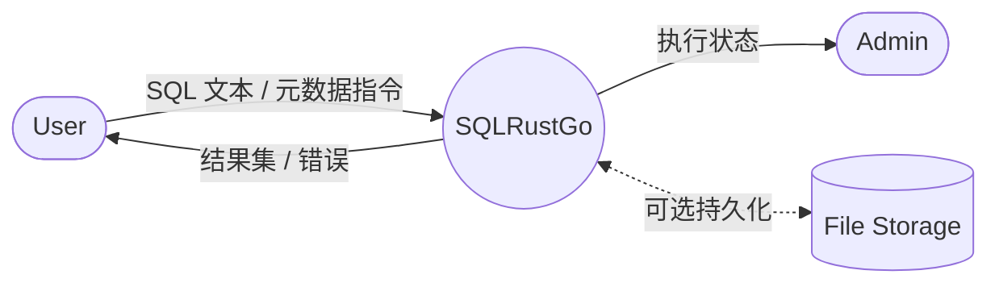
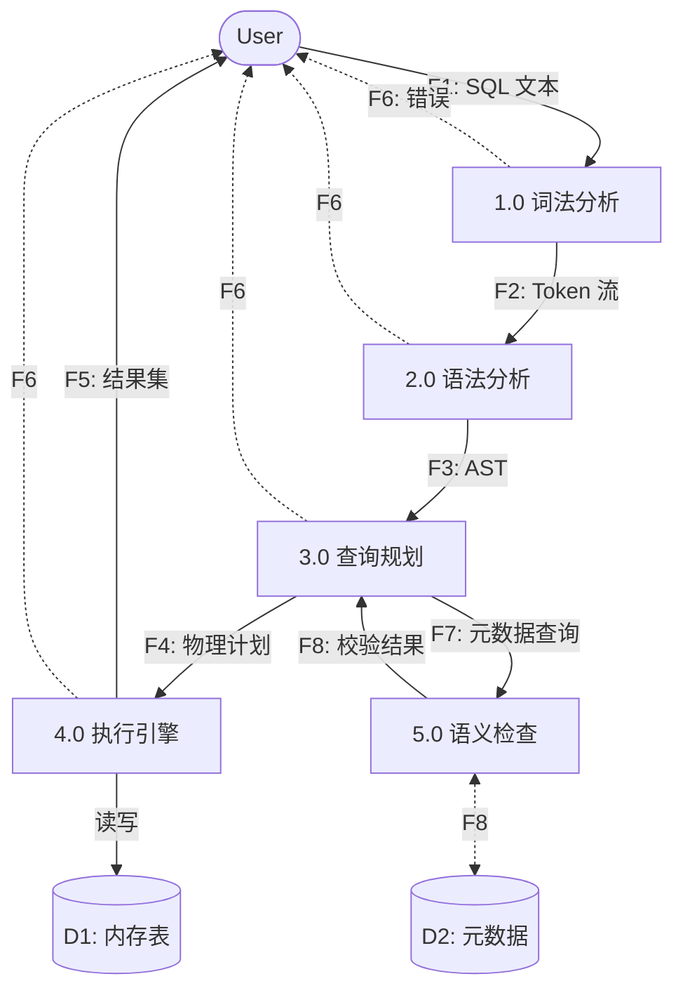
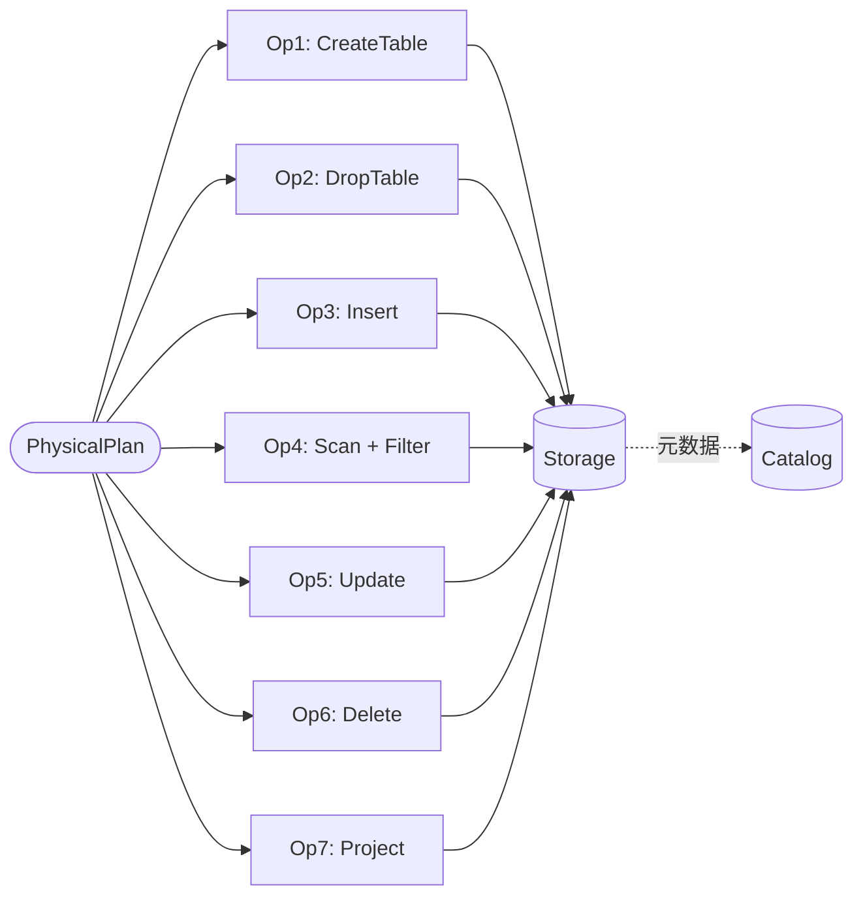

# 数据流图（DFD）— Context / Level-0 / Level-1

## 1. Context Diagram（顶层）

**说明**：

- 顶层图只有 1 个过程（SQLRustGo 系统）
- 2 个外部实体：User、Admin
- 1 个外部存储：File Storage（v0.1 不使用，预留扩展）

---

## 2. Level-0 DFD

---

## 3. Level-1 DFD：执行引擎子图

---

## 4. 数据流条目

| 流编号 | 名称 | 来源 | 去向 | 内容 |
|--------|------|------|------|------|
| F1 | SQL 文本 | User | 1.0 | 字符串 |
| F2 | Token 流 | 1.0 | 2.0 | `Vec<Token>` |
| F3 | AST | 2.0 | 3.0 | `Statement` |
| F4 | 物理计划 | 3.0 | 4.0 | `PhysicalPlan` |
| F5 | 结果集 | 4.0 | User | `Vec<Vec<Value>>` |
| F6 | 错误 | 各过程 | User | `Error` 枚举 |
| F7 | 元数据查询 | 3.0 | 5.0 | 表名/列名 |
| F8 | 校验结果 | 5.0 | 3.0 | `bool` |
