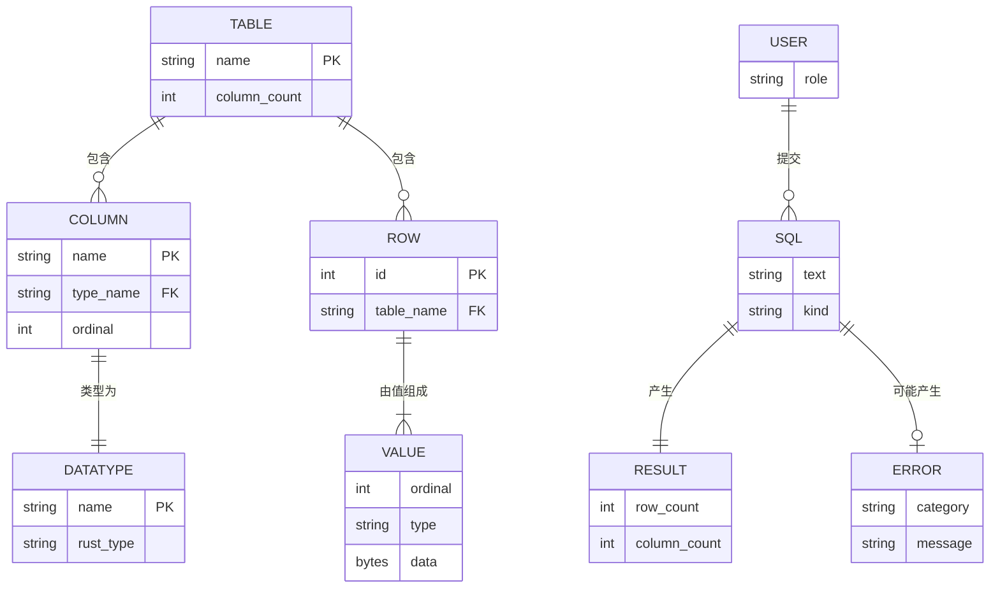

# ER 图（Entity-Relationship Diagram）

## 1. 核心实体

## 2. 实体详细定义

### TABLE

| 属性 | 类型 | 约束 |
|------|------|------|
| name | String | PK, NOT NULL, UNIQUE |
| column_count | Int | 派生：实际列数 |

### COLUMN

| 属性 | 类型 | 约束 |
|------|------|------|
| name | String | PK, NOT NULL |
| type_name | String | FK → DATATYPE.name |
| ordinal | Int | UNIQUE（表内） |

### DATATYPE

| 属性 | 类型 | 约束 |
|------|------|------|
| name | String | PK |
| rust_type | String | 映射到 Rust 类型 |

### ROW

| 属性 | 类型 | 约束 |
|------|------|------|
| id | Int | PK, 自增（v0.1 不实现） |
| table_name | String | FK → TABLE.name |

### VALUE

| 属性 | 类型 | 约束 |
|------|------|------|
| ordinal | Int | 行内列序号 |
| type | String | 实际类型 |
| data | Bytes | 序列化值 |

### SQL

| 属性 | 类型 | 约束 |
|------|------|------|
| text | String | NOT NULL |
| kind | String | CREATE / DROP / INSERT / SELECT / UPDATE / DELETE |

### RESULT

| 属性 | 类型 | 约束 |
|------|------|------|
| row_count | Int | ≥ 0 |
| column_count | Int | ≥ 0 |

### ERROR

| 属性 | 类型 | 约束 |
|------|------|------|
| category | String | Lexer / Parse / Semantic / Execution / Storage |
| message | String | 详细描述 |

---

## 3. 关系基数

| 关系 | 基数 | 说明 |
|------|------|------|
| TABLE–COLUMN | 1:N | 一张表有多列 |
| TABLE–ROW | 1:N | 一张表有多行 |
| ROW–VALUE | 1:N | 一行有 N 个值（N = 列数） |
| COLUMN–DATATYPE | N:1 | 多列共享一个类型 |
| USER–SQL | 1:N | 一个用户可提交多条 SQL |
| SQL–RESULT | 1:1 | 成功时一对一 |
| SQL–ERROR | 1:0..1 | 失败时产生 1 个错误 |
