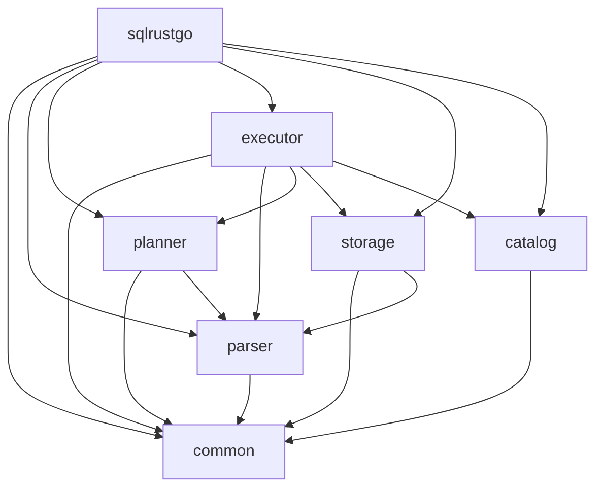

# 结构化设计 — 模块分解

## 1. 模块层次图

```
sqlrustgo (root, CLI 入口 + Database 聚合根)
│
├── sqlrustgo-common           ← 公共类型（值、错误）
│   ├── Value
│   ├── Error / Result
│   └── DataType
│
├── sqlrustgo-parser           ← 文本 → AST
│   ├── Lexer
│   ├── Token / TokenKind
│   ├── AST (Statement / Expr / BinOp / ColumnDef / DataType)
│   └── Parser
│
├── sqlrustgo-planner          ← AST → 物理计划
│   ├── LogicalPlan
│   ├── PhysicalPlan
│   └── Planner
│
├── sqlrustgo-storage          ← 表/行读写
│   ├── StorageEngine (trait)
│   └── MemoryStorage (impl)
│
├── sqlrustgo-catalog          ← 元数据
│   └── Catalog
│
└── sqlrustgo-executor         ← 计划 → 结果
    ├── Operator (trait)
    └── Executor
```

## 2. 模块依赖图



✅ **无环**（典型的分层架构）

## 3. 模块内聚度

| 模块 | 职责 | 内聚类型 |
|------|------|----------|
| common | 公共类型 | 功能内聚 |
| parser | SQL → AST | 功能内聚 |
| planner | AST → 计划 | 功能内聚 |
| storage | 表/行读写 | 功能内聚 |
| catalog | 元数据 | 功能内聚 |
| executor | 计划 → 结果 | 功能内聚 |

**全部为功能内聚（Functional Cohesion）**，最高级别。

## 4. 模块耦合度

| 模块 | 出向 | 入向 | 评估 |
|------|------|------|------|
| common | 0 | 5 | 极低（理想） |
| parser | 1 (→common) | 2 | 低 |
| planner | 2 (→common, parser) | 1 | 低 |
| storage | 2 (→common, parser) | 1 | 低 |
| catalog | 1 (→common) | 1 | 低 |
| executor | 5 (全部) | 1 | 中（聚合根） |

✅ 全部模块耦合度低，无循环依赖。

## 5. 变换流 vs 事务流

| 流程 | 类型 | 中心变换 |
|------|------|----------|
| SELECT | 变换流 | Scan → Filter → Project |
| INSERT | 事务流 | 选择目标表 → 写 |
| UPDATE | 事务流+变换 | 选目标 → 过滤 → 写 |
| DELETE | 事务流 | 选目标 → 过滤 → 写 |

## 6. 顶层/底层模块划分

| 层级 | 模块 | 调用方向 |
|------|------|----------|
| 顶层（协调者） | sqlrustgo, executor | 向下调用 |
| 中间层 | planner, parser, storage, catalog | 互相依赖少 |
| 底层（基础） | common | 被引用 |

## 7. 启发式设计决策

- **基于功能分解**：每个 crate 对应一个明确的子系统
- **抽象优先**：`StorageEngine` 和 `Operator` 留作 trait，未来可加新实现（文件存储、远程存储）
- **数据抽象**：所有值通过 `Value` 枚举在层间传递，避免泄漏内部表示
- **信息隐藏**：每模块只暴露 `lib.rs` 中 `pub use` 的类型

## 8. 与 SRS 的可追溯性

| 需求 | 实现模块 |
|------|----------|
| FR-1 DDL | parser, planner, storage, catalog |
| FR-2 DML | parser, planner, storage, catalog |
| FR-3 DQL | parser, planner, executor, storage |
| FR-4 数据类型 | common, parser, storage |
| FR-5 内存存储 | storage::memory |
| FR-6 元数据 | catalog |
| FR-7 错误处理 | common::error |
| FR-8 并发安全 | storage::memory, catalog |
