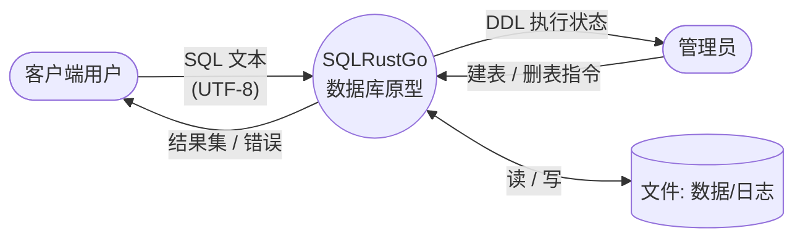
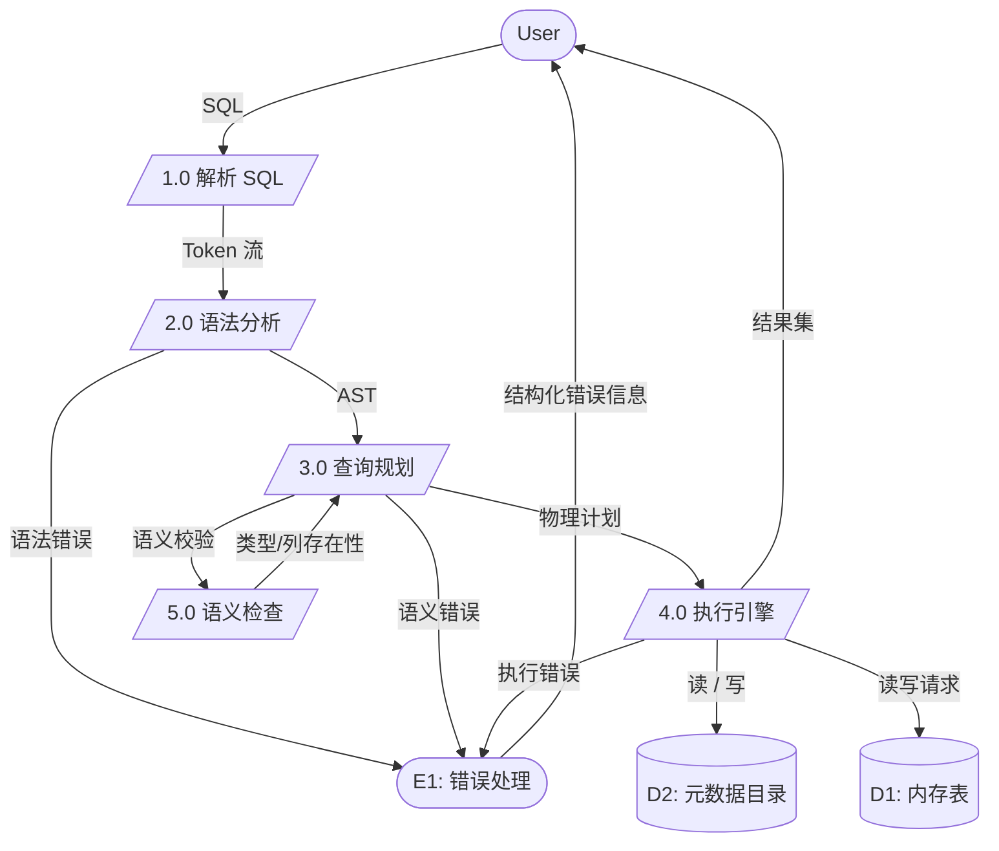
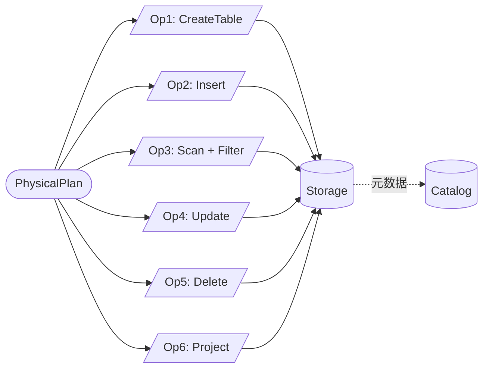
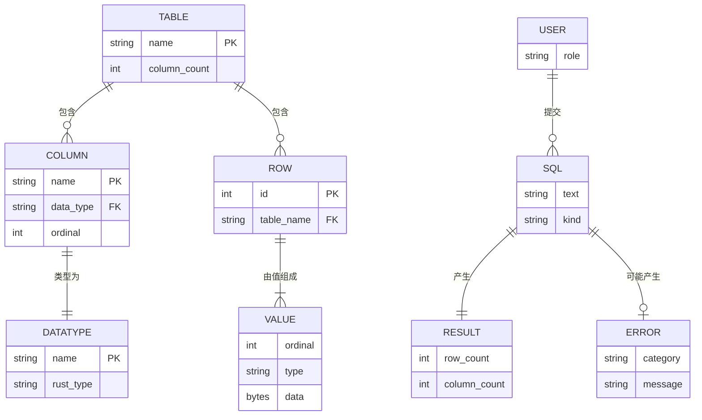

# Week 02 实验报告 — 结构化方法

> **课程**：AI增强的软件工程
> **学号**：202442020106
> **GitHub**：[Tsuki-lyy/sqlrustgo](https://github.com/Tsuki-lyy/sqlrustgo)
> **日期**：2026-06-22

---

## 1. 实验目标

运用结构化分析（Structured Analysis, SA）与结构化设计（Structured Design, SD）方法，
针对 SQLRustGo 关系数据库原型进行需求建模。包括：

1. 编写软件需求规格说明书（SRS）
2. 绘制分层数据流图（DFD Context / Level-0 / Level-1）
3. 编写数据字典（DD）
4. 绘制 ER 图
5. 编写过程规格说明（Process Specs）
6. 完成结构化设计（模块/功能分解、变换流/事务流分析）

---

## 2. 软件需求规格说明书（SRS）

> 完整文档见 [SRS.md](./SRS.md)

### 2.1 项目背景

SQLRustGo 是一个用 Rust 实现的关系型数据库原型，作为 AI 增强的软件工程课程的实验对象。
本实验以**教学/演示**为目标，不追求生产级可用性。

### 2.2 功能性需求（FR）

| 编号 | 名称 | 描述 | 优先级 |
|------|------|------|--------|
| FR-1 | DDL | CREATE TABLE / DROP TABLE | P0 |
| FR-2 | DML | INSERT / UPDATE / DELETE | P0 |
| FR-3 | DQL | SELECT [WHERE] | P0 |
| FR-4 | 数据类型 | INT / FLOAT / TEXT / BOOL / NULL | P0 |
| FR-5 | 内存存储 | HashMap 表存储 | P0 |
| FR-6 | 元数据目录 | 表/列信息维护 | P1 |
| FR-7 | 错误处理 | 统一 Error 类型 + 分类 | P1 |
| FR-8 | 并发安全 | RwLock 保护表数据 | P1 |

### 2.3 非功能性需求（NFR）

| 编号 | 类别 | 指标 | 验证方式 |
|------|------|------|----------|
| NFR-1 | 性能 | 1k 行 SCAN < 50ms | cargo bench |
| NFR-2 | 内存 | 1k 行 < 10MB | heaptrack |
| NFR-3 | 可用性 | CLI 命令清晰、错误信息友好 | 手动验证 |
| NFR-4 | 可测试性 | 单元测试覆盖核心逻辑 | `cargo test` |
| NFR-5 | 可维护性 | 模块边界清晰、依赖单向 | `cargo clippy` |
| NFR-6 | 安全性 | 无 SQL 注入（不暴露 raw input） | 代码审查 |
| NFR-7 | 可移植性 | 跨 Linux/macOS/Windows | CI 三平台 |

### 2.4 约束

| 编号 | 约束 | 说明 |
|------|------|------|
| C-1 | 语言 | Rust 2021 edition，stable 1.93+ |
| C-2 | 许可证 | MIT |
| C-3 | 部署 | 单二进制，无外部运行时 |

---

## 3. 数据流图（DFD）

### 3.1 Context Diagram（顶层）



### 3.2 Level-0 DFD



### 3.3 Level-1 DFD（执行引擎子图）



---

## 4. 数据字典（DD）

> 完整文档见 [DataDictionary.md](./DataDictionary.md)

### 4.1 数据流

| 编号 | 名称 | 组成 | 说明 |
|------|------|------|------|
| F1 | SQL 输入 | 字符串（UTF-8） | 用户提交的 SQL 语句 |
| F2 | Token 流 | Token[] | 词法分析产物 |
| F3 | AST | Statement 枚举 | 抽象语法树 |
| F4 | 物理计划 | PhysicalPlan 枚举 | 可执行计划 |
| F5 | 结果集 | `Vec<Vec<Value>>` | 行×列 |
| F6 | 错误信息 | Error 枚举 | 分类错误 |

### 4.2 数据存储

| 编号 | 名称 | 组成 | 存储方式 | 保留期 |
|------|------|------|----------|--------|
| D1 | 内存表 | `HashMap<TableName, Table>` | RwLock 保护 | 进程生命周期 |
| D2 | 元数据目录 | `HashMap<TableName, Vec<Column>>` | RwLock 保护 | 进程生命周期 |

### 4.3 数据元素（核心字段）

| 名称 | 类型 | 取值范围 | 说明 |
|------|------|----------|------|
| TableName | String | `[A-Za-z_][A-Za-z0-9_]{0,62}` | 表名 |
| ColumnName | String | 同上 | 列名 |
| DataType | enum | `Int / Float / Text / Bool` | 列类型 |
| Value | enum | `Null / Bool / Int / Float / Text` | 运行时值 |
| Row | `Vec<Value>` | 与 Column 列表等长 | 一行数据 |

### 4.4 处理逻辑（PSPEC）

| 过程 | 输入 | 算法概要 | 输出 |
|------|------|----------|------|
| 1.0 词法分析 | SQL 字符串 | 单字符前看 + 状态切换 | Token 流 |
| 2.0 语法分析 | Token 流 | 递归下降 | AST |
| 3.0 查询规划 | AST | 节点转换 | 物理计划 |
| 4.0 执行 | 物理计划 | 算子执行 | 结果集/受影响行数 |
| 5.0 语义检查 | AST + 元数据 | 列存在性 + 类型一致 | 校验后 AST |

---

## 5. ER 图

### 5.1 系统实体



---

## 6. 结构化设计（SD）

### 6.1 模块层次

```
sqlrustgo (root, CLI 入口)
├── Database
│   ├── Parser        [依赖 Lexer]
│   ├── Planner       [依赖 Parser::AST]
│   ├── Executor      [依赖 Planner + Storage + Catalog]
│   └── Database      [组合 Parser/Planner/Executor]
│
├── sqlrustgo-parser  (无业务依赖)
│   ├── Lexer
│   ├── AST
│   └── Parser
│
├── sqlrustgo-planner (依赖 parser)
│   ├── LogicalPlan
│   ├── PhysicalPlan
│   └── Planner
│
├── sqlrustgo-executor (依赖 planner, storage, catalog)
│   ├── Operator trait
│   └── Executor
│
├── sqlrustgo-storage (无业务依赖)
│   ├── StorageEngine trait
│   └── MemoryStorage
│
├── sqlrustgo-catalog (无业务依赖)
│   └── Catalog
│
└── sqlrustgo-common
    ├── Value
    └── Error / Result
```

### 6.2 模块耦合度

| 模块 | 出向依赖 | 入向依赖 | 耦合度 |
|------|----------|----------|--------|
| common | 0 | 5 | 极低 |
| parser | common | planner, executor | 低 |
| planner | common, parser | executor | 中 |
| storage | common, parser | executor | 中 |
| catalog | 0 | executor | 低 |
| executor | 全部 | 0（仅 binary） | 中（聚合根） |

> 依赖图无环，符合分层架构。

### 6.3 内聚度

| 模块 | 单一职责 | 内聚类型 |
|------|----------|----------|
| common | 公共类型 | 功能内聚 |
| parser | 把文本 → AST | 功能内聚 |
| planner | AST → 执行计划 | 功能内聚 |
| storage | 表/行读写 | 功能内聚 |
| catalog | 元数据 | 功能内聚 |
| executor | 计划 → 结果 | 功能内聚 |

> 全部为**功能内聚**（Functional Cohesion），最高级别。

### 6.4 变换流 vs 事务流分析

| 流程 | 类型 | 说明 |
|------|------|------|
| SELECT | 变换流 | input → 过滤/投影 → output |
| INSERT | 事务流 | 选择目标表 → 写 |
| UPDATE/DELETE | 事务流 + 变换 | 选择目标 → 过滤 → 写 |

---

## 7. 实验产出物清单

| 编号 | 文件 | 说明 |
|------|------|------|
| 1 | [SRS.md](./SRS.md) | 软件需求规格说明书 |
| 2 | [DataDictionary.md](./DataDictionary.md) | 数据字典 |
| 3 | [DFD-Context.md](./DFD-Context.md) | 顶层数据流图（Mermaid） |
| 4 | [DFD-Level-0.md](./DFD-Level-0.md) | 0 层数据流图 |
| 5 | [ER-Diagram.md](./ER-Diagram.md) | 实体关系图 |
| 6 | [Process-Specs.md](./Process-Specs.md) | 过程规格说明（PSPEC） |
| 7 | [SD-Modules.md](./SD-Modules.md) | 结构化设计-模块分解 |

---

## 8. 小结

本周通过 SA/SD 方法对 SQLRustGo 进行了完整的需求建模与初步设计。绘制了 3 张 DFD、1 张 ER 图、
完整数据字典、模块分解图。下周（Week 03）将用面向对象方法重新审视同一系统，对比两种方法的差异。
