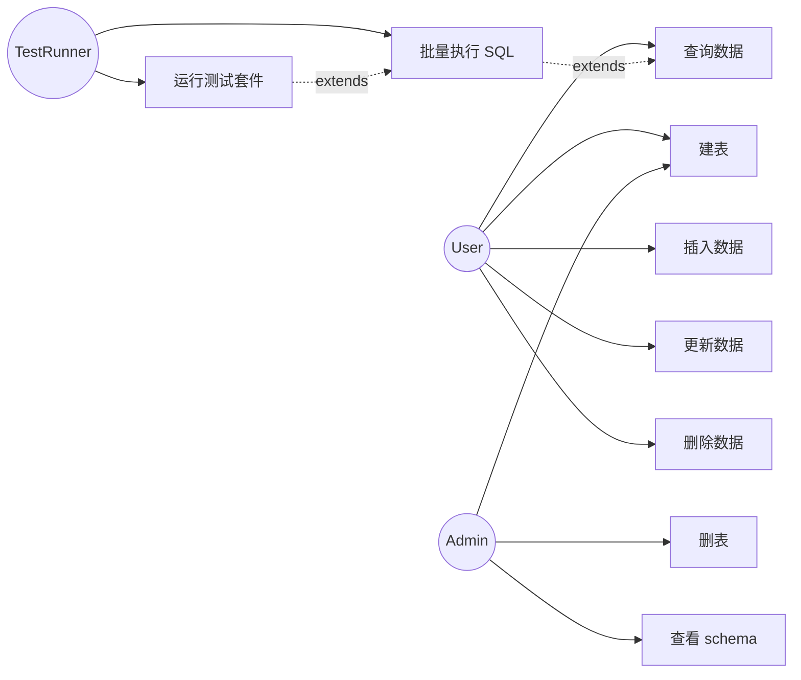
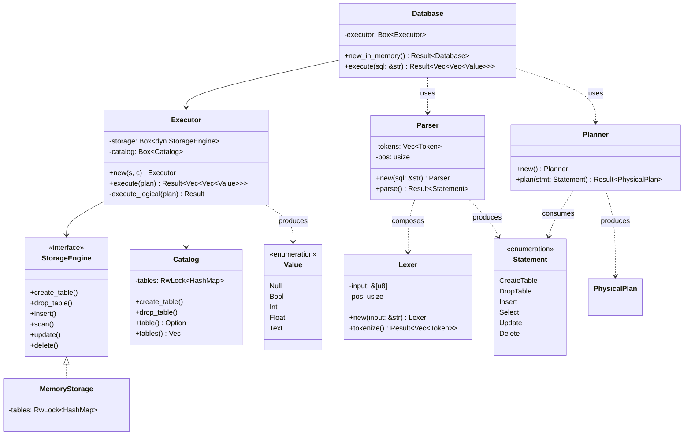
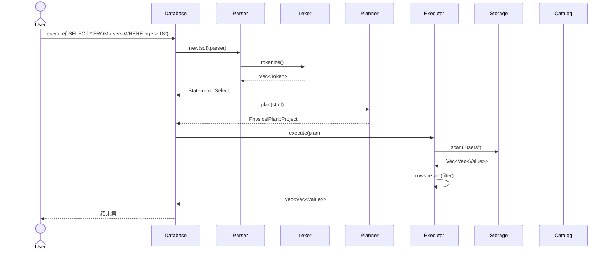
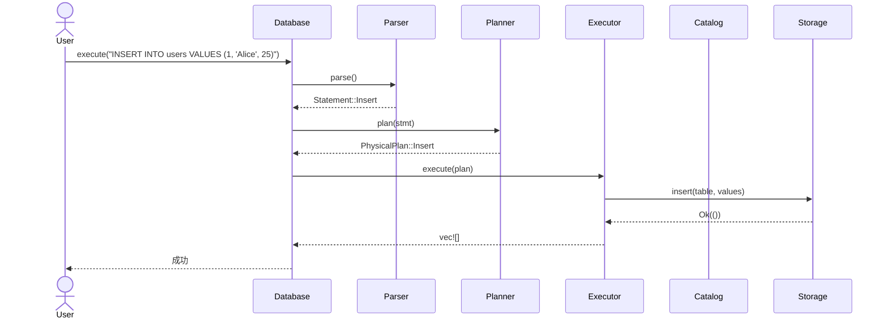
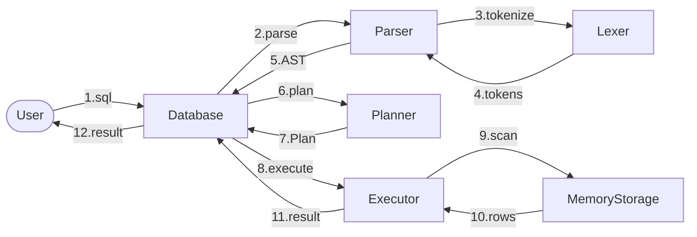
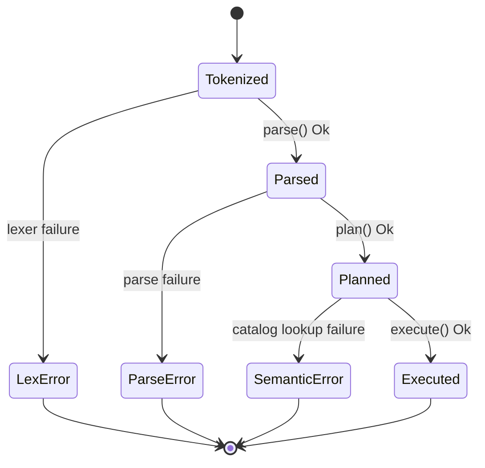
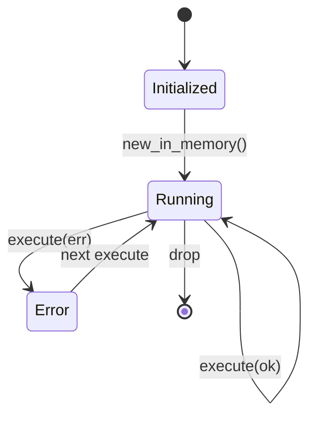
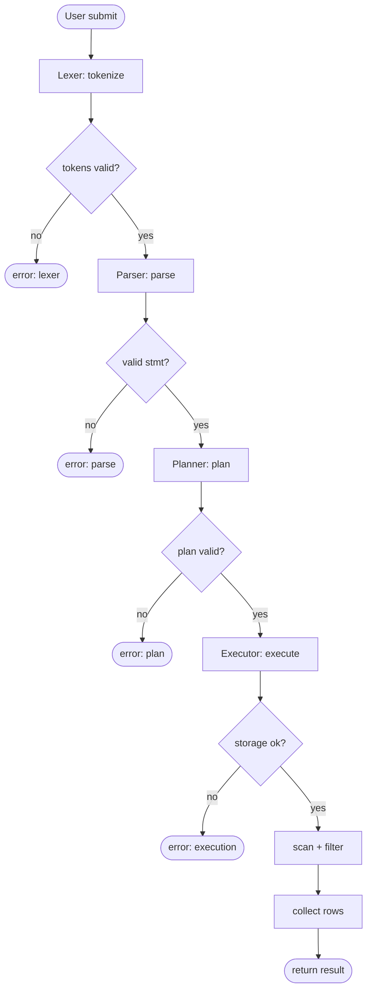
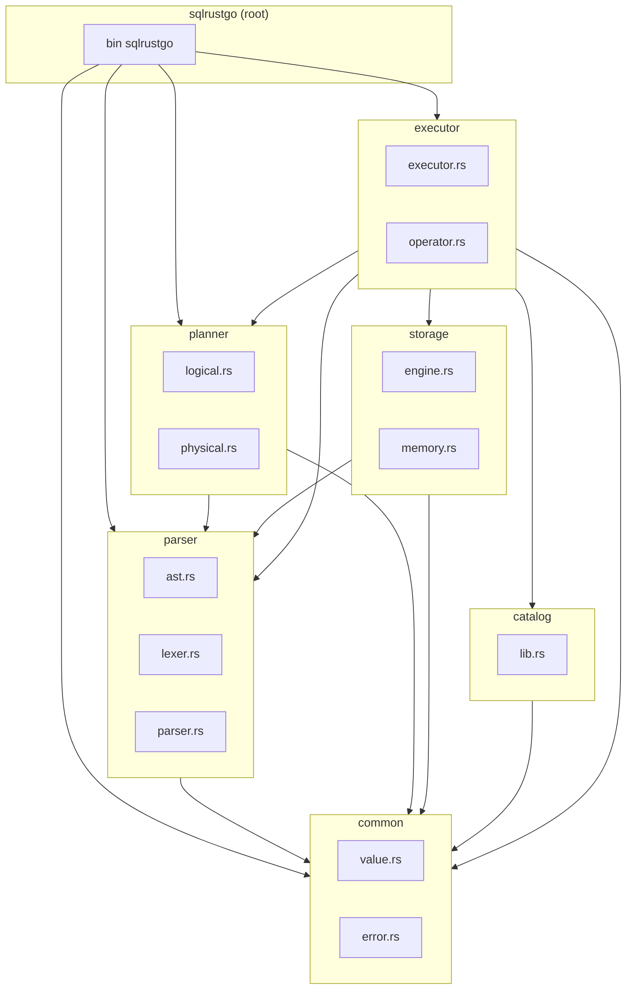

# Week 03 实验报告 — 面向对象分析设计

> **课程**：AI增强的软件工程
> **学号**：202442020106
> **日期**：2026-06-22

---

## 1. 实验目标

用面向对象方法（OOAD）重新审视 SQLRustGo 系统，输出一套可与 Week 02 结构化方法对照的设计物：

1. 用例图（Use Case Diagram）
2. 类图（Class Diagram）
3. 对象图（Object Diagram，示例场景）
4. 顺序图（Sequence Diagram）
5. 协作图（Collaboration Diagram）
6. 状态图（State Diagram）
7. 活动图（Activity Diagram）
8. 包图（Package Diagram）
9. 设计原则与设计模式识别

---

## 2. 用例图

### 2.1 参与者

| 参与者 | 描述 | 主要诉求 |
|--------|------|----------|
| User | 终端用户 | 执行 SQL |
| Admin | 管理员 | 管理 schema |
| TestRunner | 自动化测试器 | 批量执行断言 |

### 2.2 用例



---

## 3. 类图

### 3.1 领域类



### 3.2 关联关系

| 类 A | 关系 | 类 B | 基数 | 角色 |
|------|------|------|------|------|
| Database | 组合 | Executor | 1:1 | 协调者 |
| Executor | 聚合 | StorageEngine | 1:1 | 数据访问 |
| Executor | 聚合 | Catalog | 1:1 | 元数据 |
| Parser | 依赖 | Lexer | 1:1 | 词法 |
| Planner | 依赖 | Statement | N:1 | 输入 |
| Executor | 依赖 | PhysicalPlan | N:1 | 输入 |

---

## 4. 对象图（场景：`SELECT * FROM users WHERE age > 18`）

```mermaid
classDiagram
    class dbObj[db: Database] {
        executor: Box~Executor~
    }
    class execObj[exec: Executor] {
        storage: Box~dyn~
        catalog: Box~Catalog~
    }
    class stObj[storage: MemoryStorage] {
        tables: {"users": Table}
    }
    class catObj[catalog: Catalog] {
        tables: {"users": [(id,Int),(name,Text),(age,Int)]}
    }
    class tok1[t1: Token SELECT]
    class tok2[t2: Token *
    ]
    class tok3[t3: Token FROM]
    class tok4[t4: Token users]
    class tok5[t5: Token WHERE]
    class tok6[t6: Token age]
    class tok7[t7: Token >]
    class tok8[t8: Token 18]

    dbObj --> execObj : contains
    execObj --> stObj : storage
    execObj --> catObj : catalog
    tok1 --> tok2 : next
    tok2 --> tok3 : next
    tok3 --> tok4 : next
    tok4 --> tok5 : next
    tok5 --> tok6 : next
    tok6 --> tok7 : next
    tok7 --> tok8 : next
```

---

## 5. 顺序图

### 5.1 SELECT 执行时序



### 5.2 INSERT 执行时序



---

## 6. 协作图

### 6.1 SELECT 协作



---

## 7. 状态图

### 7.1 SQL Statement 生命周期



### 7.2 Database 实例状态



---

## 8. 活动图

### 8.1 SELECT 完整流程



---

## 9. 包图



---

## 10. 设计原则符合性

| 原则 | 体现 |
|------|------|
| **单一职责 (SRP)** | 每个 crate 只做一件事：parser 只解析，planner 只规划 |
| **开闭原则 (OCP)** | `StorageEngine` trait 允许新增实现（FileStorage、RemoteStorage） |
| **里氏替换 (LSP)** | `MemoryStorage` 可替换 `StorageEngine` 任意实现 |
| **接口隔离 (ISP)** | `Operator` trait 只暴露 `open/next/close`，不强迫实现事务控制 |
| **依赖倒置 (DIP)** | `Executor` 依赖 `Box<dyn StorageEngine>` 抽象，不依赖具体类 |

---

## 11. 设计模式识别

| 模式 | 应用 |
|------|------|
| **Strategy** | `StorageEngine` trait + `MemoryStorage` impl |
| **Factory Method** | `Database::new_in_memory()` 创建具体栈 |
| **Composite** | `PhysicalPlan::Project { input: Box<LogicalPlan> }` 嵌套 |
| **Iterator** | `Operator::next()` 风格（迭代器模型） |
| **RAII** | `MemoryStorage` 用 `RwLock` 包装，自管理锁释放 |
| **Builder（潜在）** | Week 06 重构时可为 `Database` 引入 `DatabaseBuilder` |

---

## 12. OOAD vs SA/SD 对比

| 维度 | SA/SD (Week 02) | OOAD (Week 03) |
|------|-----------------|----------------|
| 核心抽象 | 数据流 + 数据结构 | 对象 + 行为 |
| 可复用单位 | 模块 | 类 / 接口 |
| 行为描述 | 过程规格 | 状态图 + 活动图 |
| 适用场景 | 数据处理密集 | 业务规则复杂 |
| 本项目体现 | 清晰的层次切分 | trait 抽象、易扩展 |

> **结论**：本项目将两者结合——SA/SD 用于顶层 DFD 切分子系统，OOAD 用于子系统内部的接口设计与可扩展性。

---

## 13. 小结

本周通过 OOAD 方法输出了 7 张 UML 图（用例、类、对象、顺序、协作、状态、活动），识别了 6 大设计模式与 5 大设计原则。下周（Week 04）将用专业工具（PlantUML / Mermaid）把这些图沉淀为可维护的工程文档。
