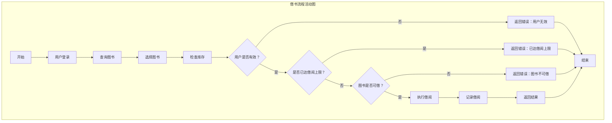
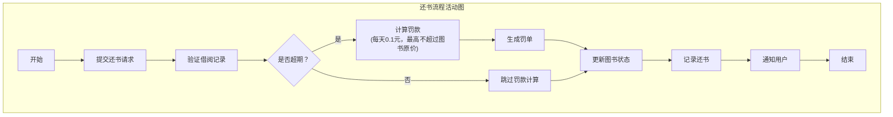
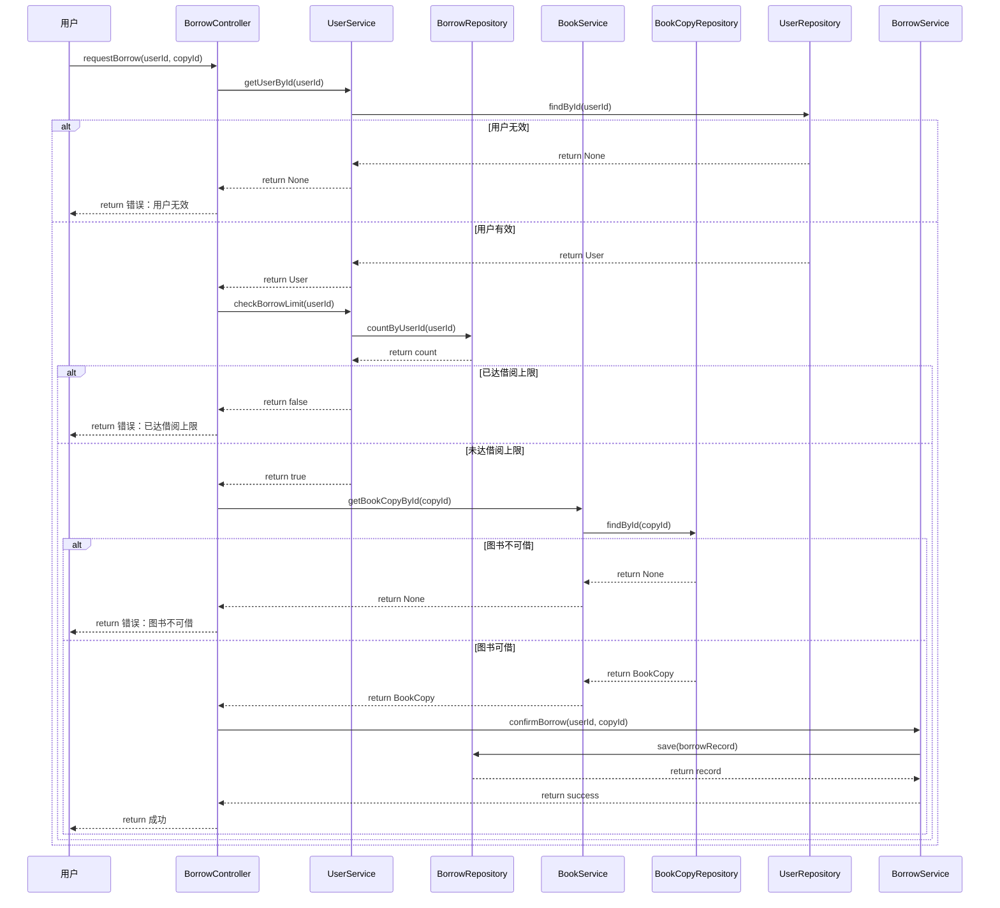
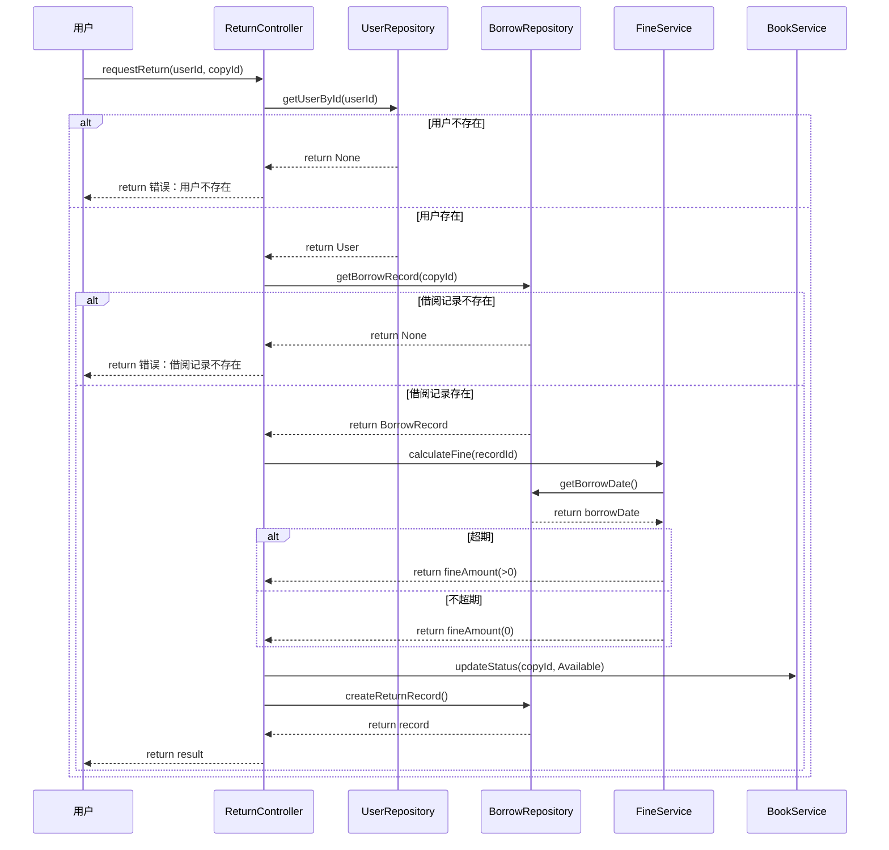
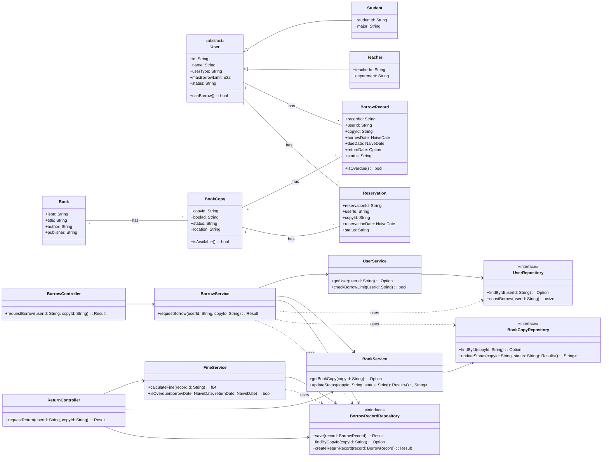

# OOA-OOP实践过程报告

## 第4周实验：UML建模与OOA-OOP实践

### 1. 用例图

```mermaid
useCaseDiagram
    title 高校图书借阅系统用例图
    
    actor Student as 学生
    actor Teacher as 教师
    actor Librarian as 图书管理员
    
    usecase Login as 登录
    usecase QueryBook as 查询图书
    usecase BorrowBook as 借书
    usecase ReturnBook as 还书
    usecase ManageBook as 管理图书
    usecase ReserveBook as 预约图书
    usecase ViewHistory as 查看借阅历史
    usecase CalculateFine as 计算罚款
    usecase ViewAllRecords as 查看所有借阅记录
    
    Student -- Login
    Student -- QueryBook
    Student -- BorrowBook
    Student -- ReturnBook
    Student -- ReserveBook
    Student -- ViewHistory
    
    Teacher -- Login
    Teacher -- QueryBook
    Teacher -- BorrowBook
    Teacher -- ReturnBook
    Teacher -- ReserveBook
    Teacher -- ViewHistory
    
    Librarian -- Login
    Librarian -- ManageBook
    Librarian -- ViewAllRecords
    
    BorrowBook --|> QueryBook : <<include>>
    ReturnBook --|> QueryBook : <<include>>
    ReturnBook --|> CalculateFine : <<include>>
    ReserveBook --|> BorrowBook : <<extend>>
```

### 2. 借书活动图



### 3. 还书活动图



### 4. 借书顺序图



### 5. 还书顺序图



### 6. 类图



### 7. 状态图

#### BookCopy状态图

```mermaid
stateDiagram-v2
    [*] --> Available
    
    state Available {
        [*] --> Available
    }
    
    state Borrowed {
        [*] --> Borrowed
    }
    
    state Reserved {
        [*] --> Reserved
    }
    
    state Lost {
        [*] --> Lost
    }
    
    state Discarded {
        [*] --> Discarded
    }
    
    Available --> Borrowed : borrow
    Available --> Reserved : reserve
    Reserved --> Available : cancelReserve
    Reserved --> Borrowed : borrow
    Borrowed --> Available : return
    Borrowed --> Lost : reportLost
    Lost --> Available : found
    
    Available --> Discarded : discard
    Borrowed --> Discarded : discard
    Reserved --> Discarded : discard
    Lost --> Discarded : discard
    Discarded --> [*]
```

#### BorrowRecord状态图

```mermaid
stateDiagram-v2
    [*] --> Borrowing : borrow
    
    state Borrowing {
        [*] --> Borrowing
    }
    
    state Returned {
        [*] --> Returned
    }
    
    state Overdue {
        [*] --> Overdue
    }
    
    Borrowing --> Returned : return
    Borrowing --> Overdue : overdue
    
    Returned --> [*]
    Overdue --> [*]
```

### 8. 设计决策说明

#### 8.1 架构设计

采用三层架构（Controller-Service-Repository）：

- **Controller层**：处理用户请求，调用Service层，返回响应
- **Service层**：实现业务逻辑，调用Repository层
- **Repository层**：负责数据存储和访问

#### 8.2 设计模式应用

1. **依赖倒置原则**：Service层依赖Repository接口，而不是具体实现
2. **单一职责原则**：每个类只负责一个功能领域
3. **开放封闭原则**：通过接口扩展，而不是修改现有代码

#### 8.3 实体关系设计

- **User与Student/Teacher**：泛化关系，Student和Teacher继承User
- **Book与BookCopy**：1对多关系，一本书可以有多个副本
- **User与BorrowRecord**：1对多关系，一个用户可以有多个借阅记录
- **BookCopy与BorrowRecord**：1对多关系，一个副本可以有多个借阅记录

#### 8.4 状态管理

- **BookCopy**：使用状态机管理图书副本的生命周期（Available→Borrowed→Available等）
- **BorrowRecord**：使用状态机管理借阅记录的状态（Borrowing→Returned/Overdue）

#### 8.5 业务规则

- 学生借阅限制：5本
- 教师借阅限制：10本
- 逾期罚款：每天0.1元，最高不超过图书原价
- 预约优先：预约的图书优先借给预约用户

#### 8.6 错误处理

在顺序图中体现了完整的错误处理流程：
- 用户不存在时返回错误
- 借阅记录不存在时返回错误
- 已达借阅上限时返回错误
- 图书不可借时返回错误

#### 8.7 扩展性考虑

- 通过接口设计支持不同的数据存储实现
- 通过状态机模式支持未来可能的新状态和转换
- 通过Service层的抽象支持业务规则的扩展
