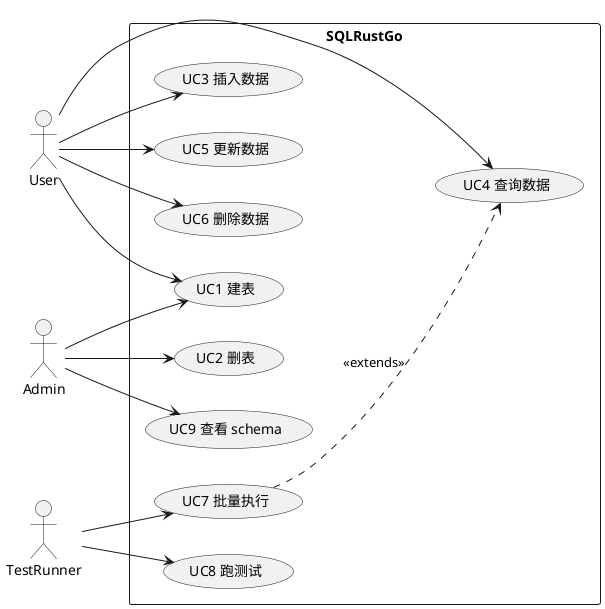
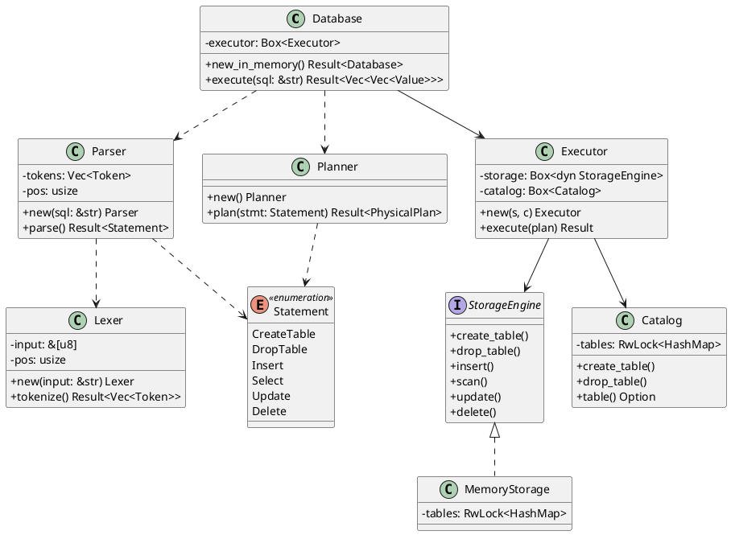
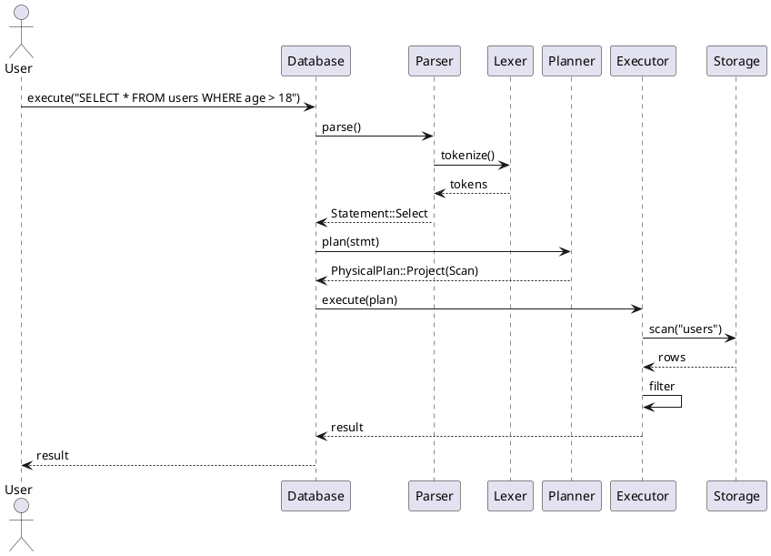
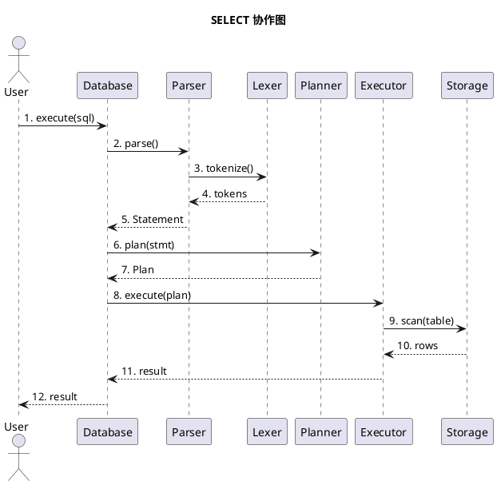
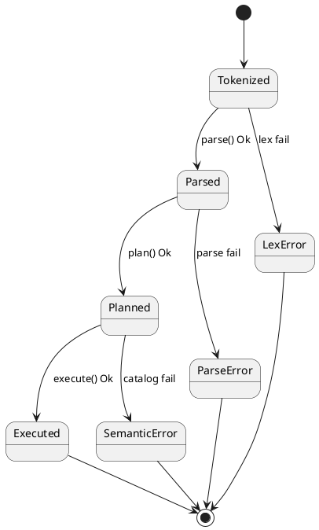
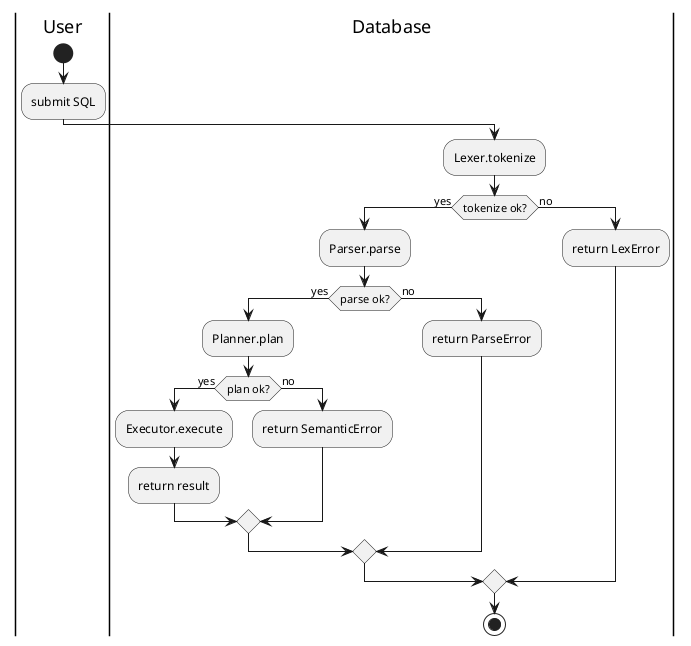
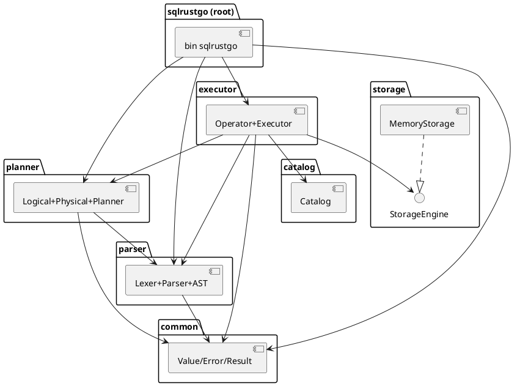
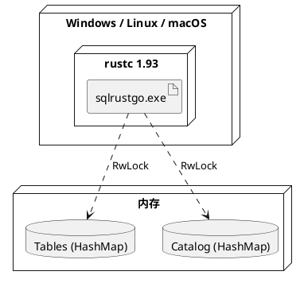

# Week 04 实验报告 — UML 完整上机

> **课程**：AI增强的软件工程
> **学号**：202442020106
> **日期**：2026-06-22

---

## 1. 实验目标

用专业 UML 工具（PlantUML + Mermaid）完成 SQLRustGo 项目的完整建模上机：

1. 安装 PlantUML 环境
2. 绘制 9 种 UML 图（用例、类、对象、顺序、协作、状态、活动、组件、部署）
3. 验证图与代码一致（双向追溯）
4. 沉淀为 `docs/uml/` 目录

---

## 2. 工具链

| 工具 | 版本 | 用途 |
|------|------|------|
| PlantUML | 1.2024.5+ | 标准 UML 图（.puml 文件） |
| Mermaid | 10.x | 嵌入 Markdown 的轻量图 |
| Markdown | - | 主文档载体 |
| TRAE IDE | - | 实时预览 Mermaid |

PlantUML 文件（`.puml`）位于 `docs/uml/`，对应 Markdown 报告位于 `reports/week-04/`。

---

## 3. UML 图清单

### 3.1 用例图 (Use Case)

文件：[docs/uml/use-case.puml](../../docs/uml/use-case.puml)



---

### 3.2 类图 (Class Diagram)

文件：[docs/uml/class.puml](../../docs/uml/class.puml)



---

### 3.3 对象图 (Object Diagram)

文件：[docs/uml/object.puml](../../docs/uml/object.puml)

```plantuml
@startuml object
object db:Database
object parser:Parser
object lexer:Lexer
object planner:Planner
object exec:Executor
object storage:MemoryStorage
object catalog:Catalog

object tok1:Token(SELECT)
object tok2:Token(*)
object tok3:Token(FROM)
object tok4:Token(users)
object tok5:Token(WHERE)
object tok6:Token(age)
object tok7:Token(>)
object tok8:Token(18)

db --> exec
db --> parser
db --> planner
exec --> storage
exec --> catalog
parser --> lexer

tok1 --> tok2
tok2 --> tok3
tok3 --> tok4
tok4 --> tok5
tok5 --> tok6
tok6 --> tok7
tok7 --> tok8
@enduml
```

---

### 3.4 顺序图 (Sequence)

文件：[docs/uml/sequence-select.puml](../../docs/uml/sequence-select.puml)



---

### 3.5 协作图 (Communication)

文件：[docs/uml/communication-select.puml](../../docs/uml/communication-select.puml)



---

### 3.6 状态图 (State Machine)

文件：[docs/uml/state.puml](../../docs/uml/state.puml)



---

### 3.7 活动图 (Activity)

文件：[docs/uml/activity-select.puml](../../docs/uml/activity-select.puml)



---

### 3.8 组件图 (Component)

文件：[docs/uml/component.puml](../../docs/uml/component.puml)



---

### 3.9 部署图 (Deployment)

文件：[docs/uml/deployment.puml](../../docs/uml/deployment.puml)



---

## 4. 图与代码双向追溯

| UML 元素 | 代码位置 |
|----------|----------|
| `Database` 类 | `src/main.rs:14` |
| `Parser::parse()` | `crates/parser/src/parser.rs:24` |
| `Lexer::tokenize()` | `crates/parser/src/lexer.rs:25` |
| `Planner::plan()` | `crates/planner/src/logical.rs:25` |
| `Executor::execute()` | `crates/executor/src/executor.rs:18` |
| `StorageEngine` trait | `crates/storage/src/engine.rs:5` |
| `MemoryStorage` impl | `crates/storage/src/memory.rs:22` |
| `Catalog` | `crates/catalog/src/lib.rs:4` |
| `Statement` 枚举 | `crates/parser/src/ast.rs:4` |
| `Value` 枚举 | `crates/common/src/value.rs:5` |

---

## 5. 工具使用心得

### 5.1 PlantUML vs Mermaid

| 维度 | PlantUML | Mermaid |
|------|----------|---------|
| 表达力 | 强（支持全部 14 种图） | 中（9 种） |
| 嵌入 MD | 需代码块 + 渲染器 | 原生支持 |
| 维护成本 | 高（独立 .puml 文件） | 低（直接写在 .md） |
| 本项目 | 标准 UML 物 | 报告插图 |

**结论**：本项目采用 **Mermaid 内嵌 + PlantUML 沉淀** 双轨制——报告里用 Mermaid 即看即得，工程档案用 PlantUML 严格建模。

### 5.2 渲染验证

- PlantUML 渲染：在 VS Code / TRAE 装 `plantuml` 扩展，右键 "Preview"
- Mermaid 渲染：TRAE / GitHub 原生支持

---

## 6. 产出清单

| 编号 | 类型 | 路径 |
|------|------|------|
| 1 | 用例图 | `docs/uml/use-case.puml` |
| 2 | 类图 | `docs/uml/class.puml` |
| 3 | 对象图 | `docs/uml/object.puml` |
| 4 | 顺序图（SELECT） | `docs/uml/sequence-select.puml` |
| 5 | 顺序图（INSERT） | `docs/uml/sequence-insert.puml` |
| 6 | 协作图 | `docs/uml/communication-select.puml` |
| 7 | 状态图 | `docs/uml/state.puml` |
| 8 | 活动图 | `docs/uml/activity-select.puml` |
| 9 | 组件图 | `docs/uml/component.puml` |
| 10 | 部署图 | `docs/uml/deployment.puml` |
| 11 | 关系矩阵 | `docs/uml/traceability.md` |

---

## 7. 小结

本周完成 9 张 UML 图的工程化沉淀，建立了"图 ↔ 代码"双向追溯。下周（Week 05）将基于这些图设计系统的宏观架构（4+1 视图）。
