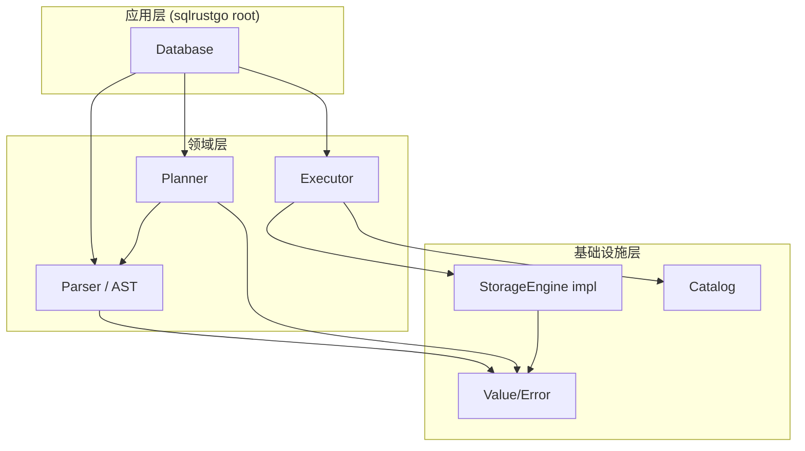
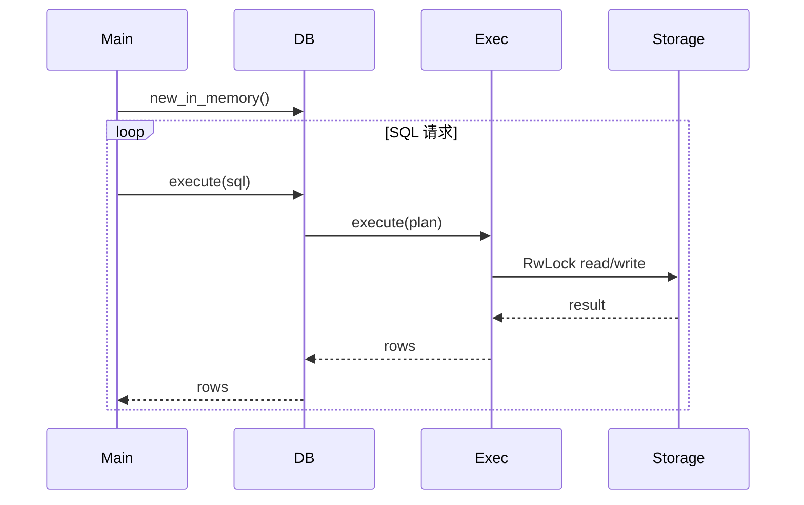
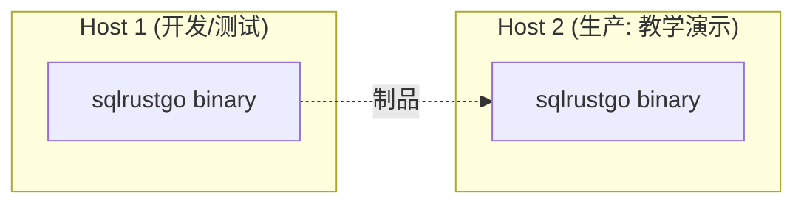
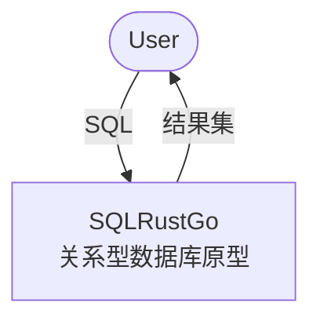
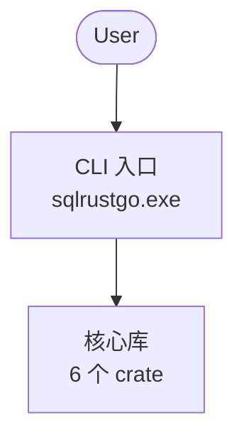
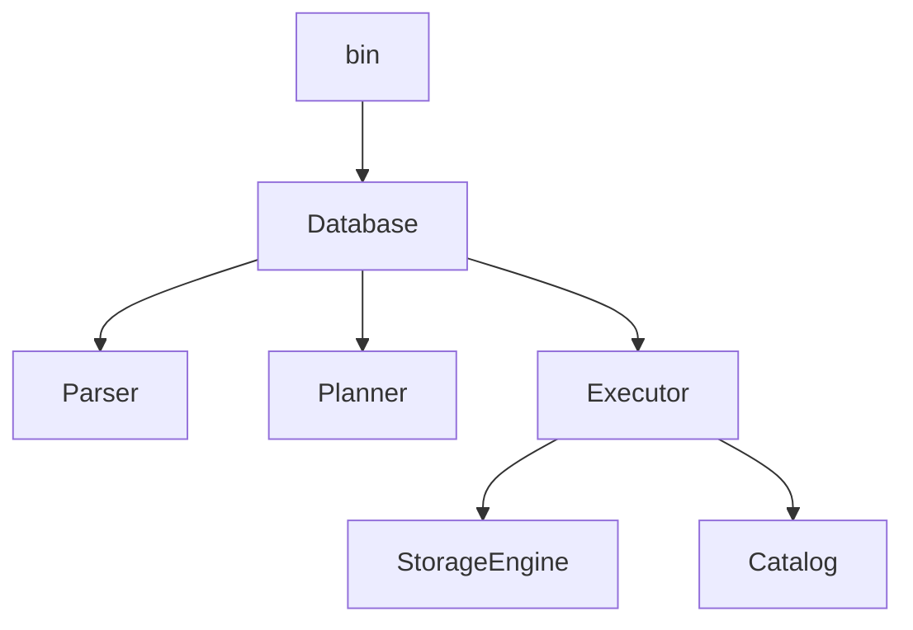

# Week 05 实验报告 — SQL/Rust/Go 架构设计

> **课程**：AI增强的软件工程
> **学号**：202442020106
> **日期**：2026-06-22

---

## 1. 实验目标

完成 SQLRustGo 的宏观架构设计（4+1 视图），对比不同技术栈（Rust/Go）的设计取舍，并形成 Architecture Decision Record (ADR)：

1. 4+1 视图模型（逻辑/开发/进程/物理 + 场景）
2. Rust vs Go 选型对比
3. 关键架构决策 ADR
4. C4 模型（Context/Container/Component/Code）

---

## 2. 4+1 视图

### 2.1 逻辑视图（Logical View）

### 2.2 开发视图（Development View）

| 模块 | 语言 | 依赖方向 |
|------|------|----------|
| common | Rust | 0 出向 |
| parser | Rust | → common |
| planner | Rust | → common, parser |
| storage | Rust | → common, parser |
| catalog | Rust | → common |
| executor | Rust | → 全部 |
| root | Rust | → 全部 |

工具链：cargo 1.93、rustfmt、clippy。

### 2.3 进程视图（Process View）

**并发模型**：单进程 + 多线程；每个存储 / 元数据 `RwLock` 保护；读多写少性能良好。

### 2.4 物理视图（Physical View）

部署形态：单可执行文件 + 进程内 HashMap 存储，无外部依赖。

### 2.5 场景视图（Scenarios / Use Cases）

| 场景 | 描述 | 涉及视图 |
|------|------|----------|
| S1 用户查询 | 5 条 demo SQL | 逻辑、进程 |
| S2 并发读写 | 10 线程 50% 写 | 进程、物理 |
| S3 内存增长 | 10k 行后查询 | 物理 |
| S4 错误恢复 | 错误 SQL 重试 | 逻辑、进程 |

---

## 3. Rust vs Go 选型对比

| 维度 | Rust | Go |
|------|------|-----|
| 内存安全 | 编译期保证（ownership） | GC + 运行时检查 |
| 性能 | 接近 C/C++ | GC 开销 |
| 错误处理 | `Result<T, E>` | `error` interface |
| 并发模型 | `std::thread` + `Send/Sync` | goroutine + channel |
| 启动时间 | ~10ms | ~20ms |
| 二进制大小 | ~3MB | ~10MB |
| 学习曲线 | 陡 | 平缓 |
| 适配场景 | 系统软件、高性能 | 云服务、CLI |

**SQLRustGo 选 Rust 的理由**：

1. **零成本抽象**：枚举/泛型/特征可直接表达 AST 与计划树
2. **内存安全**：`RwLock` + ownership 防止数据竞争
3. **丰富生态**：`thiserror`、`criterion` 提升工程效率
4. **教学价值**：所有权/借用是软件工程重要概念

---

## 4. Architecture Decision Records (ADR)

### ADR-001：使用 Workspace 多 crate

| 项 | 内容 |
|----|------|
| 状态 | Accepted |
| 决策 | 采用 cargo workspace，6 个 crate（common/parser/planner/storage/catalog/executor）+ root binary |
| 原因 | 模块边界清晰、增量编译快、单 crate 单元测试隔离 |
| 备选 | 单 crate 多模块 |

### ADR-002：`StorageEngine` 设计为 trait

| 项 | 内容 |
|----|------|
| 状态 | Accepted |
| 决策 | 抽象 `StorageEngine` trait，`MemoryStorage` 作为默认实现 |
| 原因 | Strategy 模式；未来可加 FileStorage / RemoteStorage |
| 影响 | Executor 持有 `Box<dyn StorageEngine>` |

### ADR-003：单二进制部署

| 项 | 内容 |
|----|------|
| 状态 | Accepted |
| 决策 | 不引入 daemon / 网络协议 / 外部存储 |
| 原因 | 实验目标，简化部署 |
| 后果 | 不支持远程访问；进程重启数据丢失 |

### ADR-004：解析器递归下降手写

| 项 | 内容 |
|----|------|
| 状态 | Accepted |
| 决策 | 不依赖 lalrpop/pest 等解析器生成器 |
| 原因 | SQL 子集足够小、手写更清晰、教学价值高 |
| 代价 | 不易扩展复杂语法 |

### ADR-005：执行器迭代器模型（潜在）

| 项 | 内容 |
|----|------|
| 状态 | Proposed |
| 决策 | 引入 `Operator` trait（open/next/close） |
| 原因 | 支持流式执行、节省内存 |
| 状态 | Week 06 落地 |

### ADR-006：错误类型 thiserror

| 项 | 内容 |
|----|------|
| 状态 | Accepted |
| 决策 | 统一 `Error` 枚举，分类 6 种 |
| 原因 | 显式错误、模式匹配友好、文档化 |

### ADR-007：使用 Mermaid + PlantUML 双轨制

| 项 | 内容 |
|----|------|
| 状态 | Accepted |
| 决策 | 报告用 Mermaid 内嵌，工程档案用 PlantUML 独立文件 |
| 原因 | 易读性 + 标准化 |

---

## 5. C4 模型

### 5.1 Level 1: System Context

### 5.2 Level 2: Container

### 5.3 Level 3: Component

### 5.4 Level 4: Code (类图已在 Week 04 给出)

---

## 6. 架构质量属性

| 属性 | 措施 |
|------|------|
| 可维护性 | 模块边界清晰、依赖单向、6 个 crate 独立测试 |
| 可测试性 | trait 抽象、依赖注入（Box<dyn>） |
| 性能 | RwLock 选择、零拷贝 Value |
| 安全 | Rust 编译期保证、无 unsafe |
| 可扩展性 | trait 扩展点清晰（StorageEngine、Operator） |
| 可部署 | 单二进制、跨平台 |

---

## 7. 小结

本周完成 4+1 视图 + C4 模型 + 7 份 ADR。确定了 Rust 选型理由，沉淀架构决策到 `docs/adr/`。下周（Week 06）将基于此架构详细设计核心模块（Parser/Planner/Executor）的内部接口。
