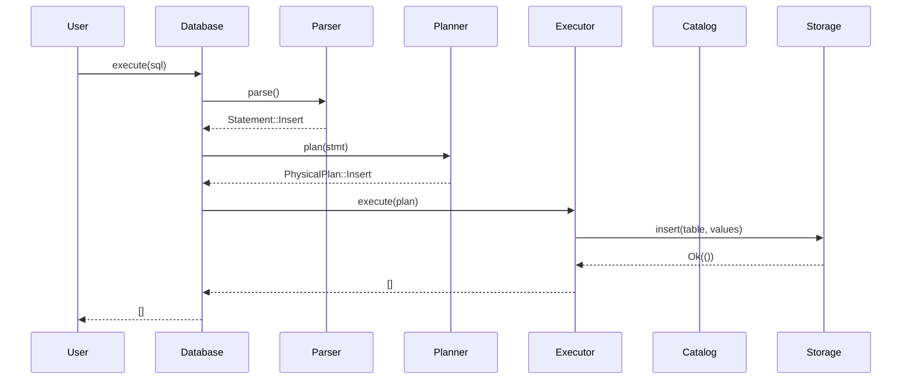
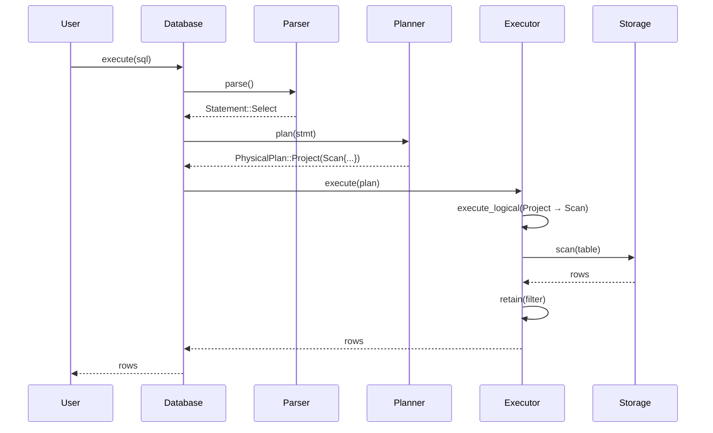
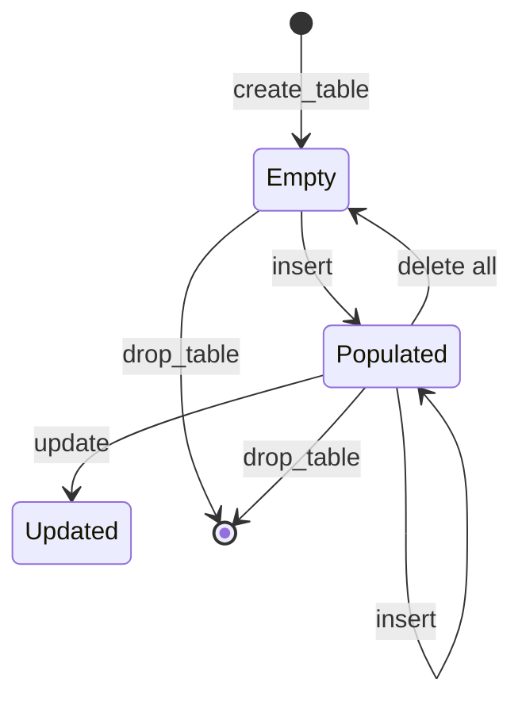

# Week 06 实验报告 — 核心模块设计

> **课程**：AI增强的软件工程
> **学号**：202442020106
> **日期**：2026-06-22

---

## 1. 实验目标

对 SQLRustGo 四大核心模块（Parser/Planner/Executor/Storage）做详细设计：

1. 各模块的内部接口（API 签名 + 错误处理 + 不变式）
2. 关键算法（递归下降解析、计划转换、过滤求值、内存存储）
3. 性能复杂度（时间/空间）
4. 用 PlantUML/Mermaid 给出时序图与状态机
5. 与 Week 05 ADR-005 对齐：落地 Operator 迭代器模型

---

## 2. Parser 模块设计

### 2.1 模块定位

把 SQL 字符串 → `Statement`（AST 根）。

### 2.2 公开 API

```rust
pub struct Parser { /* tokens, pos */ }

impl Parser {
    pub fn new(sql: &str) -> Self;
    pub fn parse(&mut self) -> Result<Statement>;
}

// re-export
pub use ast::{BinOp, ColumnDef, DataType, Expr, Statement};
pub use lexer::{Keyword, Lexer, Token, TokenKind};
```

### 2.3 内部流程

```
SQL → Lexer::tokenize() → Vec<Token> → Parser::parse() → Statement
```

### 2.4 关键算法

- 词法分析：单字符前看 + 状态机
- 语法分析：递归下降，每个子句一个方法

### 2.5 错误处理

| 错误 | 类别 | 抛出位置 |
|------|------|----------|
| 非法字符 | `Error::Lexer` | Lexer::tokenize |
| 期望 `;` | `Error::Parse` | 各 parse_* |
| 未知关键字 | `Error::Parse` | parse_statement |

### 2.6 测试矩阵

| 用例 | 输入 | 期望 |
|------|------|------|
| CREATE | `CREATE TABLE t (id INT);` | CreateTable |
| INSERT | `INSERT INTO t VALUES (1);` | Insert |
| SELECT | `SELECT * FROM t;` | Select(None) |
| SELECT-WHERE | `SELECT * FROM t WHERE id = 1;` | Select(Some(...)) |
| DROP | `DROP TABLE t;` | DropTable |
| UPDATE | `UPDATE t SET x = 1;` | Update |
| DELETE | `DELETE FROM t;` | Delete |

---

## 3. Planner 模块设计

### 3.1 模块定位

把 AST → 物理计划（`PhysicalPlan`），可被 Executor 直接执行。

### 3.2 公开 API

```rust
pub struct Planner;
impl Planner {
    pub fn new() -> Self;
    pub fn plan(&self, stmt: Statement) -> Result<PhysicalPlan>;
}

pub enum LogicalPlan { ... }
pub enum PhysicalPlan { ... }
```

### 3.3 转换映射

| AST | 物理计划 |
|-----|----------|
| `CreateTable` | `CreateTable { name, columns }` |
| `DropTable` | `DropTable { name }` |
| `Insert` | `Insert { table, values }` |
| `Select` | `Project { Scan { table, where } }` |
| `Update` | `Update { ... }` |
| `Delete` | `Delete { ... }` |

### 3.4 关键算法

- 模式匹配 + 字段填充
- SELECT 包装为 `Project(Scan)`，预留 Week 12 加入 `Filter` 优化

---

## 4. Executor 模块设计

### 4.1 模块定位

把物理计划 → 结果集（`Vec<Vec<Value>>`）。

### 4.2 公开 API

```rust
pub struct Executor {
    storage: Box<dyn StorageEngine>,
    catalog: Box<Catalog>,
}
impl Executor {
    pub fn new(storage: Box<dyn StorageEngine>, catalog: Box<Catalog>) -> Self;
    pub fn execute(&self, plan: &PhysicalPlan) -> Result<Vec<Vec<Value>>>;
    fn execute_logical(&self, plan: &LogicalPlan) -> Result<Vec<Vec<Value>>>;
}

// 算子接口（Week 06 落地 ADR-005）
pub trait Operator {
    fn open(&mut self) -> Result<()>;
    fn next(&mut self) -> Result<Option<Vec<Value>>>;
    fn close(&mut self) -> Result<()>;
}
```

### 4.3 关键算法

- `Project(Scan)` → `scan + rows.retain(filter)`
- `Insert` → `storage.insert(values)`
- `Update/Delete` → 委托给 storage

### 4.4 复杂度

| 操作 | 时间 | 空间 |
|------|------|------|
| scan(N rows) | O(N) | O(N) 输出 |
| filter | O(N × p) | O(K) 保留 |
| insert | O(1) | O(1) |

---

## 5. Storage 模块设计

### 5.1 模块定位

抽象数据持久层，提供 `StorageEngine` trait 与 `MemoryStorage` 实现。

### 5.2 公开 API

```rust
pub trait StorageEngine: Send + Sync {
    fn create_table(&self, name: &str, columns: Vec<(String, String)>) -> Result<()>;
    fn drop_table(&self, name: &str) -> Result<()>;
    fn insert(&self, table: &str, values: Vec<Value>) -> Result<()>;
    fn scan(&self, table: &str) -> Result<Vec<Vec<Value>>>;
    fn update(&self, table: &str, assignments: Vec<(String, Value)>, filter: Option<&Expr>) -> Result<usize>;
    fn delete(&self, table: &str, filter: Option<&Expr>) -> Result<usize>;
}

pub struct MemoryStorage {
    tables: RwLock<HashMap<String, Table>>,
}
struct Table { columns: Vec<(String, String)>, rows: Vec<Vec<Value>> }
```

### 5.3 关键算法

- 创建表：检查不存在 → 插入 HashMap
- 插入：行追加（无类型校验，由 planner 负责）
- 扫描：克隆 rows
- 过滤求值：递归 `eval(expr, row)`，支持 `=` `<` `>`

### 5.4 复杂度

| 操作 | 时间 | 空间 |
|------|------|------|
| create_table | O(1) | O(1) |
| insert | O(1) | O(R) |
| scan | O(N) | O(N) |
| update with filter | O(N × p) | O(1) |
| delete with filter | O(N × p) | O(1) |

### 5.5 并发安全

- `RwLock::read` 用于 scan
- `RwLock::write` 用于 DDL/DML
- 行级锁（Week 12 性能优化目标）

---

## 6. 模块间时序图

### 6.1 INSERT 详细时序



### 6.2 SELECT 详细时序



---

## 7. 状态机

### 7.1 MemoryStorage::Table 状态



---

## 8. 不变式（Invariants）

| 模块 | 不变式 |
|------|--------|
| Parser | 解析后 `pos` 指向 EOF |
| Planner | 输出计划满足 Executor 输入约束 |
| Executor | 每次执行要么成功返回行集，要么返回错误 |
| Storage | 同一表名仅存在一份；列定义与插入值长度匹配 |

---

## 9. 扩展点

| 扩展 | 现状 | 路径 |
|------|------|------|
| 新存储引擎 | `StorageEngine` trait | 实现 trait |
| 新算子 | `Operator` trait | 引入新 Operator |
| 新数据类型 | `Value` enum | 加变体 |
| 新语法 | `Parser` | 加 parse_* |

---

## 10. 后续工作

- Week 08：补充单元测试（目标覆盖率 ≥ 70%）
- Week 12：行级锁、批量插入
- Week 13：审计日志、敏感字段
